Pada sesi praktik kali ini, kita akan menyusun sebuah database perusahaan yang lengkap dengan tabel pegawai di dalamnya. Untuk memulainya, langkah pertama adalah membuat database yang akan menjadi wadah bagi tabel pegawai kita. Langkah-langkahnya adalah sebagai berikut:

 1.***Langkah-Langkah pembuatan database pada Shell**

Langkah pertama dalam pembuatan table perusahaan adalah membuat sebuah database yang akan kita gunakan untuk kedepannya.
```shell
CREATE DATABASE "Nama Database";
=================================
CREATE DATABASE Perusahaan_Clement;
```

Penjelasan :
#### **CREATE DATABASE**:

- **CREATE**: Kata kunci ini digunakan untuk membuat atau membangun sesuatu yang baru dalam sistem database.
- **DATABASE**: Menyatakan bahwa objek yang akan dibuat adalah sebuah database.

#### 2. **Perusahaan_Clement**:

- Ini adalah nama dari database yang akan dibuat. Dalam hal ini, nama database yang diinginkan adalah `Perusahaan_Clement`.

Hasil : 


2.**memastikan database berhasil dibuat**

Langkah kedua adalah melihat database yang sudah dibuat apakah berhasil atau tidak dengan menggunakan query `show`.

```shell
show databases;
```

Penjelasan : 
#### 1. **SHOW**:

- Kata kunci `SHOW` digunakan dalam SQL untuk meminta informasi dari sistem manajemen basis data (DBMS).
- Perintah ini menampilkan berbagai jenis metadata atau informasi tentang struktur database, seperti daftar database, tabel, kolom, dan lainnya.

#### 2. **DATABASES**:

- Kata kunci `DATABASES` menginstruksikan DBMS untuk menampilkan daftar semua database yang tersedia di server DBMS saat ini.
- Dengan kata lain, perintah ini meminta DBMS untuk mengembalikan daftar nama semua database yang ada.

Hasil : 


3.**Masuk kedalam Database yang sudah dibuat**

ketika sudah memastikan database sudah berhasil dibuat langkah selanjutnya kita akan masuk kedalam database yang akan kita gunakan menggunakan query `use`.

```shell
use "Nama_database";
========================
use pegawai;
```

Penjelasan : 
#### 1. **USE**:

- Kata kunci `USE` digunakan dalam SQL untuk memilih dan mengaktifkan sebuah database tertentu untuk digunakan dalam sesi kerja saat ini.
- Ketika Anda menjalankan query ini, Anda memberi tahu sistem manajemen basis data (DBMS) bahwa semua perintah SQL berikutnya akan diterapkan pada database yang disebutkan.

#### 2. **Perusahaan_Clement**:

- Ini adalah nama database yang akan diaktifkan atau dipilih.
- Dalam hal ini, nama database yang ingin Anda gunakan adalah `Perusahaan_Clement`.

Hasil : 


4.**Membuat table dalam database**

ketika sudah masuk kedalam database langkah selanjutnya adalah membuat table pada database dengan menggunakan query dibawah ini : 

```shell
CREATE TABLE pegawai (
    NIP INT PRIMARY KEY,
    NDep VARCHAR(100) NOT NULL,
    NBlk VARCHAR(100),
    JK ENUM('P', 'L') NOT NULL,
    Alamat TEXT NOT NULL,
    telp VARCHAR(15) NOT NULL,
    jabatan ENUM('Sales', 'Manajer', 'Staff'),
    Gaji BIGINT NOT NULL,
    NoCab VARCHAR(10) NOT NULL
);
```

Penjelasan : 
#### 1. **CREATE TABLE pegawai**:

- **CREATE TABLE**: Perintah ini digunakan untuk membuat tabel baru di dalam database.
- **pegawai**: Nama tabel yang akan dibuat adalah `pegawai`.

#### 2. **Kolom-kolom dalam Tabel pegawai**:

- **NIP INT PRIMARY KEY**:
    
    - **NIP**: Nama kolom untuk Nomor Induk Pegawai.
    - **INT**: Tipe data integer (bilangan bulat).
    - **PRIMARY KEY**: Menandakan bahwa kolom ini adalah kunci utama tabel. Setiap nilai dalam kolom ini harus unik dan tidak boleh NULL.
- **NDep VARCHAR(100) NOT NULL**:
    
    - **NDep**: Nama kolom untuk Nama Depan Pegawai.
    - **VARCHAR(100)**: Tipe data karakter dengan panjang maksimum 100 karakter.
    - **NOT NULL**: Menandakan bahwa kolom ini tidak boleh kosong.
- **NBlk VARCHAR(100)**:
    
    - **NBlk**: Nama kolom untuk Nama Belakang Pegawai.
    - **VARCHAR(100)**: Tipe data karakter dengan panjang maksimum 100 karakter.
    - Kolom ini tidak memiliki constraint `NOT NULL`, sehingga boleh kosong.
- **JK ENUM('P', 'L') NOT NULL**:
    
    - **JK**: Nama kolom untuk Jenis Kelamin.
    - **ENUM('P', 'L')**: Tipe data enumerasi dengan nilai yang diperbolehkan 'P' (Perempuan) dan 'L' (Laki-laki).
    - **NOT NULL**: Menandakan bahwa kolom ini tidak boleh kosong.
- **Alamat TEXT NOT NULL**:
    
    - **Alamat**: Nama kolom untuk alamat pegawai.
    - **TEXT**: Tipe data teks dengan panjang yang tidak terbatas.
    - **NOT NULL**: Menandakan bahwa kolom ini tidak boleh kosong.
- **telp VARCHAR(15) NOT NULL**:
    
    - **telp**: Nama kolom untuk nomor telepon pegawai.
    - **VARCHAR(15)**: Tipe data karakter dengan panjang maksimum 15 karakter.
    - **NOT NULL**: Menandakan bahwa kolom ini tidak boleh kosong.
- **jabatan ENUM('Sales', 'Manajer', 'Staff')**:
    
    - **jabatan**: Nama kolom untuk jabatan pegawai.
    - **ENUM('Sales', 'Manajer', 'Staff')**: Tipe data enumerasi dengan nilai yang diperbolehkan 'Sales', 'Manajer', dan 'Staff'.
    - Kolom ini tidak memiliki constraint `NOT NULL`, sehingga boleh kosong.
- **Gaji BIGINT NOT NULL**:
    
    - **Gaji**: Nama kolom untuk gaji pegawai.
    - **BIGINT**: Tipe data integer dengan rentang nilai yang sangat besar.
    - **NOT NULL**: Menandakan bahwa kolom ini tidak boleh kosong.
- **NoCab VARCHAR(10) NOT NULL**:
    
    - **NoCab**: Nama kolom untuk nomor cabang.
    - **VARCHAR(10)**: Tipe data karakter dengan panjang maksimum 10 karakter.
    - **NOT NULL**: Menandakan bahwa kolom ini tidak boleh kosong.

Hasil : 


5.**Memastikan table berhasil dibuat**

Ketika sudah membuat tabel pastikan tabel yang dibuat berhasil dibuat dengan menggunakan query `show`.

```shell
show tables;
```
Penjelasan : 
#### 1. **SHOW**:

- Kata kunci `SHOW` digunakan dalam SQL untuk meminta informasi dari sistem manajemen basis data (DBMS).
- Perintah ini menampilkan berbagai jenis metadata atau informasi tentang struktur database, seperti daftar database, tabel, kolom, dan lainnya.

#### 2. **TABLES**:

- Kata kunci `TABLES` menginstruksikan DBMS untuk menampilkan daftar semua tabel yang ada dalam database yang sedang aktif atau dipilih.
- Ini berarti perintah akan mengembalikan nama-nama semua tabel yang ada dalam database yang sedang digunakan.

Hasil : 


6.**Memastikan structur table sesuai atau benar**

Langkah selanjutnya setelah melihat table berhasil dibuat adalah memastikan bahwa struktur table sesuai dengan yang kita inginkan menggunakan query `desc`.

```shell
desc "Nama_database";
========================
desc pegawai;
```
Penjelasan : 
#### 1. **DESC**:

- `DESC` adalah singkatan dari `DESCRIBE`.
- Perintah ini digunakan untuk menampilkan struktur atau definisi dari sebuah tabel, termasuk informasi mengenai kolom-kolom dalam tabel tersebut.

#### 2. **pegawai**:

- Ini adalah nama tabel yang ingin Anda deskripsikan.
- Dalam konteks ini, `pegawai` adalah tabel yang telah Anda buat atau yang ada di database.

Hasil : 


7.**Memasukan data kedalam table**

Langkah selanjutnya adalah memasukan data kedalam table dengan langkah-langkah seperti berikut ini.

```shell 
INSERT INTO pegawai (NIP, NDep, NBlk, JK, Alamat, telp, jabatan, Gaji, NoCab) 
VALUES (10107, 'Emya', 'Salsalina', 'P', 'Jl. Suci 78 Bandung', '022-555768', 'Manajer', 5250000, 'C101'),
(10246, 'Dian', 'Anggraini', 'P', 'Jl. Mawar 5 Semarang', '024-555102', 'Sales', 2750000, 'C103'),
(10324, 'Martin', 'Susanto', 'L', 'Jl. Bima 51 Jakarta', '021-555888', 'Manajer', 1750000, 'C102'),
(10252, 'Antoni', 'Irawan', 'L', 'Jl. A. Yani 51 Jakarta', '021-555888', 'Manajer', 5750000, 'C102'),
(10176, 'Diah', 'Wahyuni', 'P', 'Jl. Maluku 56 Bandung', '022-555934', 'Sales', 2500000, 'C101'),
(10314, 'Ayu', 'Rahmadani', 'P', 'Jl. Malaka 342 Jakarta', '021-555098', 'Sales', 1950000, 'C102'),
(10307, 'Erik', 'Andrian', 'L', 'Jl. Manggis 5 Semarang', '024-555236', 'Manajer', 6250000, 'C103'),
(10415, 'Susan', 'Sumantri', 'P', 'Jl. Pahlawan 24 Surabaya', '031-555120', 'Manajer', 2650000, 'C104'),
(10407, 'Rio', 'Gunawan', 'L', 'Jl. Melati 356 Surabaya', '031-555231', 'Staff', 1725000, 'C104');
```

Penjelasan :
#### 1. **INSERT INTO pegawai**:

- **INSERT INTO**: Perintah ini digunakan untuk menambahkan data baru ke dalam tabel.
- **pegawai**: Nama tabel di mana data baru akan dimasukkan.

#### 2. **(NIP, NDep, NBlk, JK, Alamat, telp, jabatan, Gaji, NoCab)**:

- Daftar kolom yang akan diisi dengan nilai-nilai baru.
- Kolom-kolom ini mencakup: `NIP` (Nomor Induk Pegawai), `NDep` (Nama Depan), `NBlk` (Nama Belakang), `JK` (Jenis Kelamin), `Alamat`, `telp` (telepon), `jabatan`, `Gaji`, dan `NoCab` (Nomor Cabang).

#### 3. **VALUES**:

- Kata kunci ini digunakan untuk memasukkan nilai-nilai yang sesuai dengan kolom-kolom yang disebutkan.
- Setelah `VALUES`, terdapat serangkaian nilai yang sesuai dengan urutan kolom yang telah disebutkan.

Hasil : 


8.**Memastikan data berhasil masuk**

Langkah selanjutnya ketika sudah memasukan data adalah memastikan data masuk kedalam table dengan langkah-langkah berikut.

```shell
SELECT*FROM "Nama_table";
==============================
SELECT*FROM pegawai;
```
Penjelasan : 
#### 1. **SELECT**:

- Kata kunci `SELECT` digunakan untuk mengambil data dari tabel dalam database.
- Perintah ini memberitahu DBMS bahwa Anda ingin memilih atau menampilkan data.

#### 2. *****:

- Tanda bintang `*` adalah wildcard yang digunakan untuk memilih semua kolom dalam tabel.
- Ini berarti bahwa query ini akan mengambil semua kolom yang ada di tabel `pegawai`.

#### 3. **FROM**:

- Kata kunci `FROM` digunakan untuk menentukan tabel mana yang akan diambil datanya.
- Ini menginstruksikan DBMS untuk mengambil data dari tabel yang disebutkan setelah kata kunci ini.

#### 4. **pegawai**:

- Ini adalah nama tabel dari mana data akan diambil.
- Dalam konteks ini, `pegawai` adalah tabel yang berisi informasi tentang pegawai.

Hasil : 


# SELECT COUNT

```css
SELECT COUNT(NIP) AS JumlahPegawai, COUNT(Jabatan) AS JumlahJabatan FROM pegawai;
```

Penjelasan:
- **SELECT COUNT(NIP) AS JumlahPegawai**:
    
    - Fungsi `COUNT(NIP)` menghitung jumlah entri yang ada di kolom `NIP` dalam tabel `pegawai`.
    - `AS JumlahPegawai` memberikan alias pada hasil hitungan tersebut, yaitu `JumlahPegawai`. Hasilnya akan berupa jumlah total baris di kolom `NIP`.
- **COUNT(Jabatan) AS JumlahJabatan**:
    
    - Sama seperti sebelumnya, `COUNT(Jabatan)` menghitung jumlah entri dalam kolom `Jabatan`.
    - `AS JumlahJabatan` memberikan alias pada hasil hitungan tersebut dengan nama `JumlahJabatan`.
- **FROM pegawai**:
    
    - Perintah ini menunjukkan bahwa kueri akan dilakukan pada tabel yang bernama `pegawai`.

Hasil: 
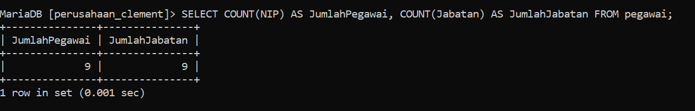

```css
SELECT COUNT(NIP) AS JumlahPegawai
    -> FROM pegawai
    -> WHERE NoCab = 'C102';
```

Penjelasan:
- **SELECT COUNT(NIP) AS JumlahPegawai**:
    
    - Fungsi `COUNT(NIP)` menghitung jumlah entri yang ada di kolom `NIP` dalam tabel `pegawai`.
    - `AS JumlahPegawai` memberikan alias pada hasil hitungan tersebut, yaitu `JumlahPegawai`. Hasilnya adalah jumlah total pegawai yang memiliki `NIP` (Nomor Induk Pegawai).
- **FROM pegawai**:
    
    - Perintah ini menunjukkan bahwa kueri akan dilakukan pada tabel yang bernama `pegawai`.
- **WHERE NoCab = 'C102'**:
    
    - Kondisi ini membatasi hasil kueri hanya pada baris-baris yang memiliki nilai `NoCab` sama dengan `'C102'`.
    - Dengan kata lain, kueri ini hanya menghitung pegawai yang bekerja di cabang dengan nomor `'C102'`.

Hasil:
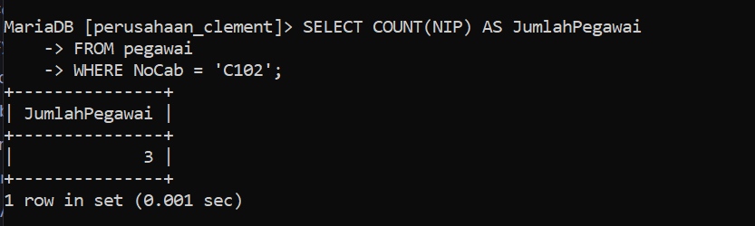

# SELECT NoCab
```css
SELECT NoCab, COUNT(NIP) AS Jumlah_Pegawai
    -> FROM pegawai
    -> GROUP BY NoCab;
```
Penjelasan:
- **SELECT NoCab, COUNT(NIP) AS Jumlah_Pegawai**:
    
    - **`NoCab`**: Kolom ini dipilih untuk ditampilkan dalam hasil kueri. Ini adalah kolom yang berisi nomor cabang (`NoCab`).
    - **`COUNT(NIP)`**: Fungsi ini menghitung jumlah entri yang ada di kolom `NIP` untuk setiap cabang.
    - **`AS Jumlah_Pegawai`**: Memberikan alias `Jumlah_Pegawai` pada hasil hitungan tersebut, yang menunjukkan jumlah pegawai di masing-masing cabang.
- **FROM pegawai**:
    
    - Perintah ini menunjukkan bahwa kueri akan dijalankan pada tabel yang bernama `pegawai`.
- **GROUP BY NoCab**:
    
    - Bagian ini mengelompokkan hasil kueri berdasarkan kolom `NoCab`. Dengan kata lain, kueri ini akan menghitung jumlah pegawai (`NIP`) untuk setiap nilai `NoCab`.
    - Tanpa perintah `GROUP BY`, fungsi agregat seperti `COUNT()` akan memberikan hasil hitungan untuk seluruh tabel tanpa memisahkan berdasarkan cabang.

Hasil:
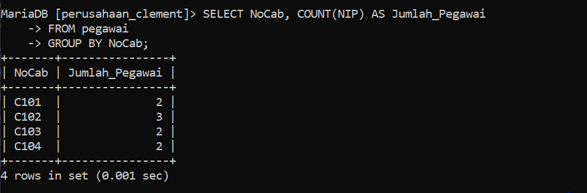

```css
SELECT NoCab, COUNT(NIP) AS Jumlah_pegawai
    -> FROM pegawai
    -> GROUP BY NoCab HAVING COUNT(NIP) >= 3;
```
Penjelasan:
- **SELECT NoCab, COUNT(NIP) AS Jumlah_pegawai**:
    
    - **`NoCab`**: Kolom ini dipilih untuk ditampilkan dalam hasil kueri, yaitu nomor cabang (`NoCab`).
    - **`COUNT(NIP)`**: Fungsi ini menghitung jumlah entri yang ada di kolom `NIP` untuk setiap cabang.
    - **`AS Jumlah_pegawai`**: Memberikan alias `Jumlah_pegawai` pada hasil hitungan tersebut, yang menunjukkan jumlah pegawai di setiap cabang.
- **FROM pegawai**:
    
    - Perintah ini menunjukkan bahwa kueri akan dijalankan pada tabel yang bernama `pegawai`.
- **GROUP BY NoCab**:
    
    - Perintah ini mengelompokkan hasil kueri berdasarkan kolom `NoCab`, sehingga kueri ini menghitung jumlah pegawai (`NIP`) untuk setiap cabang (`NoCab`).
- **HAVING COUNT(NIP) >= 3**:
    
    - Bagian `HAVING` digunakan untuk memfilter hasil yang sudah dikelompokkan oleh `GROUP BY`.
    - Kondisi `HAVING COUNT(NIP) >= 3` berarti hanya menyertakan cabang-cabang yang memiliki tiga atau lebih pegawai.
    - Berbeda dengan `WHERE`, `HAVING` digunakan setelah data dikelompokkan (setelah `GROUP BY`), sehingga bisa menerapkan kondisi pada hasil agregasi seperti `COUNT()`.

Hasil:
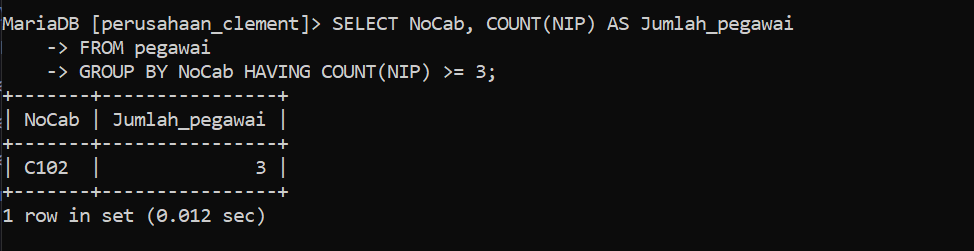

# SELECT SUM
```css
SELECT SUM(Gaji) AS Total_Gaji
    -> FROM pegawai;
```
Penjelasan:
- **SELECT SUM(Gaji) AS Total_Gaji**:
    
    - **`SUM(Gaji)`**: Fungsi `SUM()` digunakan untuk menjumlahkan semua nilai yang ada di kolom `Gaji` dalam tabel `pegawai`.
    - **`AS Total_Gaji`**: Alias `Total_Gaji` digunakan untuk memberikan nama pada hasil penjumlahan tersebut, sehingga kolom hasil akan diberi label `Total_Gaji`.
- **FROM pegawai**:
    
    - Bagian ini menunjukkan bahwa kueri akan dijalankan pada tabel yang bernama `pegawai`.

Hasil:
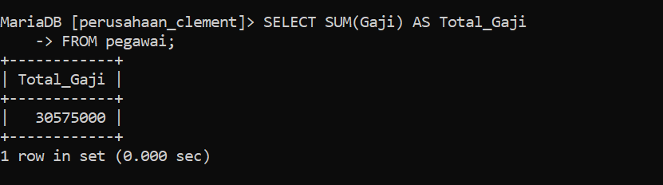

```css
SELECT SUM(Gaji) AS Gaji_Manajer
    -> FROM pegawai
    -> WHERE Jabatan = 'Manajer';
```
Penjelasan:
- **SELECT SUM(Gaji) AS Gaji_Manajer**:
    
    - **`SUM(Gaji)`**: Fungsi `SUM()` digunakan untuk menjumlahkan semua nilai yang ada di kolom `Gaji`, tetapi hanya untuk baris-baris yang memenuhi kondisi tertentu.
    - **`AS Gaji_Manajer`**: Alias `Gaji_Manajer` digunakan untuk memberikan nama pada hasil penjumlahan tersebut. Hasil ini akan menunjukkan total gaji dari semua pegawai yang memiliki jabatan 'Manajer'.
- **FROM pegawai**:
    
    - Perintah ini menunjukkan bahwa kueri akan dijalankan pada tabel yang bernama `pegawai`.
- **WHERE Jabatan = 'Manajer'**:
    
    - Kondisi `WHERE` ini menyaring data sehingga hanya baris-baris yang memiliki nilai `Jabatan` sama dengan 'Manajer' yang akan dipertimbangkan.
    - Dengan kata lain, penjumlahan gaji hanya akan dilakukan untuk pegawai yang memiliki jabatan 'Manajer'.

Hasil:
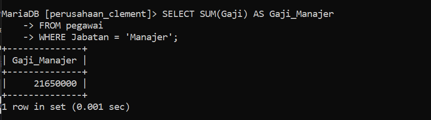

```css
SELECT NoCab, SUM(Gaji) AS TotalGaji
    -> FROM pegawai
    -> GROUP BY NoCab;
```
Penjelasan:
- **SELECT NoCab, SUM(Gaji) AS TotalGaji**:
    
    - **`NoCab`**: Kolom ini dipilih untuk ditampilkan dalam hasil kueri, yaitu nomor cabang (`NoCab`).
    - **`SUM(Gaji)`**: Fungsi `SUM()` digunakan untuk menjumlahkan semua nilai di kolom `Gaji` untuk setiap cabang.
    - **`AS TotalGaji`**: Alias `TotalGaji` digunakan untuk memberikan nama pada hasil penjumlahan tersebut. Kolom hasil akan diberi label `TotalGaji`, yang menunjukkan total gaji untuk setiap cabang.
- **FROM pegawai**:
    
    - Perintah ini menunjukkan bahwa kueri akan dijalankan pada tabel yang bernama `pegawai`.
- **GROUP BY NoCab**:
    
    - Perintah ini mengelompokkan hasil kueri berdasarkan kolom `NoCab`. Dengan kata lain, kueri ini akan menghitung total gaji (`SUM(Gaji)`) untuk setiap kelompok cabang (`NoCab`).
    - `GROUP BY` memastikan bahwa total gaji dihitung secara terpisah untuk setiap cabang.

Hasil:
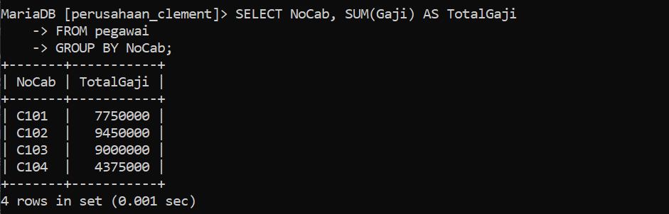

```css
SELECT NoCab, SUM(Gaji) AS Total_Gaji
    -> FROM pegawai
    -> GROUP BY NoCab HAVING SUM(Gaji) >= 8000000;
```
Penjelasan:
- **SELECT NoCab, SUM(Gaji) AS Total_Gaji**:
    
    - **`NoCab`**: Kolom ini dipilih untuk ditampilkan dalam hasil kueri, yaitu nomor cabang (`NoCab`).
    - **`SUM(Gaji)`**: Fungsi `SUM()` digunakan untuk menjumlahkan semua nilai di kolom `Gaji` untuk setiap cabang.
    - **`AS Total_Gaji`**: Alias `Total_Gaji` digunakan untuk memberikan nama pada hasil penjumlahan tersebut. Kolom hasil akan diberi label `Total_Gaji`, yang menunjukkan total gaji untuk setiap cabang.
- **FROM pegawai**:
    
    - Perintah ini menunjukkan bahwa kueri akan dijalankan pada tabel yang bernama `pegawai`.
- **GROUP BY NoCab**:
    
    - Perintah ini mengelompokkan hasil kueri berdasarkan kolom `NoCab`, sehingga total gaji (`SUM(Gaji)`) dihitung secara terpisah untuk setiap cabang (`NoCab`).
    - `GROUP BY` memastikan bahwa total gaji dihitung secara independen untuk setiap cabang.
- **HAVING SUM(Gaji) >= 8000000**:
    
    - Bagian `HAVING` ini menyaring hasil yang sudah dikelompokkan oleh `GROUP BY`.
    - Kondisi `HAVING SUM(Gaji) >= 8000000` berarti hanya menyertakan cabang-cabang yang memiliki total gaji sebesar 8.000.000 atau lebih.

Hasil:
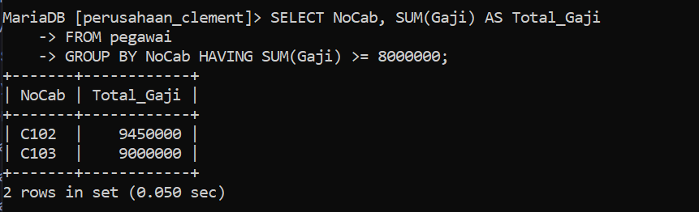

# AVG
```css
SELECT AVG(Gaji) AS GajiRataMgr
    -> FROM pegawai
    -> WHERE Jabatan = 'Manajer';
```
Penjelasan:
- **SELECT AVG(Gaji) AS GajiRataMgr**:
    
    - **`AVG(Gaji)`**: Fungsi `AVG()` digunakan untuk menghitung rata-rata dari semua nilai yang ada di kolom `Gaji`. Dalam hal ini, fungsi ini akan menghitung rata-rata gaji untuk pegawai yang memenuhi kondisi tertentu.
    - **`AS GajiRataMgr`**: Alias `GajiRataMgr` digunakan untuk memberikan nama pada hasil rata-rata tersebut. Kolom hasil akan diberi label `GajiRataMgr`, yang menunjukkan rata-rata gaji dari pegawai dengan jabatan 'Manajer'.
- **FROM pegawai**:
    
    - Perintah ini menunjukkan bahwa kueri akan dijalankan pada tabel yang bernama `pegawai`.
- **WHERE Jabatan = 'Manajer'**:
    
    - Kondisi `WHERE` ini menyaring data sehingga hanya baris-baris yang memiliki nilai `Jabatan` sama dengan 'Manajer' yang akan dipertimbangkan dalam perhitungan.
    - Dengan kata lain, `AVG(Gaji)` hanya akan dihitung untuk pegawai yang memiliki jabatan 'Manajer'.

Hasil:
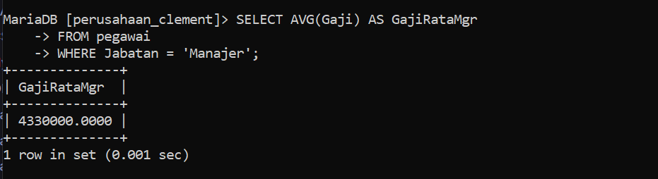

```css
 SELECT NoCab, AVG(Gaji) AS RataGaji
    -> FROM pegawai
    -> GROUP BY NoCab;
```
Penjelasan:
- **SELECT NoCab, AVG(Gaji) AS RataGaji**:
    
    - **`NoCab`**: Kolom ini dipilih untuk ditampilkan dalam hasil kueri. Ini adalah nomor cabang (`NoCab`).
    - **`AVG(Gaji)`**: Fungsi `AVG()` digunakan untuk menghitung rata-rata dari semua nilai di kolom `Gaji` untuk setiap cabang.
    - **`AS RataGaji`**: Alias `RataGaji` digunakan untuk memberikan nama pada hasil rata-rata tersebut. Kolom hasil akan diberi label `RataGaji`, yang menunjukkan rata-rata gaji di setiap cabang.
- **FROM pegawai**:
    
    - Perintah ini menunjukkan bahwa kueri akan dijalankan pada tabel yang bernama `pegawai`.
- **GROUP BY NoCab**:
    
    - Perintah ini mengelompokkan hasil kueri berdasarkan kolom `NoCab`. Dengan kata lain, `GROUP BY` memastikan bahwa fungsi agregat seperti `AVG(Gaji)` dihitung secara terpisah untuk setiap kelompok yang memiliki nomor cabang (`NoCab`).
    - Setiap grup akan dihitung rata-rata gajinya secara terpisah.

Hasil:
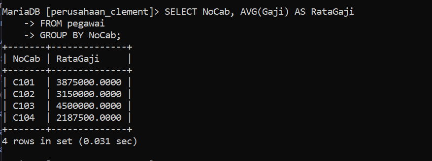

```css
SELECT NoCab, AVG(Gaji) AS RataGaji
    -> FROM pegawai
    -> GROUP BY NoCab HAVING NoCab = 'C101' OR NoCab = 'C102';
```
Penjelasan:
- **SELECT NoCab, AVG(Gaji) AS RataGaji**:
    
    - **`NoCab`**: Kolom ini dipilih untuk ditampilkan dalam hasil kueri. Ini adalah nomor cabang (`NoCab`).
    - **`AVG(Gaji)`**: Fungsi `AVG()` digunakan untuk menghitung rata-rata dari semua nilai di kolom `Gaji` untuk setiap cabang.
    - **`AS RataGaji`**: Alias `RataGaji` digunakan untuk memberikan nama pada hasil rata-rata tersebut. Kolom hasil akan diberi label `RataGaji`, yang menunjukkan rata-rata gaji di setiap cabang.
- **FROM pegawai**:
    
    - Perintah ini menunjukkan bahwa kueri akan dijalankan pada tabel yang bernama `pegawai`.
- **GROUP BY NoCab**:
    
    - Perintah ini mengelompokkan hasil kueri berdasarkan kolom `NoCab`. Dengan kata lain, `GROUP BY` memastikan bahwa fungsi agregat seperti `AVG(Gaji)` dihitung secara terpisah untuk setiap cabang.
- **HAVING NoCab = 'C101' OR NoCab = 'C102'**:
    
    - Bagian `HAVING` digunakan untuk memfilter hasil yang sudah dikelompokkan oleh `GROUP BY`.
    - Kondisi `HAVING NoCab = 'C101' OR NoCab = 'C102'` berarti hanya menyertakan cabang-cabang yang memiliki nomor cabang 'C101' atau 'C102' dalam hasil akhir.
    - `HAVING` digunakan untuk menerapkan kondisi pada hasil agregat setelah pengelompokan dilakukan oleh `GROUP BY`.

Hasil:
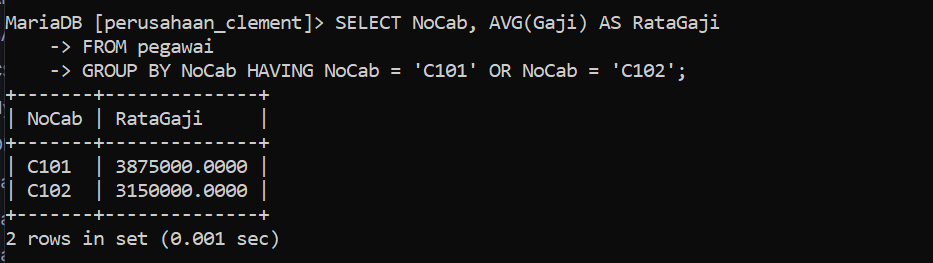

# MAX && MIN

```css
SELECT MAX(Gaji) AS GajiTerbesar, MIN(Gaji) AS GajiTerkecil
    -> FROM pegawai;
```
Penjelasan:

Hasil:
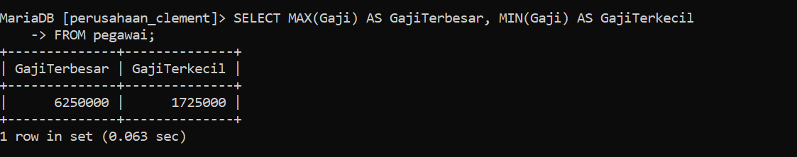

```css
 SELECT MAX(Gaji) AS GajiTerbesar, MIN(Gaji) AS GajiTerkecil
    -> FROM pegawai
    -> WHERE Jabatan = 'Manajer';
```
Penjelasan:
- **SELECT MAX(Gaji) AS GajiTerbesar, MIN(Gaji) AS GajiTerkecil**:
    
    - **`MAX(Gaji)`**: Fungsi `MAX()` digunakan untuk menemukan nilai maksimum dari kolom `Gaji`. Ini akan mengembalikan gaji tertinggi yang ada di tabel.
    - **`AS GajiTerbesar`**: Alias `GajiTerbesar` digunakan untuk memberi nama pada kolom hasil dari fungsi `MAX(Gaji)`. Kolom ini akan menampilkan nilai gaji terbesar.
    - **`MIN(Gaji)`**: Fungsi `MIN()` digunakan untuk menemukan nilai minimum dari kolom `Gaji`. Ini akan mengembalikan gaji terendah yang ada di tabel.
    - **`AS GajiTerkecil`**: Alias `GajiTerkecil` digunakan untuk memberi nama pada kolom hasil dari fungsi `MIN(Gaji)`. Kolom ini akan menampilkan nilai gaji terkecil.
- **FROM pegawai**:
    
    - Perintah ini menunjukkan bahwa kueri akan dijalankan pada tabel yang bernama `pegawai`.

Hasil:
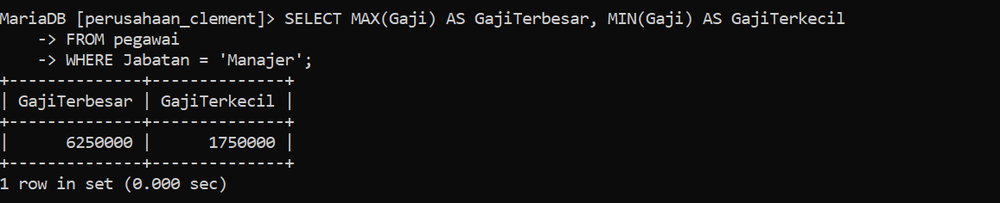

```css
 SELECT NoCab, MAX(Gaji) AS GajiTerbesar, MIN(Gaji) AS GajiTerkecil
    -> FROM pegawai
    -> GROUP BY NoCab;
```
Penjelasan:
- **SELECT NoCab, MAX(Gaji) AS GajiTerbesar, MIN(Gaji) AS GajiTerkecil**:
    
    - **`NoCab`**: Kolom ini dipilih untuk ditampilkan dalam hasil kueri. Ini adalah nomor cabang (`NoCab`).
    - **`MAX(Gaji)`**: Fungsi `MAX()` digunakan untuk menemukan nilai maksimum dari kolom `Gaji` untuk setiap cabang. Ini akan mengembalikan gaji tertinggi yang ada di setiap cabang.
    - **`AS GajiTerbesar`**: Alias `GajiTerbesar` digunakan untuk memberi nama pada kolom hasil dari fungsi `MAX(Gaji)`. Kolom ini akan menampilkan nilai gaji terbesar di setiap cabang.
    - **`MIN(Gaji)`**: Fungsi `MIN()` digunakan untuk menemukan nilai minimum dari kolom `Gaji` untuk setiap cabang. Ini akan mengembalikan gaji terendah yang ada di setiap cabang.
    - **`AS GajiTerkecil`**: Alias `GajiTerkecil` digunakan untuk memberi nama pada kolom hasil dari fungsi `MIN(Gaji)`. Kolom ini akan menampilkan nilai gaji terkecil di setiap cabang.
- **FROM pegawai**:
    
    - Perintah ini menunjukkan bahwa kueri akan dijalankan pada tabel yang bernama `pegawai`.
- **GROUP BY NoCab**:
    
    - Perintah ini mengelompokkan hasil kueri berdasarkan kolom `NoCab`. Dengan kata lain, `GROUP BY` memastikan bahwa fungsi agregat seperti `MAX(Gaji)` dan `MIN(Gaji)` dihitung secara terpisah untuk setiap cabang (`NoCab`).
    - Setiap kelompok akan dihitung nilai gaji tertinggi dan terendahnya secara terpisah.

Hasil:
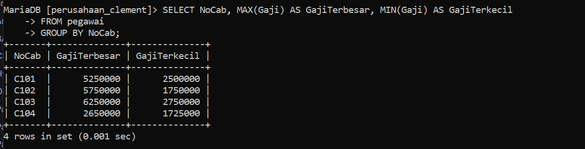

```css
SELECT NoCab, MAX(Gaji) AS GajiTerbesar, MIN(Gaji) AS GajiTerkecil
    -> FROM pegawai
    -> GROUP BY NoCab HAVING COUNT(NIP) >= 3;
```
Penjelasan:
- **SELECT NoCab, MAX(Gaji) AS GajiTerbesar, MIN(Gaji) AS GajiTerkecil**:
    
    - **`NoCab`**: Kolom ini dipilih untuk ditampilkan dalam hasil kueri. Ini adalah nomor cabang (`NoCab`).
    - **`MAX(Gaji)`**: Fungsi `MAX()` digunakan untuk menemukan nilai maksimum dari kolom `Gaji` untuk setiap cabang. Ini akan mengembalikan gaji tertinggi yang ada di setiap cabang.
    - **`AS GajiTerbesar`**: Alias `GajiTerbesar` digunakan untuk memberi nama pada kolom hasil dari fungsi `MAX(Gaji)`. Kolom ini akan menampilkan nilai gaji terbesar di setiap cabang.
    - **`MIN(Gaji)`**: Fungsi `MIN()` digunakan untuk menemukan nilai minimum dari kolom `Gaji` untuk setiap cabang. Ini akan mengembalikan gaji terendah yang ada di setiap cabang.
    - **`AS GajiTerkecil`**: Alias `GajiTerkecil` digunakan untuk memberi nama pada kolom hasil dari fungsi `MIN(Gaji)`. Kolom ini akan menampilkan nilai gaji terkecil di setiap cabang.
- **FROM pegawai**:
    
    - Perintah ini menunjukkan bahwa kueri akan dijalankan pada tabel yang bernama `pegawai`.
- **GROUP BY NoCab**:
    
    - Perintah ini mengelompokkan hasil kueri berdasarkan kolom `NoCab`. Dengan kata lain, `GROUP BY` memastikan bahwa fungsi agregat seperti `MAX(Gaji)` dan `MIN(Gaji)` dihitung secara terpisah untuk setiap cabang (`NoCab`).
    - Setiap kelompok (cabang) akan dihitung nilai gaji tertinggi dan terendahnya secara terpisah.
- **HAVING COUNT(NIP) >= 3**:
    
    - Bagian `HAVING` digunakan untuk memfilter hasil yang sudah dikelompokkan oleh `GROUP BY`.
    - Kondisi `HAVING COUNT(NIP) >= 3` berarti hanya cabang-cabang yang memiliki tiga atau lebih pegawai yang akan dimasukkan dalam hasil akhir.
    - `COUNT(NIP)` menghitung jumlah pegawai (baris) dalam setiap kelompok (cabang). Hanya cabang dengan jumlah pegawai minimal 3 yang akan ditampilkan.

Hasil:
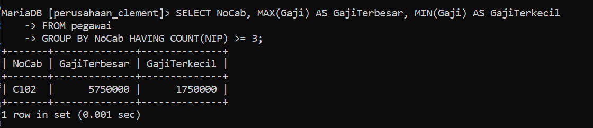

# Gabungan 
```css
 SELECT COUNT(NIP) AS JumlahPegawai, SUM(Gaji) AS TotalGaji,
    -> AVG(Gaji) AS RataGaji, MAX(Gaji) AS GajiMaks, MIN(Gaji) AS GajiMin
    -> FROM pegawai;
```
Penjelasan:
- **SELECT COUNT(NIP) AS JumlahPegawai**:
    
    - **`COUNT(NIP)`**: Fungsi `COUNT()` digunakan untuk menghitung jumlah total pegawai berdasarkan kolom `NIP`. Fungsi ini menghitung jumlah baris dalam tabel yang memiliki nilai tidak `NULL` di kolom `NIP`.
    - **`AS JumlahPegawai`**: Alias `JumlahPegawai` digunakan untuk memberi nama pada kolom hasil dari fungsi `COUNT(NIP)`. Kolom ini akan menampilkan jumlah total pegawai.
- **SUM(Gaji) AS TotalGaji**:
    
    - **`SUM(Gaji)`**: Fungsi `SUM()` digunakan untuk menjumlahkan semua nilai di kolom `Gaji`. Ini memberikan total gaji yang dibayarkan kepada semua pegawai dalam tabel.
    - **`AS TotalGaji`**: Alias `TotalGaji` digunakan untuk memberi nama pada kolom hasil dari fungsi `SUM(Gaji)`. Kolom ini akan menampilkan total gaji.
- **AVG(Gaji) AS RataGaji**:
    
    - **`AVG(Gaji)`**: Fungsi `AVG()` digunakan untuk menghitung rata-rata nilai di kolom `Gaji`. Ini memberikan nilai rata-rata gaji pegawai.
    - **`AS RataGaji`**: Alias `RataGaji` digunakan untuk memberi nama pada kolom hasil dari fungsi `AVG(Gaji)`. Kolom ini akan menampilkan rata-rata gaji.
- **MAX(Gaji) AS GajiMaks**:
    
    - **`MAX(Gaji)`**: Fungsi `MAX()` digunakan untuk menemukan nilai maksimum dari kolom `Gaji`. Ini memberikan gaji tertinggi yang ada di tabel.
    - **`AS GajiMaks`**: Alias `GajiMaks` digunakan untuk memberi nama pada kolom hasil dari fungsi `MAX(Gaji)`. Kolom ini akan menampilkan gaji terbesar.
- **MIN(Gaji) AS GajiMin**:
    
    - **`MIN(Gaji)`**: Fungsi `MIN()` digunakan untuk menemukan nilai minimum dari kolom `Gaji`. Ini memberikan gaji terendah yang ada di tabel.
    - **`AS GajiMin`**: Alias `GajiMin` digunakan untuk memberi nama pada kolom hasil dari fungsi `MIN(Gaji)`. Kolom ini akan menampilkan gaji terkecil.
- **FROM pegawai**:
    
    - Perintah ini menunjukkan bahwa kueri akan dijalankan pada tabel yang bernama `pegawai`.

Hasil:
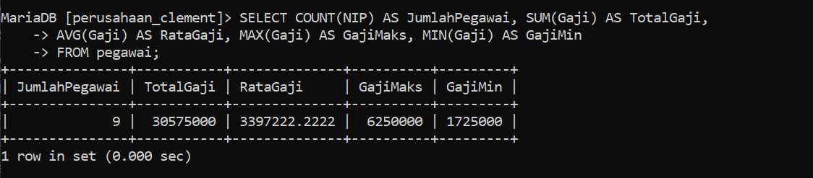

```css
SELECT COUNT(NIP) AS JumlahPegawai, SUM(Gaji) AS TotalGaji,
    -> AVG(Gaji) AS RataGaji, MAX(Gaji) AS GajiMaks, MIN(Gaji) AS GajiMin
    -> FROM pegawai
    -> WHERE Jabatan = 'Staf' OR Jabatan = 'Sales'
    -> GROUP BY NoCab HAVING SUM(Gaji) <= 2600000;
```
Penjelasan:
- **SELECT COUNT(NIP) AS JumlahPegawai, SUM(Gaji) AS TotalGaji, AVG(Gaji) AS RataGaji, MAX(Gaji) AS GajiMaks, MIN(Gaji) AS GajiMin**:
    
    - **`COUNT(NIP)`**: Fungsi `COUNT()` menghitung jumlah pegawai berdasarkan kolom `NIP` yang memenuhi kriteria (dalam hal ini, pegawai dengan jabatan 'Staf' atau 'Sales').
    - **`AS JumlahPegawai`**: Alias `JumlahPegawai` digunakan untuk memberi nama pada kolom hasil dari fungsi `COUNT(NIP)`. Kolom ini akan menampilkan jumlah pegawai.
    - **`SUM(Gaji)`**: Fungsi `SUM()` menghitung total gaji dari pegawai yang memenuhi kriteria.
    - **`AS TotalGaji`**: Alias `TotalGaji` digunakan untuk memberi nama pada kolom hasil dari fungsi `SUM(Gaji)`. Kolom ini akan menampilkan total gaji.
    - **`AVG(Gaji)`**: Fungsi `AVG()` menghitung rata-rata gaji dari pegawai yang memenuhi kriteria.
    - **`AS RataGaji`**: Alias `RataGaji` digunakan untuk memberi nama pada kolom hasil dari fungsi `AVG(Gaji)`. Kolom ini akan menampilkan rata-rata gaji.
    - **`MAX(Gaji)`**: Fungsi `MAX()` menemukan gaji tertinggi di antara pegawai yang memenuhi kriteria.
    - **`AS GajiMaks`**: Alias `GajiMaks` digunakan untuk memberi nama pada kolom hasil dari fungsi `MAX(Gaji)`. Kolom ini akan menampilkan gaji terbesar.
    - **`MIN(Gaji)`**: Fungsi `MIN()` menemukan gaji terendah di antara pegawai yang memenuhi kriteria.
    - **`AS GajiMin`**: Alias `GajiMin` digunakan untuk memberi nama pada kolom hasil dari fungsi `MIN(Gaji)`. Kolom ini akan menampilkan gaji terkecil.
- **FROM pegawai**:
    
    - Perintah ini menunjukkan bahwa kueri akan dijalankan pada tabel yang bernama `pegawai`.
- **WHERE Jabatan = 'Staf' OR Jabatan = 'Sales'**:
    
    - Bagian `WHERE` digunakan untuk memfilter baris berdasarkan kondisi yang diberikan.
    - Kondisi `Jabatan = 'Staf' OR Jabatan = 'Sales'` berarti hanya pegawai yang memiliki jabatan 'Staf' atau 'Sales' yang akan dipertimbangkan dalam perhitungan agregat.
- **GROUP BY NoCab**:
    
    - Perintah ini mengelompokkan hasil kueri berdasarkan kolom `NoCab`. Dengan kata lain, `GROUP BY` memastikan bahwa statistik agregat dihitung secara terpisah untuk setiap cabang (`NoCab`).
- **HAVING SUM(Gaji) <= 2600000**:
    
    - Bagian `HAVING` digunakan untuk memfilter hasil yang sudah dikelompokkan oleh `GROUP BY`.
    - Kondisi `SUM(Gaji) <= 2600000` berarti hanya cabang-cabang di mana total gaji pegawai yang memiliki jabatan 'Staf' atau 'Sales' tidak lebih dari 2.600.000 yang akan ditampilkan dalam hasil.

Hasil:
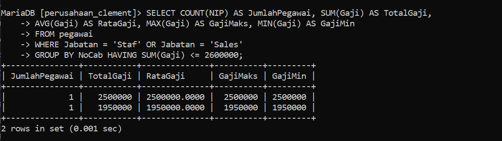


 