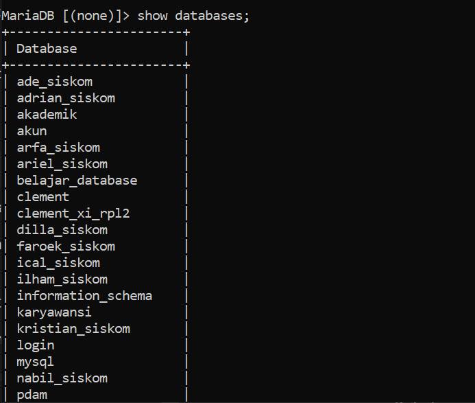
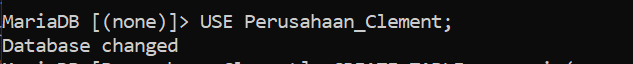
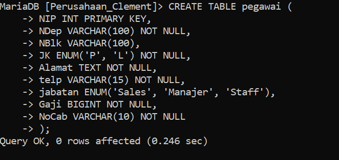
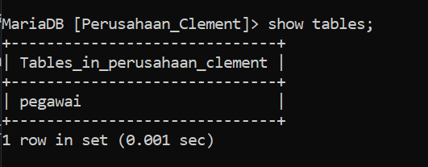
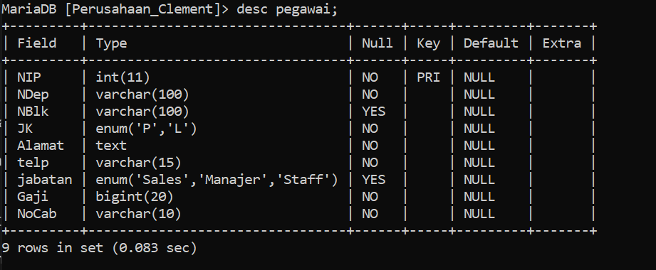
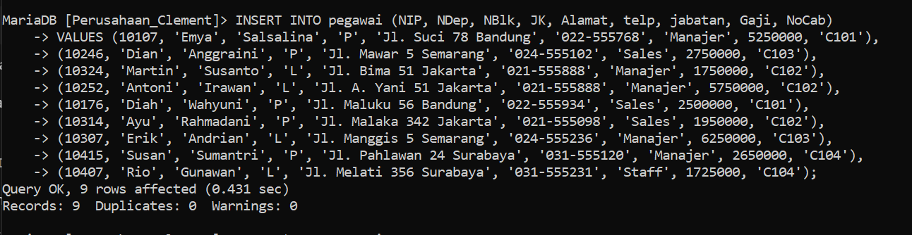
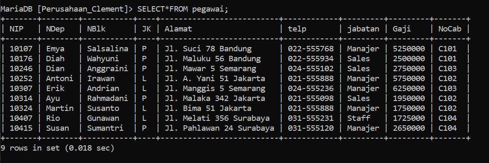

Pada sesi praktik kali ini, kita akan menyusun sebuah database perusahaan yang lengkap dengan tabel pegawai di dalamnya. Untuk memulainya, langkah pertama adalah membuat database yang akan menjadi wadah bagi tabel pegawai kita. Langkah-langkahnya adalah sebagai berikut:

 1.***Langkah-Langkah pembuatan database pada Shell**

Langkah pertama dalam pembuatan table perusahaan adalah membuat sebuah database yang akan kita gunakan untuk kedepannya.
```shell
CREATE DATABASE "Nama Database";
=================================
CREATE DATABASE Perusahaan_Clement;
```

Penjelasan :
#### **CREATE DATABASE**:

- **CREATE**: Kata kunci ini digunakan untuk membuat atau membangun sesuatu yang baru dalam sistem database.
- **DATABASE**: Menyatakan bahwa objek yang akan dibuat adalah sebuah database.

#### 2. **Perusahaan_Clement**:

- Ini adalah nama dari database yang akan dibuat. Dalam hal ini, nama database yang diinginkan adalah `Perusahaan_Clement`.

Hasil : 


2.**memastikan database berhasil dibuat**

Langkah kedua adalah melihat database yang sudah dibuat apakah berhasil atau tidak dengan menggunakan query `show`.

```shell
show databases;
```

Penjelasan : 
#### 1. **SHOW**:

- Kata kunci `SHOW` digunakan dalam SQL untuk meminta informasi dari sistem manajemen basis data (DBMS).
- Perintah ini menampilkan berbagai jenis metadata atau informasi tentang struktur database, seperti daftar database, tabel, kolom, dan lainnya.

#### 2. **DATABASES**:

- Kata kunci `DATABASES` menginstruksikan DBMS untuk menampilkan daftar semua database yang tersedia di server DBMS saat ini.
- Dengan kata lain, perintah ini meminta DBMS untuk mengembalikan daftar nama semua database yang ada.

Hasil : 


3.**Masuk kedalam Database yang sudah dibuat**

ketika sudah memastikan database sudah berhasil dibuat langkah selanjutnya kita akan masuk kedalam database yang akan kita gunakan menggunakan query `use`.

```shell
use "Nama_database";
========================
use pegawai;
```

Penjelasan : 
#### 1. **USE**:

- Kata kunci `USE` digunakan dalam SQL untuk memilih dan mengaktifkan sebuah database tertentu untuk digunakan dalam sesi kerja saat ini.
- Ketika Anda menjalankan query ini, Anda memberi tahu sistem manajemen basis data (DBMS) bahwa semua perintah SQL berikutnya akan diterapkan pada database yang disebutkan.

#### 2. **Perusahaan_Clement**:

- Ini adalah nama database yang akan diaktifkan atau dipilih.
- Dalam hal ini, nama database yang ingin Anda gunakan adalah `Perusahaan_Clement`.

Hasil : 


4.**Membuat table dalam database**

ketika sudah masuk kedalam database langkah selanjutnya adalah membuat table pada database dengan menggunakan query dibawah ini : 

```shell
CREATE TABLE pegawai (
    NIP INT PRIMARY KEY,
    NDep VARCHAR(100) NOT NULL,
    NBlk VARCHAR(100),
    JK ENUM('P', 'L') NOT NULL,
    Alamat TEXT NOT NULL,
    telp VARCHAR(15) NOT NULL,
    jabatan ENUM('Sales', 'Manajer', 'Staff'),
    Gaji BIGINT NOT NULL,
    NoCab VARCHAR(10) NOT NULL
);
```

Penjelasan : 
#### 1. **CREATE TABLE pegawai**:

- **CREATE TABLE**: Perintah ini digunakan untuk membuat tabel baru di dalam database.
- **pegawai**: Nama tabel yang akan dibuat adalah `pegawai`.

#### 2. **Kolom-kolom dalam Tabel pegawai**:

- **NIP INT PRIMARY KEY**:
    
    - **NIP**: Nama kolom untuk Nomor Induk Pegawai.
    - **INT**: Tipe data integer (bilangan bulat).
    - **PRIMARY KEY**: Menandakan bahwa kolom ini adalah kunci utama tabel. Setiap nilai dalam kolom ini harus unik dan tidak boleh NULL.
- **NDep VARCHAR(100) NOT NULL**:
    
    - **NDep**: Nama kolom untuk Nama Depan Pegawai.
    - **VARCHAR(100)**: Tipe data karakter dengan panjang maksimum 100 karakter.
    - **NOT NULL**: Menandakan bahwa kolom ini tidak boleh kosong.
- **NBlk VARCHAR(100)**:
    
    - **NBlk**: Nama kolom untuk Nama Belakang Pegawai.
    - **VARCHAR(100)**: Tipe data karakter dengan panjang maksimum 100 karakter.
    - Kolom ini tidak memiliki constraint `NOT NULL`, sehingga boleh kosong.
- **JK ENUM('P', 'L') NOT NULL**:
    
    - **JK**: Nama kolom untuk Jenis Kelamin.
    - **ENUM('P', 'L')**: Tipe data enumerasi dengan nilai yang diperbolehkan 'P' (Perempuan) dan 'L' (Laki-laki).
    - **NOT NULL**: Menandakan bahwa kolom ini tidak boleh kosong.
- **Alamat TEXT NOT NULL**:
    
    - **Alamat**: Nama kolom untuk alamat pegawai.
    - **TEXT**: Tipe data teks dengan panjang yang tidak terbatas.
    - **NOT NULL**: Menandakan bahwa kolom ini tidak boleh kosong.
- **telp VARCHAR(15) NOT NULL**:
    
    - **telp**: Nama kolom untuk nomor telepon pegawai.
    - **VARCHAR(15)**: Tipe data karakter dengan panjang maksimum 15 karakter.
    - **NOT NULL**: Menandakan bahwa kolom ini tidak boleh kosong.
- **jabatan ENUM('Sales', 'Manajer', 'Staff')**:
    
    - **jabatan**: Nama kolom untuk jabatan pegawai.
    - **ENUM('Sales', 'Manajer', 'Staff')**: Tipe data enumerasi dengan nilai yang diperbolehkan 'Sales', 'Manajer', dan 'Staff'.
    - Kolom ini tidak memiliki constraint `NOT NULL`, sehingga boleh kosong.
- **Gaji BIGINT NOT NULL**:
    
    - **Gaji**: Nama kolom untuk gaji pegawai.
    - **BIGINT**: Tipe data integer dengan rentang nilai yang sangat besar.
    - **NOT NULL**: Menandakan bahwa kolom ini tidak boleh kosong.
- **NoCab VARCHAR(10) NOT NULL**:
    
    - **NoCab**: Nama kolom untuk nomor cabang.
    - **VARCHAR(10)**: Tipe data karakter dengan panjang maksimum 10 karakter.
    - **NOT NULL**: Menandakan bahwa kolom ini tidak boleh kosong.

Hasil : 


5.**Memastikan table berhasil dibuat**

Ketika sudah membuat tabel pastikan tabel yang dibuat berhasil dibuat dengan menggunakan query `show`.

```shell
show tables;
```
Penjelasan : 
#### 1. **SHOW**:

- Kata kunci `SHOW` digunakan dalam SQL untuk meminta informasi dari sistem manajemen basis data (DBMS).
- Perintah ini menampilkan berbagai jenis metadata atau informasi tentang struktur database, seperti daftar database, tabel, kolom, dan lainnya.

#### 2. **TABLES**:

- Kata kunci `TABLES` menginstruksikan DBMS untuk menampilkan daftar semua tabel yang ada dalam database yang sedang aktif atau dipilih.
- Ini berarti perintah akan mengembalikan nama-nama semua tabel yang ada dalam database yang sedang digunakan.

Hasil : 


6.**Memastikan structur table sesuai atau benar**

Langkah selanjutnya setelah melihat table berhasil dibuat adalah memastikan bahwa struktur table sesuai dengan yang kita inginkan menggunakan query `desc`.

```shell
desc "Nama_database";
========================
desc pegawai;
```
Penjelasan : 
#### 1. **DESC**:

- `DESC` adalah singkatan dari `DESCRIBE`.
- Perintah ini digunakan untuk menampilkan struktur atau definisi dari sebuah tabel, termasuk informasi mengenai kolom-kolom dalam tabel tersebut.

#### 2. **pegawai**:

- Ini adalah nama tabel yang ingin Anda deskripsikan.
- Dalam konteks ini, `pegawai` adalah tabel yang telah Anda buat atau yang ada di database.

Hasil : 


7.**Memasukan data kedalam table**

Langkah selanjutnya adalah memasukan data kedalam table dengan langkah-langkah seperti berikut ini.

```shell 
INSERT INTO pegawai (NIP, NDep, NBlk, JK, Alamat, telp, jabatan, Gaji, NoCab) 
VALUES (10107, 'Emya', 'Salsalina', 'P', 'Jl. Suci 78 Bandung', '022-555768', 'Manajer', 5250000, 'C101'),
(10246, 'Dian', 'Anggraini', 'P', 'Jl. Mawar 5 Semarang', '024-555102', 'Sales', 2750000, 'C103'),
(10324, 'Martin', 'Susanto', 'L', 'Jl. Bima 51 Jakarta', '021-555888', 'Manajer', 1750000, 'C102'),
(10252, 'Antoni', 'Irawan', 'L', 'Jl. A. Yani 51 Jakarta', '021-555888', 'Manajer', 5750000, 'C102'),
(10176, 'Diah', 'Wahyuni', 'P', 'Jl. Maluku 56 Bandung', '022-555934', 'Sales', 2500000, 'C101'),
(10314, 'Ayu', 'Rahmadani', 'P', 'Jl. Malaka 342 Jakarta', '021-555098', 'Sales', 1950000, 'C102'),
(10307, 'Erik', 'Andrian', 'L', 'Jl. Manggis 5 Semarang', '024-555236', 'Manajer', 6250000, 'C103'),
(10415, 'Susan', 'Sumantri', 'P', 'Jl. Pahlawan 24 Surabaya', '031-555120', 'Manajer', 2650000, 'C104'),
(10407, 'Rio', 'Gunawan', 'L', 'Jl. Melati 356 Surabaya', '031-555231', 'Staff', 1725000, 'C104');
```

Penjelasan :
#### 1. **INSERT INTO pegawai**:

- **INSERT INTO**: Perintah ini digunakan untuk menambahkan data baru ke dalam tabel.
- **pegawai**: Nama tabel di mana data baru akan dimasukkan.

#### 2. **(NIP, NDep, NBlk, JK, Alamat, telp, jabatan, Gaji, NoCab)**:

- Daftar kolom yang akan diisi dengan nilai-nilai baru.
- Kolom-kolom ini mencakup: `NIP` (Nomor Induk Pegawai), `NDep` (Nama Depan), `NBlk` (Nama Belakang), `JK` (Jenis Kelamin), `Alamat`, `telp` (telepon), `jabatan`, `Gaji`, dan `NoCab` (Nomor Cabang).

#### 3. **VALUES**:

- Kata kunci ini digunakan untuk memasukkan nilai-nilai yang sesuai dengan kolom-kolom yang disebutkan.
- Setelah `VALUES`, terdapat serangkaian nilai yang sesuai dengan urutan kolom yang telah disebutkan.

Hasil : 


8.**Memastikan data berhasil masuk**

Langkah selanjutnya ketika sudah memasukan data adalah memastikan data masuk kedalam table dengan langkah-langkah berikut.

```shell
SELECT*FROM "Nama_table";
==============================
SELECT*FROM pegawai;
```
Penjelasan : 
#### 1. **SELECT**:

- Kata kunci `SELECT` digunakan untuk mengambil data dari tabel dalam database.
- Perintah ini memberitahu DBMS bahwa Anda ingin memilih atau menampilkan data.

#### 2. *****:

- Tanda bintang `*` adalah wildcard yang digunakan untuk memilih semua kolom dalam tabel.
- Ini berarti bahwa query ini akan mengambil semua kolom yang ada di tabel `pegawai`.

#### 3. **FROM**:

- Kata kunci `FROM` digunakan untuk menentukan tabel mana yang akan diambil datanya.
- Ini menginstruksikan DBMS untuk mengambil data dari tabel yang disebutkan setelah kata kunci ini.

#### 4. **pegawai**:

- Ini adalah nama tabel dari mana data akan diambil.
- Dalam konteks ini, `pegawai` adalah tabel yang berisi informasi tentang pegawai.

Hasil : 


 