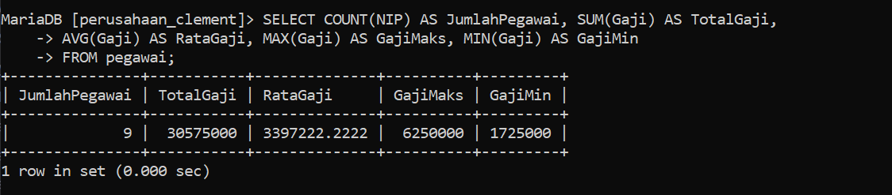

# Pembuatan DataBase
Pada sesi praktik kali ini, kita akan menyusun sebuah database perusahaan yang lengkap dengan tabel pegawai di dalamnya. Untuk memulainya, langkah pertama adalah membuat database yang akan menjadi wadah bagi tabel pegawai kita. Langkah-langkahnya adalah sebagai berikut:

 1.***Langkah-Langkah pembuatan database pada Shell**

Langkah pertama dalam pembuatan table perusahaan adalah membuat sebuah database yang akan kita gunakan untuk kedepannya.
```shell
CREATE DATABASE "Nama Database";
=================================
CREATE DATABASE Perusahaan_Clement;
```

Penjelasan :
#### **CREATE DATABASE**:

- **CREATE**: Kata kunci ini digunakan untuk membuat atau membangun sesuatu yang baru dalam sistem database.
- **DATABASE**: Menyatakan bahwa objek yang akan dibuat adalah sebuah database.

#### 2. **Perusahaan_Clement**:

- Ini adalah nama dari database yang akan dibuat. Dalam hal ini, nama database yang diinginkan adalah `Perusahaan_Clement`.

Hasil : 


2.**memastikan database berhasil dibuat**

Langkah kedua adalah melihat database yang sudah dibuat apakah berhasil atau tidak dengan menggunakan query `show`.

```shell
show databases;
```

Penjelasan : 
#### 1. **SHOW**:

- Kata kunci `SHOW` digunakan dalam SQL untuk meminta informasi dari sistem manajemen basis data (DBMS).
- Perintah ini menampilkan berbagai jenis metadata atau informasi tentang struktur database, seperti daftar database, tabel, kolom, dan lainnya.

#### 2. **DATABASES**:

- Kata kunci `DATABASES` menginstruksikan DBMS untuk menampilkan daftar semua database yang tersedia di server DBMS saat ini.
- Dengan kata lain, perintah ini meminta DBMS untuk mengembalikan daftar nama semua database yang ada.

Hasil : 


3.**Masuk kedalam Database yang sudah dibuat**

ketika sudah memastikan database sudah berhasil dibuat langkah selanjutnya kita akan masuk kedalam database yang akan kita gunakan menggunakan query `use`.

```shell
use "Nama_database";
========================
use pegawai;
```

Penjelasan : 
#### 1. **USE**:

- Kata kunci `USE` digunakan dalam SQL untuk memilih dan mengaktifkan sebuah database tertentu untuk digunakan dalam sesi kerja saat ini.
- Ketika Anda menjalankan query ini, Anda memberi tahu sistem manajemen basis data (DBMS) bahwa semua perintah SQL berikutnya akan diterapkan pada database yang disebutkan.

#### 2. **Perusahaan_Clement**:

- Ini adalah nama database yang akan diaktifkan atau dipilih.
- Dalam hal ini, nama database yang ingin Anda gunakan adalah `Perusahaan_Clement`.

Hasil : 


4.**Membuat table dalam database**

ketika sudah masuk kedalam database langkah selanjutnya adalah membuat table pada database dengan menggunakan query dibawah ini : 

```shell
CREATE TABLE pegawai (
    NIP INT PRIMARY KEY,
    NDep VARCHAR(100) NOT NULL,
    NBlk VARCHAR(100),
    JK ENUM('P', 'L') NOT NULL,
    Alamat TEXT NOT NULL,
    telp VARCHAR(15) NOT NULL,
    jabatan ENUM('Sales', 'Manajer', 'Staff'),
    Gaji BIGINT NOT NULL,
    NoCab VARCHAR(10) NOT NULL
);
```

Penjelasan : 
#### 1. **CREATE TABLE pegawai**:

- **CREATE TABLE**: Perintah ini digunakan untuk membuat tabel baru di dalam database.
- **pegawai**: Nama tabel yang akan dibuat adalah `pegawai`.

#### 2. **Kolom-kolom dalam Tabel pegawai**:

- **NIP INT PRIMARY KEY**:
    
    - **NIP**: Nama kolom untuk Nomor Induk Pegawai.
    - **INT**: Tipe data integer (bilangan bulat).
    - **PRIMARY KEY**: Menandakan bahwa kolom ini adalah kunci utama tabel. Setiap nilai dalam kolom ini harus unik dan tidak boleh NULL.
- **NDep VARCHAR(100) NOT NULL**:
    
    - **NDep**: Nama kolom untuk Nama Depan Pegawai.
    - **VARCHAR(100)**: Tipe data karakter dengan panjang maksimum 100 karakter.
    - **NOT NULL**: Menandakan bahwa kolom ini tidak boleh kosong.
- **NBlk VARCHAR(100)**:
    
    - **NBlk**: Nama kolom untuk Nama Belakang Pegawai.
    - **VARCHAR(100)**: Tipe data karakter dengan panjang maksimum 100 karakter.
    - Kolom ini tidak memiliki constraint `NOT NULL`, sehingga boleh kosong.
- **JK ENUM('P', 'L') NOT NULL**:
    
    - **JK**: Nama kolom untuk Jenis Kelamin.
    - **ENUM('P', 'L')**: Tipe data enumerasi dengan nilai yang diperbolehkan 'P' (Perempuan) dan 'L' (Laki-laki).
    - **NOT NULL**: Menandakan bahwa kolom ini tidak boleh kosong.
- **Alamat TEXT NOT NULL**:
    
    - **Alamat**: Nama kolom untuk alamat pegawai.
    - **TEXT**: Tipe data teks dengan panjang yang tidak terbatas.
    - **NOT NULL**: Menandakan bahwa kolom ini tidak boleh kosong.
- **telp VARCHAR(15) NOT NULL**:
    
    - **telp**: Nama kolom untuk nomor telepon pegawai.
    - **VARCHAR(15)**: Tipe data karakter dengan panjang maksimum 15 karakter.
    - **NOT NULL**: Menandakan bahwa kolom ini tidak boleh kosong.
- **jabatan ENUM('Sales', 'Manajer', 'Staff')**:
    
    - **jabatan**: Nama kolom untuk jabatan pegawai.
    - **ENUM('Sales', 'Manajer', 'Staff')**: Tipe data enumerasi dengan nilai yang diperbolehkan 'Sales', 'Manajer', dan 'Staff'.
    - Kolom ini tidak memiliki constraint `NOT NULL`, sehingga boleh kosong.
- **Gaji BIGINT NOT NULL**:
    
    - **Gaji**: Nama kolom untuk gaji pegawai.
    - **BIGINT**: Tipe data integer dengan rentang nilai yang sangat besar.
    - **NOT NULL**: Menandakan bahwa kolom ini tidak boleh kosong.
- **NoCab VARCHAR(10) NOT NULL**:
    
    - **NoCab**: Nama kolom untuk nomor cabang.
    - **VARCHAR(10)**: Tipe data karakter dengan panjang maksimum 10 karakter.
    - **NOT NULL**: Menandakan bahwa kolom ini tidak boleh kosong.

Hasil : 


5.**Memastikan table berhasil dibuat**

Ketika sudah membuat tabel pastikan tabel yang dibuat berhasil dibuat dengan menggunakan query `show`.

```shell
show tables;
```
Penjelasan : 
#### 1. **SHOW**:

- Kata kunci `SHOW` digunakan dalam SQL untuk meminta informasi dari sistem manajemen basis data (DBMS).
- Perintah ini menampilkan berbagai jenis metadata atau informasi tentang struktur database, seperti daftar database, tabel, kolom, dan lainnya.

#### 2. **TABLES**:

- Kata kunci `TABLES` menginstruksikan DBMS untuk menampilkan daftar semua tabel yang ada dalam database yang sedang aktif atau dipilih.
- Ini berarti perintah akan mengembalikan nama-nama semua tabel yang ada dalam database yang sedang digunakan.

Hasil : 


6.**Memastikan structur table sesuai atau benar**

Langkah selanjutnya setelah melihat table berhasil dibuat adalah memastikan bahwa struktur table sesuai dengan yang kita inginkan menggunakan query `desc`.

```shell
desc "Nama_database";
========================
desc pegawai;
```
Penjelasan : 
#### 1. **DESC**:

- `DESC` adalah singkatan dari `DESCRIBE`.
- Perintah ini digunakan untuk menampilkan struktur atau definisi dari sebuah tabel, termasuk informasi mengenai kolom-kolom dalam tabel tersebut.

#### 2. **pegawai**:

- Ini adalah nama tabel yang ingin Anda deskripsikan.
- Dalam konteks ini, `pegawai` adalah tabel yang telah Anda buat atau yang ada di database.

Hasil : 


7.**Memasukan data kedalam table**

Langkah selanjutnya adalah memasukan data kedalam table dengan langkah-langkah seperti berikut ini.

```shell 
INSERT INTO pegawai (NIP, NDep, NBlk, JK, Alamat, telp, jabatan, Gaji, NoCab) 
VALUES (10107, 'Emya', 'Salsalina', 'P', 'Jl. Suci 78 Bandung', '022-555768', 'Manajer', 5250000, 'C101'),
(10246, 'Dian', 'Anggraini', 'P', 'Jl. Mawar 5 Semarang', '024-555102', 'Sales', 2750000, 'C103'),
(10324, 'Martin', 'Susanto', 'L', 'Jl. Bima 51 Jakarta', '021-555888', 'Manajer', 1750000, 'C102'),
(10252, 'Antoni', 'Irawan', 'L', 'Jl. A. Yani 51 Jakarta', '021-555888', 'Manajer', 5750000, 'C102'),
(10176, 'Diah', 'Wahyuni', 'P', 'Jl. Maluku 56 Bandung', '022-555934', 'Sales', 2500000, 'C101'),
(10314, 'Ayu', 'Rahmadani', 'P', 'Jl. Malaka 342 Jakarta', '021-555098', 'Sales', 1950000, 'C102'),
(10307, 'Erik', 'Andrian', 'L', 'Jl. Manggis 5 Semarang', '024-555236', 'Manajer', 6250000, 'C103'),
(10415, 'Susan', 'Sumantri', 'P', 'Jl. Pahlawan 24 Surabaya', '031-555120', 'Manajer', 2650000, 'C104'),
(10407, 'Rio', 'Gunawan', 'L', 'Jl. Melati 356 Surabaya', '031-555231', 'Staff', 1725000, 'C104');
```

Penjelasan :
#### 1. **INSERT INTO pegawai**:

- **INSERT INTO**: Perintah ini digunakan untuk menambahkan data baru ke dalam tabel.
- **pegawai**: Nama tabel di mana data baru akan dimasukkan.

#### 2. **(NIP, NDep, NBlk, JK, Alamat, telp, jabatan, Gaji, NoCab)**:

- Daftar kolom yang akan diisi dengan nilai-nilai baru.
- Kolom-kolom ini mencakup: `NIP` (Nomor Induk Pegawai), `NDep` (Nama Depan), `NBlk` (Nama Belakang), `JK` (Jenis Kelamin), `Alamat`, `telp` (telepon), `jabatan`, `Gaji`, dan `NoCab` (Nomor Cabang).

#### 3. **VALUES**:

- Kata kunci ini digunakan untuk memasukkan nilai-nilai yang sesuai dengan kolom-kolom yang disebutkan.
- Setelah `VALUES`, terdapat serangkaian nilai yang sesuai dengan urutan kolom yang telah disebutkan.

Hasil : 


8.**Memastikan data berhasil masuk**

Langkah selanjutnya ketika sudah memasukan data adalah memastikan data masuk kedalam table dengan langkah-langkah berikut.

```shell
SELECT*FROM "Nama_table";
==============================
SELECT*FROM pegawai;
```
Penjelasan : 
#### 1. **SELECT**:

- Kata kunci `SELECT` digunakan untuk mengambil data dari tabel dalam database.
- Perintah ini memberitahu DBMS bahwa Anda ingin memilih atau menampilkan data.

#### 2. *****:

- Tanda bintang `*` adalah wildcard yang digunakan untuk memilih semua kolom dalam tabel.
- Ini berarti bahwa query ini akan mengambil semua kolom yang ada di tabel `pegawai`.

#### 3. **FROM**:

- Kata kunci `FROM` digunakan untuk menentukan tabel mana yang akan diambil datanya.
- Ini menginstruksikan DBMS untuk mengambil data dari tabel yang disebutkan setelah kata kunci ini.

#### 4. **pegawai**:

- Ini adalah nama tabel dari mana data akan diambil.
- Dalam konteks ini, `pegawai` adalah tabel yang berisi informasi tentang pegawai.

Hasil : 


# SELECT COUNT

```css
SELECT COUNT(NIP) AS JumlahPegawai, COUNT(Jabatan) AS JumlahJabatan FROM pegawai;
```

Penjelasan:
SELECT untuk memilih kolom apa saja yang ingin dipilih (untuk dihitung).

COUNT (NIP) = untuk menghitung Jumlah barisan data yang memiluntai

dari kalom Yang dipilih. NIP adalah nama kolom Yang dipilih untuk dihitung.

As = untuk mengubah nauna dari suatu kolom untuk sementara. Jumlah PeSouvai = merupakan nama ubahan dari Perintah As Yang digunakan. merupakan nama sementara dari perintah COUNT(NIP).

1- COUNT (Departemen) = untuk menghitung jumlah baris data Yoard yang memiliki konten data dari kumpulan yang dipilih.

Jabatan adalah nama kolom yang dipilih untuk dihitung.

As untuk mengubah nama dari suatu kolom untuk sementara. Jumlah Jabatan = merupakan nama sementara dari perintah court (Jabatan).

1- From Pegawai merupakan dari tabel mana datanya Yang didupakan Pesawai adalah nama tabel Yang datanya ingin digunakan.

Hasilnya karena ada y barisan data, Yand indin dihitung adalah kalam NIP, Jumlah dari kolom NIP (isi datanya) ada 9, ditampilkan sebagai Jumlah pesawai. kolom Jabatan Jusa dihitung, akan tetapi ada satu data Yang berisi Null (kosong), oleh karena itu hanya ada & data ditampilkan sebadal jumlah jabatan

Hasil: 


```css
SELECT COUNT(NIP) AS JumlahPegawai
    -> FROM pegawai
    -> WHERE NoCab = 'C102';
```

Penjelasan:
SELECT = untuk memilih kolom mana saja yang ingin dipilih untuk dihitung.

COUNT (NIP) = untuk menghitung jumlah blok data yang memiliki data dari kolom yang dipilih.

NIP adalah nama kolom Yang dipilih untuk Jihitung.

As = untuk mengubah nama dari suatu kolom untuk sementara
Jumlah pesawai nama sementara Yang dipilih untuk kolom COUNT (NIP)

From Pesawai dari tabel mana datanya akan digunakan.

Pegawai adalah nama tabel Yang dipilih untuk digunakan. WHERE merupakan kondisi yang harus dipenuhi ajar datanya dapat dendon query COUNT (NIP).

(Nocab = 'C102') = adalah kordisi dari WHERE Yang harus dipenuhi, Jadi hanya barisan data yang memiliki Clo2' di kolom "vocab" Yang bisa dihitung.

Hasilnya Di 9 barisan data Yangada Pada tabel Pesawai, kita ingin menghitung Jumlah barisan data Yang memiliki nilai 'clo2' Pada kolom "Nocab" nya dengan menggunakan COUNT. Jadi Yang muncul adalah 3 barisan data. kita Juda ingin mengubah nama dari kolom hasil Perintah COUNT Secara sementara dengan Perintah As, namanya adalah Jumlah Pegawai.

Hasil:


# SELECT NoCab
```css
SELECT NoCab, COUNT(NIP) AS Jumlah_Pegawai
    -> FROM pegawai
    -> GROUP BY NoCab;
```
Penjelasan:
SELECT untuk memilih kolom mana saja Yand insin dihitung atau ditampilkan. NoCab merupakan nama kolom Yang ingin ditampilkan.

COUNT (NIP) = untuk menghitung Jumlah batisan data Yang mempunyai isi data dari kolom Yang dipilih. NIP adalah nama kolom Yang dipilih untuk dihitung.

AS untuk mengubah nama dari suatu kolom untuk sementara.

Jumlah Pegawai merupakan nama Sementara dari kolom hasil COUNT(NIP). From Pegawai dari tabel mana yang data kodomnya ingin digunakan.

Pegawai adalah nama tabel Yang dipilih untuk digunakan.

GROUP BY = untuk menjelompokkan data berdasarkan nilai data yang telah ditentukan Pada kolom yang dipilih.

Nocab hama kolom Yang dipilih untuk datanya dikelompokkan.

Hasilnya Berdasarkan 9 barisan data, masing-masing. nilai dalam kojom Nocab
dikelompokkan berdasarkan nilainya sendiri, Jadi Nocab clol bersama Nocab yang nilai nya sama Yaitu clol. Jadi Nocab Yang memiliki C201 ada 2, c102 ada 3, cl03 ada 2, C104 ada 2. Total semuanya 9, sesuai dengan Jumlah barisan data yang ada. Adapun nama dari kolom hasil Yaitu Jumlah-Pegawai dari Perintah AS

Hasil:


```css
SELECT NoCab, COUNT(NIP) AS Jumlah_pegawai
    -> FROM pegawai
    -> GROUP BY NoCab HAVING COUNT(NIP) >= 3;
```
Penjelasan:
SELECT = untuk memilih kojom mana sasa Yang ingin dihitung atau ditampilkan.

Nocab merupakan nama kolom yang ingin ditampilkan.

COUNT(NIP) = untuk menghitung jumlah barisun data yang mempunyai isi data dari kolom Yang dipilih. NIP adalah nama kolom Yang dipilih untuk dihitung.

AS untuk mengubah nama dari suatu kojom untuk sementara.

Jumlah-Pesawai nama sementara dari kolom hasil COUNT (NIP).

From Pegawai untuk memilih dari tabel mana Yand data kolomnya ingin digunakan. Pesawai adalah nama taber Yang dipilih untuk digunakan.

GROUP BY untuk menjelompokkan data berdasarkan nilai data Yang telah ditentukan Pada kolom Yang dipilih.

- Nocab nama kolom Yang dipilih untuk dikelompokkan datanya.

HAVING = untuk menentukan kondisi (Yand hans dipenuhi) oleh suatu kelompok data

sedang melakukan

adar bisa ditampilkun. (COUNT (NIP) >= 3) = merupakan kondisi Yang harus dipenuhi oleh suatu kelompok

Jadi hanya kelompok data Yang hasil hitungannya lebih atau Sama dengan 3.

Hasilnya seperti sebelumnya, ada 9 barisan data dibagi sesuai Nocab nya masinθ -masing. Namun Yand indin ditampilkan adalah hasil hitungan yang lebih dari atau sama dengan 3. Yaitu Nocab C102 Yang ada 3.

Yand lain c101 ada 2, c103 ada 2, c109 ada 2.

Hasil:


# SELECT SUM
```css
SELECT SUM(Gaji) AS Total_Gaji
    -> FROM pegawai;
```
Penjelasan:
SELECT untuk memilih kolom mana sata yang dipilih untuk ditampilkan/dijumlahkan. Nocab adalah nama kolom yang ingin ditampilkan.

SUM (Gaji) = untuk menghitung Jumlah data (khusus andra) Pada kolom Yang dipilih.

Gaji adalah nama kolom yang dipilih untuk dijumlahkan isi datanya.

AS untuk menanti nama dari kolom hasil sum(Gasi) untuk sementara. Total Gaji merupakan nama sementara dari Perintah AS.

From Pelawai untuk memilih dari tabel mana Yand data kolomnya akan digunakan.. Pegawai adalah nama tabel yang dipilih.

ya).

GROUP BY untuk mendelompokkan data ditentukan Pada kolom Yang dipilih. berdasarkan nilai data yang telah

Itu saja

Nocab nama kolom yang datanya dipilih untuk dikelompokkan.

Hasilnya Jadi, berdasarkan kolom Nocab, barisan data yang kolom Nocab nya berisi (101 maka kolom Gazi dari barisan data itu digumlatikan bersama batisan data Yand memiliki Nocab cl01 Juda. Maka kolom Gaji dijumlahikan sesuai dengan kolom Nocab nya masing-masing, mulai dari (101 memiliki 2 kolom Gavi Yand bisa dijumlahkan. sama dengan C103 dan c104. Adapun C102 memiliki 3 kolom Gaji yang dapat dijumlahkan. TotalGari merupakan hasil Perintah dati As untuk mengubah nama kolom hasil dati SUM(GOD).

Hasil:


```css
SELECT SUM(Gaji) AS Gaji_Manajer
    -> FROM pegawai
    -> WHERE Jabatan = 'Manajer';
```
Penjelasan:
SELECT = untuk memilih kolom mana saja yang dipilih untuk dijumlahfan. Sum (Gavi) = untuk menghitung Jumlah isi data (khusus andka) Pada kolom Yang dipilih. Gaji adalah nama kolom Yang dipilih untuk dijumlahkan isi datanya.

AS untuk mengganti nama dati kolom hasil sum (Gari) secara sementara. Gazi-Manager = merupakan nama sementara dari Perintah As.

From Pegawai untuk memilih dari tabel mana Yand kolom datanča akan digunakan. Pegawai adalah nama dari table Yang dipilih.

-(Jabatan = "manaser") = merupakan kondisi dari WHERE.

WHERE = kondisi Yang harus dipenuhi oleh suatu kolom avar datanya bisa dijumlah.

Hanya barisan data yang koloms

Jabatannya berisi

Manajer Yand

kolom Gatinya bisa ditumlahkan.

Hasilnya barisan data Yang kolom Jabatannya berisi manajer akan dijumlah kolom Golinya menjadi. 1725.0000. Jadi hanya beberapa kolom. Saja yang dijumlah

Hasil:


```css
SELECT NoCab, SUM(Gaji) AS TotalGaji
    -> FROM pegawai
    -> GROUP BY NoCab;
```
Penjelasan:
SELECT untuk memilih kolom mana sata yang dipilih untuk ditampilkan/dijumlahkan. Nocab adalah nama kolom yang ingin ditampilkan.

SUM (Gaji) = untuk menghitung Jumlah data (khusus andra) Pada kolom Yang dipilih.

Gaji adalah nama kolom yang dipilih untuk dijumlahkan isi datanya.

AS untuk menanti nama dari kolom hasil sum(Gasi) untuk sementara. Total Gaji merupakan nama sementara dari Perintah AS.

From Pelawai untuk memilih dari tabel mana Yand data kolomnya akan digunakan.. Pegawai adalah nama tabel yang dipilih.

mya).

GROUP BY untuk mendelompokkan data ditentukan Pada kolom Yang dipilih. berdasarkan nilai data yang telah

lah

Nocab nama kolom yang datanya dipilih untuk dikelompokkan.

Hasilnya Jadi, berdasarkan kolom Nocab, barisan data yang kolom Nocab nya berisi (101 maka kolom Gazi dari barisan data itu digumlatikan bersama batisan data Yand memiliki Nocab cl01 Juda. Maka kolom Gaji dijumlahikan sesuai dengan kolom Nocab nya masing-masing, mulai dari (101 memiliki 2 kolom Gavi Yand bisa dijumlahkan. sama dengan C103 dan c104. Adapun C102 memiliki 3 kolom Gaji yang dapat dijumlahkan. TotalGari merupakan hasil Perintah dati As untuk mengubah nama kolom hasil dati SUM(GOD).

Hasil:


```css
SELECT NoCab, SUM(Gaji) AS Total_Gaji
    -> FROM pegawai
    -> GROUP BY NoCab HAVING SUM(Gaji) >= 8000000;
```
Penjelasan:
SELECT = untuk memilih kojom mana saja yang dipilih untuk ditampilkan/digumlahkan.

NoCab nama kojom Yang dipilih untuk ditampilkan.

SUM(Gaji) = untuk menghitung Jumlah data (khusus angka) Pada kolom Yang dipilih. Gari adalah nama kolem Yang dipilih untuk dilumlahkan isi, datanya

AS = untuk mengganti nama dari kojom hasil sum (Gari) untuk sementara.

-Total-Gari nama sementara dari Perintah As. - From Pesawal untuk memilih dari tabel mana yang data kolomnya ingin digunakan.

Pegawai adalah nama dari tabel yang dipilih. GROUP BY = untuk mendelompokkan data berdasarkan nilai data Yang telah ditentukan Poda kolom yang dipilih.

Nocab = noma kolom Yang dipilih untuk datanya dikelompokkan.

Having = kondisi yang harus dipenuhi oleh suatu kelompok data avar bisa ditampilkan.

SUM (Gavi) >= 8000000) = kondisi dari HAVING, Hasil dari Penjumlahan Gaji yang hanya bisa ditampilkan adalah Hasil yang lebih dari atau sama dendan 8000000.

- Hasilnya = Sama seperti sebelumnya, tetapi Nocab Yand memenuhi kondisi tersebut hanyalah C102 dan C103 karena hasil Jumlah kolom Gati nya lebih dari atau sama dengan 8000000. Adapun hasil kolom Sum(Gazi) diganti Jadi Total-Gori.

Hasil:


# AVG
```css
SELECT AVG(Gaji) AS Rata_rata
    -> FROM pegawai;
```
Penjelasan : 
SELECT = untuk memilih kolom mana saja yang dipilih untuk ditampilkan.

AVG(Gaji) = untuk menghitung rata-rata dari data yang ada Pada kojom Yang dipilih.

Gaji adalah nama kolom Yang dipilih untuk dihitung rata-ratanya. As untuk mengganti nama dari kolom hasil AVG (Gati) untuk sementara. Rata-rata nama sementara dari Perintah As.

From Pegawai untuk memilih dari tabel mana yang data kolomnya ingin digunakan. Pegawai adalah nama dari tabel yang dipilih.

Hasilnya = 3397222.2222 merupakan hasil ratatata dari semua 9 barisan data Pada kolom Gati. Adapun nama kolom hasil dari AVG(Gati) Yaitu Rata-rata.

Hasil :


```css
SELECT AVG(Gaji) AS GajiRataMgr
    -> FROM pegawai
    -> WHERE Jabatan = 'Manajer';
```
Penjelasan:
SELECT = untuk memilih kolom mana saja yang dipilih untuk ditampilkan.

AVG (Gaji) = untuk menghitung rata-rata dari data yang ada pada kolom Yang dipilih. Gati adalah nama kolom Yang dipilih untuk dihitung rata-ratanya.

AS = untuk mengganti nama dari kolom hasil AVG (Gaji) untuk sementara.

Gari Ratamgr = nama sementara dari Perintah AS.

FROM pesawal = untuk memilih dari tabel Mang Yand data kolomnya ingin Pegawai adalah nama dati tabel Yang dipilih.

WHERE = Kondisi yang harus dipenuhi oleh suatu kolom agar datanya bisa dihitung rata-ratanya

Jabatan = 'Manager') = kondisi dari WHERE. Barisan data yang kolom Jabatannya manajer akan dihitung rata-rata kolom Gaji nya.

Hasilnya = 5750000.0000 merupakan hasil hitung rata-rata dari barisan data yand memiliki manajer di kolom Jabatan nya, dari situ kolom Gazi nya di fitung.

Hasil:


```css
 SELECT NoCab, AVG(Gaji) AS RataGaji
    -> FROM pegawai
    -> GROUP BY NoCab;
```
Penjelasan:
SELECT = untuk memilih kolom mana saja yang dipilih untuk ditampilkan, dihitung. Nocab Kolom Yang dipilih untuk ditampilkan.

1-AVG (Gaji) = untuk menghitung rata-rata dari data yang ada pada kolom yang dipilih. Gati adalah nama kolom Yang dipilih untuk dihitung rata-ratanya.

As untuk mengganti nama dari kolom hasil AVG(Gavi) untuk sementara.

Rata Gati adalah nama sementara dari Perintah As.

From Pegawai = untuk memilih dari tabel mana Yang data kolomiya ingin digunakan. Pegawai adalah nama dari tabel yang dipilih.

GROUP BY = untuk mengelompokkan data berdasarkan nilai data yang telah ditentukan. Pada kolom Yang dipilih.

Nocab nama kolom Yang dipilih untuk datanya dikelompokkan.

Hasilnya = Hampir sama seperti no.7, masing-masing kolom No.cab dihitung rata-ratana

sesuai dengan isi Nocab, jadi yang c101 dihitung dengan c101 yang lainya suwa (Yand sama). Adapun fata Gaji merupakan nama sementara dari kolom hasi AVG(Gari).

Hasil:


```css
SELECT NoCab, AVG(Gaji) AS RataGaji
    -> FROM pegawai
    -> GROUP BY NoCab HAVING NoCab = 'C101' OR NoCab = 'C102';
```
Penjelasan:
SELECT untuk memilih kolom mana saja yang dipilih untuk ditampilkan, dihitung.

Nocab kolom Yang dipilih untuk ditampilkan.

AVG (Gaji) = untuk menghitung rata-rata dati data yang ada pada kolom Yang dipilih. Gati adalah nama kolom Yang dipilih untuk dihitung rata-ratanya.

As = untuk mengganti nama dati kolom hasil AVG(Gaji) untuk sementara.

Rata Gaji nama sementara dari Perintah As.

From Pegawai untuk memilih dari tabel mana yan datanya Kolomnya ingin digunakan Pegawai adalah nama dari tabel yang dipilih.

GROUP BY = untuk mengelompokkan data berdasarkan nilai data yang telah ditentukan Pada kolom Yang dipilih.

Nocab = nama kolom Yang dipilih untuk datorva dikelompoklan.

HAVING = kondisi yang harus dipenuhi oleh suatu kelompok data.

(Nocab 'C101' OR Nocab = 'c102') = merupakan kondisi dari Having. Jadi kolom Nocab Yang memiliki (101 atau (102 Yang hanya akan ditampilkan. OR adalah kondisi Yang hanya salah satu datanya yang harus dipenuhi.

Hasil:


# MAX && MIN

```css
SELECT MAX(Gaji) AS GajiTerbesar, MIN(Gaji) AS GajiTerkecil
    -> FROM pegawai;
```
Penjelasan:
SELECT = untuk memilih kolom mana saja Yang dipilih untuk ditampilkan,

- MAX(Gari) = untuk menampilkan nilai maksimum atau terbesar tertinggi dari suatu data dalam kolom Yang dipilih.

Gori adalah nama kolom Yand difilih. As Gavirerbesar untuk mendianti nama dari kolom hasil max (Gati), menjadi nama Sementaranya Yaitu Gajiterbesar.

MIN (Gaji) = untuk menampikan nilai data dalam kolom Yang dipilih. minimum atau terkecil/terendah dari suatu Govi adalah nama kolom Yang dipilih.

As Gajiterkecil = untuk mengganti nama dati kolom hasil MIN (Gati) menjadi Gajiterkecil

untur sementara.

FROM Pegawai untuk memilih dari tabel mana yang dati kolomnya indin ditampilkan.

Hasilnya Jadi dari 9 nilai yang ada di kolom Gari, Gasi maksimumnya adalah 6250000 dan namanya diubah menadi Gatiterbesar. Gavi minimumnya adalah 1725000 dan namanya diubah meroadi Gariterkecil.

Hasil:


```css
 SELECT MAX(Gaji) AS GajiTerbesar, MIN(Gaji) AS GajiTerkecil
    -> FROM pegawai
    -> WHERE Jabatan = 'Manajer';
```
Penjelasan:
SELECT untuk memilih kolom mana saja yang dipilih untuk ditampilkan.

MAX (Gari) = untuk menampilkan nilai terbesar dari suatu data dalam kolom Yang dipilih.

Gati adalah nama kolom yang dipilih.

As Gajiterbesar untuk mengganti nama dari kolom hasil Max (Gati) mentadi Gatiterbesar untuk sementara.

MIN (Gaji) = untuk menampilkan nilai terkecil dari suatu data dalam kolom Yang dipilih Gaji adalah nama kolom Yang dipilih.

As Gatiterkecil = untuk menanti nama dari kolom hasil MIN (Gari) menjadi Gati terke -cil untuk sementara.

From Pegawai untuk memilih dari tabel mana Yand data kojomnya ingin ditampilkan.

WHERE = kondisi Yang harus dipenuhi oleh suatu kolom data agar bisa ditampilkan.

- Gabatan = 'manajer') = kondisi dari WHERE Yang harus dipenuhi. Barisan data Yang kolom Jabatannya bernisi manajer akan ditampilkan kolom Garinya.

Hasilnya = Jabatan Manater Yang memiliki nilai maksimum adalah 6250000 kolom hasil MAX nya diubah Jadi Gaji terbesar.

Sedangkan nilai minimumnya adalah 5250000 kolom hasil MIN nya diubah Jadi Gati jerkeci

Hasil:


```css
 SELECT NoCab, MAX(Gaji) AS GajiTerbesar, MIN(Gaji) AS GajiTerkecil
    -> FROM pegawai
    -> GROUP BY NoCab;
```
Penjelasan:
SELECT untuk memilih kolom mana saja yang dipilih untuk ditampilFan.

Nocab = nama kolom Yang Ingin ditampilkan.

MAX(GaJi) = untuk menampilkan nilai terbesar dan suatu data dalam kolom Yang dipilih Gati adalah nama kolom Yang dipilih. 

As Goviterbesar untuk mengganti nama kolom hasil MAX(Gati) menjadi Gariterbesar Untuk sementara.

- MIN (GOJI) = untuk menampilkan nilai terkecil dari suatu data dalam kolom yang dipilih. Gaji adalah nama kolom Yang dipilih.

As Gajiterkecil untuk mengganti nama kolom hasil MIN (Gaji) menjadi Gariperakecil untuk sementara.

FROM Pesawai adalah untuk memilih dari tabel mana Yand data kolamnya ingin ditampilkan Pegawai adalah nama tabel Yang dipilih.

GROUP BY = untuk mendelompokkan data Pada kolom Yang dipilih.

Nocab nama kolom Yang dipilih untuk dikelompokkan.

Having = kondisi Yang harus dipenuhi oleh suatu kelompok data (COUNT (NIP) >= 3) = kondisi dati HAVING. Hanya hasil hitung kolom NIP yang lebih dari atau sama dengan 3 Yang muncul.

Hasilnya seperti no.4, Yang mempunyai hasil hitung lebih dari atau sama dengan 3 adalah Nocab (102. Jadi hanya itv Yand dicati Nilai maksimum dan minimumnya Pada kolom Gazi.

Hasil:


```css
	SELECT NoCab, MAX(Gaji) AS GajiTerbesar, MIN(Gaji) AS GajiTerkecil
	    -> FROM pegawai
	    -> GROUP BY NoCab HAVING COUNT(NIP) >= 3;
```
Penjelasan:
SELECT = untuk memilih kolom mana saja Yang di Pilih untuk ditampilkan.

COUNT (NIP) = untuk menghitund Jumlah barisan data Yang ada pada kolam Yang dipilih.

As Jumlah pesawai untuk mengganti nama kolom hosil COUNT (NIP) menjadi Jumlah Pesarai. Sum (Gaji) = untuk menjumlah data Yang ada pada kojom Yang dipilih.. Gari adalah kolom Yand dipilih...

sum (Gazi) menjadi Total Gari.

AVG (Gari) = untuk menghitung rata-ratanya suatu data dalam kojom Yang dipilih.

- AS Total Gaji = untuk mendianti nama kojom hasil

Gaji adalah nama kolom Yang dipilih untuk dihitung.

AS RataGati = untuk mendianti nama kolom hasil AVG (Gari) menjadi Rata Gaji.

MAX (Gaji) = untuk menampilkan nilai terbesar dari suatu data dalam kojom Yand dipilih

Gaji adalah nama kolon yang dipilih.
As Goviterbesar untuk mengganti nama kolom hasil MAX(Gati) menjadi Gariterbesar Untuk sementara.

- MIN (GOJI) = untuk menampilkan nilai terkecil dari suatu data dalam kolom yang dipilih. Gaji adalah nama kolom Yang dipilih.

As Gajiterkecil untuk mengganti nama kolom hasil MIN (Gaji) menjadi Gariperakecil untuk sementara.

FROM Pesawai adalah untuk memilih dari tabel mana Yand data kolamnya ingin ditampilkan Pegawai adalah nama tabel Yang dipilih.

GROUP BY = untuk mendelompokkan data Pada kolom Yang dipilih.

Nocab nama kolom Yang dipilih untuk dikelompokkan.

Having = kondisi Yang harus dipenuhi oleh suatu kelompok data (COUNT (NIP) >= 3) = kondisi dati HAVING. Hanya hasil hitung kolom NIP yang lebih dari atau sama dengan 3 Yang muncul.

Hasilnya seperti no.4, Yang mempunyai hasil hitung lebih dari atau sama dengan 3 adalah Nocab (102. Jadi hanya itv Yand dicati Nilai maksimum dan minimumnya Pada kolom Gazi.

Hasil:


# Gabungan 
```css
 SELECT COUNT(NIP) AS JumlahPegawai, SUM(Gaji) AS TotalGaji,
    -> AVG(Gaji) AS RataGaji, MAX(Gaji) AS GajiMaks, MIN(Gaji) AS GajiMin
    -> FROM pegawai;
```
Penjelasan:
SELECT = untuk memilih kolom mana saja Yang di Pilih untuk ditampilkan.

COUNT (NIP) = untuk menghitund Jumlah barisan data Yang ada pada kolam Yang dipilih.

As Jumlah pesawai untuk mengganti nama kolom hosil COUNT (NIP) menjadi Jumlah Pesarai. Sum (Gaji) = untuk menjumlah data Yang ada pada kojom Yang dipilih.. Gari adalah kolom Yand dipilih...

sum (Gazi) menjadi Total Gari.

AVG (Gari) = untuk menghitung rata-ratanya suatu data dalam kojom Yang dipilih.

- AS Total Gaji = untuk mendianti nama kojom hasil

Gaji adalah nama kolom Yang dipilih untuk dihitung.

AS RataGati = untuk mendianti nama kolom hasil AVG (Gari) menjadi Rata Gaji.

MAX (Gaji) = untuk menampilkan nilai terbesar dari suatu data dalam kojom Yand dipilih

Gaji adalah nama kolon yang dipilih.

As Garimaks = untuk mengganti nama dati kolom hasil MAX(Gati) menjadi Garimals. untuk sementara.

MIN (Gati) = untuk menampilkan nilai terkecil dari suatu kolom Yang dipilih. Gaji nama kolom Yang dipilih.

As Gatimin = untuk mengganti nama dati kolom hasil MIN (Gaji) menjadi Garimin. Untuk sementara.

From Pelawai = untuk memilih tabel mana yang dipilih untuk ditampilkan. Pegawai adalah nama tabel Yang dipilih

Hasilnya = Dihitung berasa NIP, DiJumlahkan semua data Pada kolom Gaji, Dihitung Ratarata dati kolom Gavi, Ditampilkan nilai terbesar pada kolom Gari, dan Nilai terkecil dalam kojom Gaji.

Hasil:


```css
SELECT COUNT(NIP) AS JumlahPegawai, SUM(Gaji) AS TotalGaji,
    -> AVG(Gaji) AS RataGaji, MAX(Gaji) AS GajiMaks, MIN(Gaji) AS GajiMin
    -> FROM pegawai
    -> WHERE Jabatan = 'Staf' OR Jabatan = 'Sales'
    -> GROUP BY NoCab HAVING SUM(Gaji) <= 2600000;
```
Penjelasan:
ELECT = untuk memilih kolam mana saja yang ingin digunakan.

COUNT (NIP) = untuk menghitung barisan data yang ada pada kolom Yang dipilih.

AS Jumlah Pegawai = untuk mensvanti nama dari kolom hasil COUNT (NIP) menjadi jumlah Pevawai untuk sementara.

- SUM(Gooi) = untuk menjumlah data yang ada pada kolom Yang dipilih. Gazi adalah nama kolom Yang dipilih.

As Total Gari untuk mengsanti nama dari kolom hasil sum(Gari) menjadi Total Gari untuk Sementara.

AVG (Gati) = untuk menghitung rata-rata dari kolom Yand dipilih. Gaji adalah nama kolom Yang dipilih.

As RataGaji untuk mengganti nama dari kolom hasil AVG (Gaji) menjadi RataGoji Untuk sementara.

MAX (Gari) = untuk menampilkan nilai.

terbesar dari suatu data dalam kolom Yang dipilih. Gari adalah nama kolom. Yang dipilih.

Hasil:


 