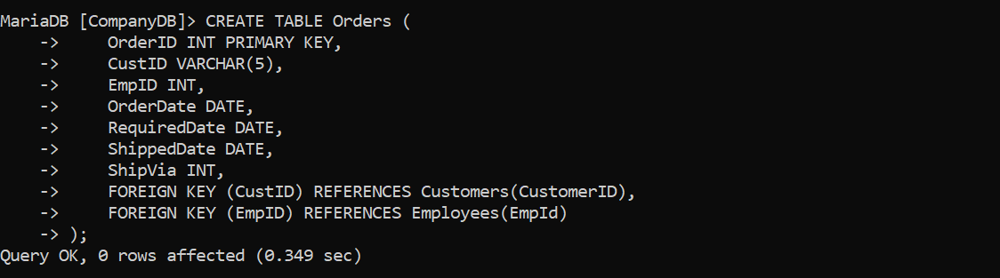
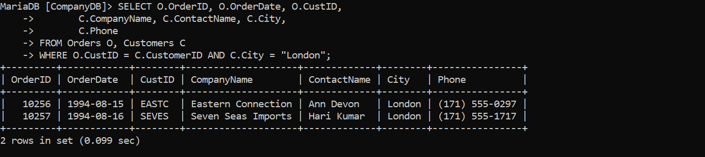
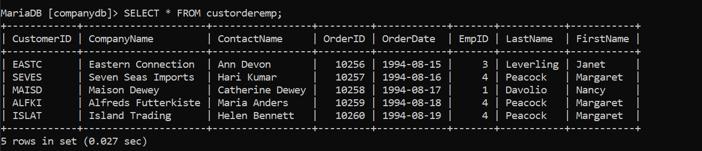
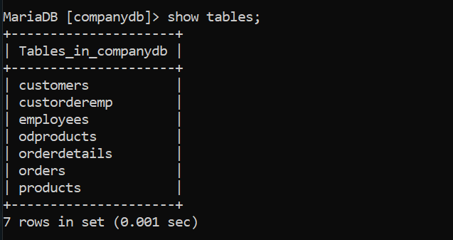

# Pembuatan DataBase (Company_Clement)
Pada sesi praktik kali ini, kita akan menyusun sebuah database perusahaan yang lengkap dengan tabel pegawai di dalamnya. Untuk memulainya, langkah pertama adalah membuat database yang akan menjadi wadah bagi tabel pegawai kita. Langkah-langkahnya adalah sebagai berikut:

 1.***Langkah-Langkah pembuatan database pada Shell**

Langkah pertama dalam pembuatan table perusahaan adalah membuat sebuah database yang akan kita gunakan untuk kedepannya.
```shell
CREATE DATABASE "Nama Database";
=================================
CREATE DATABASE Perusahaan_Clement;
```

Penjelasan :
#### **CREATE DATABASE**:

- **CREATE**: Kata kunci ini digunakan untuk membuat atau membangun sesuatu yang baru dalam sistem database.
- **DATABASE**: Menyatakan bahwa objek yang akan dibuat adalah sebuah database.

#### 2. **Perusahaan_Clement**:

- Ini adalah nama dari database yang akan dibuat. Dalam hal ini, nama database yang diinginkan adalah `Perusahaan_Clement`.

Hasil : 


2.**memastikan database berhasil dibuat**

Langkah kedua adalah melihat database yang sudah dibuat apakah berhasil atau tidak dengan menggunakan query `show`.

```shell
show databases;
```

Penjelasan : 
#### 1. **SHOW**:

- Kata kunci `SHOW` digunakan dalam SQL untuk meminta informasi dari sistem manajemen basis data (DBMS).
- Perintah ini menampilkan berbagai jenis metadata atau informasi tentang struktur database, seperti daftar database, tabel, kolom, dan lainnya.

#### 2. **DATABASES**:

- Kata kunci `DATABASES` menginstruksikan DBMS untuk menampilkan daftar semua database yang tersedia di server DBMS saat ini.
- Dengan kata lain, perintah ini meminta DBMS untuk mengembalikan daftar nama semua database yang ada.

Hasil : 


3.**Masuk kedalam Database yang sudah dibuat**

ketika sudah memastikan database sudah berhasil dibuat langkah selanjutnya kita akan masuk kedalam database yang akan kita gunakan menggunakan query `use`.

```shell
use "Nama_database";
========================
use pegawai;
```

Penjelasan : 
#### 1. **USE**:

- Kata kunci `USE` digunakan dalam SQL untuk memilih dan mengaktifkan sebuah database tertentu untuk digunakan dalam sesi kerja saat ini.
- Ketika Anda menjalankan query ini, Anda memberi tahu sistem manajemen basis data (DBMS) bahwa semua perintah SQL berikutnya akan diterapkan pada database yang disebutkan.

#### 2. **Perusahaan_Clement**:

- Ini adalah nama database yang akan diaktifkan atau dipilih.
- Dalam hal ini, nama database yang ingin Anda gunakan adalah `Perusahaan_Clement`.

Hasil : 


4.**Membuat table dalam database**

ketika sudah masuk kedalam database langkah selanjutnya adalah membuat table pada database dengan menggunakan query dibawah ini : 

```shell
CREATE TABLE pegawai (
    NIP INT PRIMARY KEY,
    NDep VARCHAR(100) NOT NULL,
    NBlk VARCHAR(100),
    JK ENUM('P', 'L') NOT NULL,
    Alamat TEXT NOT NULL,
    telp VARCHAR(15) NOT NULL,
    jabatan ENUM('Sales', 'Manajer', 'Staff'),
    Gaji BIGINT NOT NULL,
    NoCab VARCHAR(10) NOT NULL
);
```

Penjelasan : 
#### 1. **CREATE TABLE pegawai**:

- **CREATE TABLE**: Perintah ini digunakan untuk membuat tabel baru di dalam database.
- **pegawai**: Nama tabel yang akan dibuat adalah `pegawai`.

#### 2. **Kolom-kolom dalam Tabel pegawai**:

- **NIP INT PRIMARY KEY**:
    
    - **NIP**: Nama kolom untuk Nomor Induk Pegawai.
    - **INT**: Tipe data integer (bilangan bulat).
    - **PRIMARY KEY**: Menandakan bahwa kolom ini adalah kunci utama tabel. Setiap nilai dalam kolom ini harus unik dan tidak boleh NULL.
- **NDep VARCHAR(100) NOT NULL**:
    
    - **NDep**: Nama kolom untuk Nama Depan Pegawai.
    - **VARCHAR(100)**: Tipe data karakter dengan panjang maksimum 100 karakter.
    - **NOT NULL**: Menandakan bahwa kolom ini tidak boleh kosong.
- **NBlk VARCHAR(100)**:
    
    - **NBlk**: Nama kolom untuk Nama Belakang Pegawai.
    - **VARCHAR(100)**: Tipe data karakter dengan panjang maksimum 100 karakter.
    - Kolom ini tidak memiliki constraint `NOT NULL`, sehingga boleh kosong.
- **JK ENUM('P', 'L') NOT NULL**:
    
    - **JK**: Nama kolom untuk Jenis Kelamin.
    - **ENUM('P', 'L')**: Tipe data enumerasi dengan nilai yang diperbolehkan 'P' (Perempuan) dan 'L' (Laki-laki).
    - **NOT NULL**: Menandakan bahwa kolom ini tidak boleh kosong.
- **Alamat TEXT NOT NULL**:
    
    - **Alamat**: Nama kolom untuk alamat pegawai.
    - **TEXT**: Tipe data teks dengan panjang yang tidak terbatas.
    - **NOT NULL**: Menandakan bahwa kolom ini tidak boleh kosong.
- **telp VARCHAR(15) NOT NULL**:
    
    - **telp**: Nama kolom untuk nomor telepon pegawai.
    - **VARCHAR(15)**: Tipe data karakter dengan panjang maksimum 15 karakter.
    - **NOT NULL**: Menandakan bahwa kolom ini tidak boleh kosong.
- **jabatan ENUM('Sales', 'Manajer', 'Staff')**:
    
    - **jabatan**: Nama kolom untuk jabatan pegawai.
    - **ENUM('Sales', 'Manajer', 'Staff')**: Tipe data enumerasi dengan nilai yang diperbolehkan 'Sales', 'Manajer', dan 'Staff'.
    - Kolom ini tidak memiliki constraint `NOT NULL`, sehingga boleh kosong.
- **Gaji BIGINT NOT NULL**:
    
    - **Gaji**: Nama kolom untuk gaji pegawai.
    - **BIGINT**: Tipe data integer dengan rentang nilai yang sangat besar.
    - **NOT NULL**: Menandakan bahwa kolom ini tidak boleh kosong.
- **NoCab VARCHAR(10) NOT NULL**:
    
    - **NoCab**: Nama kolom untuk nomor cabang.
    - **VARCHAR(10)**: Tipe data karakter dengan panjang maksimum 10 karakter.
    - **NOT NULL**: Menandakan bahwa kolom ini tidak boleh kosong.

Hasil : 


5.**Memastikan table berhasil dibuat**

Ketika sudah membuat tabel pastikan tabel yang dibuat berhasil dibuat dengan menggunakan query `show`.

```shell
show tables;
```
Penjelasan : 
#### 1. **SHOW**:

- Kata kunci `SHOW` digunakan dalam SQL untuk meminta informasi dari sistem manajemen basis data (DBMS).
- Perintah ini menampilkan berbagai jenis metadata atau informasi tentang struktur database, seperti daftar database, tabel, kolom, dan lainnya.

#### 2. **TABLES**:

- Kata kunci `TABLES` menginstruksikan DBMS untuk menampilkan daftar semua tabel yang ada dalam database yang sedang aktif atau dipilih.
- Ini berarti perintah akan mengembalikan nama-nama semua tabel yang ada dalam database yang sedang digunakan.

Hasil : 


6.**Memastikan structur table sesuai atau benar**

Langkah selanjutnya setelah melihat table berhasil dibuat adalah memastikan bahwa struktur table sesuai dengan yang kita inginkan menggunakan query `desc`.

```shell
desc "Nama_database";
========================
desc pegawai;
```
Penjelasan : 
#### 1. **DESC**:

- `DESC` adalah singkatan dari `DESCRIBE`.
- Perintah ini digunakan untuk menampilkan struktur atau definisi dari sebuah tabel, termasuk informasi mengenai kolom-kolom dalam tabel tersebut.

#### 2. **pegawai**:

- Ini adalah nama tabel yang ingin Anda deskripsikan.
- Dalam konteks ini, `pegawai` adalah tabel yang telah Anda buat atau yang ada di database.

Hasil : 


7.**Memasukan data kedalam table**

Langkah selanjutnya adalah memasukan data kedalam table dengan langkah-langkah seperti berikut ini.

```shell 
INSERT INTO pegawai (NIP, NDep, NBlk, JK, Alamat, telp, jabatan, Gaji, NoCab) 
VALUES (10107, 'Emya', 'Salsalina', 'P', 'Jl. Suci 78 Bandung', '022-555768', 'Manajer', 5250000, 'C101'),
(10246, 'Dian', 'Anggraini', 'P', 'Jl. Mawar 5 Semarang', '024-555102', 'Sales', 2750000, 'C103'),
(10324, 'Martin', 'Susanto', 'L', 'Jl. Bima 51 Jakarta', '021-555888', 'Manajer', 1750000, 'C102'),
(10252, 'Antoni', 'Irawan', 'L', 'Jl. A. Yani 51 Jakarta', '021-555888', 'Manajer', 5750000, 'C102'),
(10176, 'Diah', 'Wahyuni', 'P', 'Jl. Maluku 56 Bandung', '022-555934', 'Sales', 2500000, 'C101'),
(10314, 'Ayu', 'Rahmadani', 'P', 'Jl. Malaka 342 Jakarta', '021-555098', 'Sales', 1950000, 'C102'),
(10307, 'Erik', 'Andrian', 'L', 'Jl. Manggis 5 Semarang', '024-555236', 'Manajer', 6250000, 'C103'),
(10415, 'Susan', 'Sumantri', 'P', 'Jl. Pahlawan 24 Surabaya', '031-555120', 'Manajer', 2650000, 'C104'),
(10407, 'Rio', 'Gunawan', 'L', 'Jl. Melati 356 Surabaya', '031-555231', 'Staff', 1725000, 'C104');
```

Penjelasan :
#### 1. **INSERT INTO pegawai**:

- **INSERT INTO**: Perintah ini digunakan untuk menambahkan data baru ke dalam tabel.
- **pegawai**: Nama tabel di mana data baru akan dimasukkan.

#### 2. **(NIP, NDep, NBlk, JK, Alamat, telp, jabatan, Gaji, NoCab)**:

- Daftar kolom yang akan diisi dengan nilai-nilai baru.
- Kolom-kolom ini mencakup: `NIP` (Nomor Induk Pegawai), `NDep` (Nama Depan), `NBlk` (Nama Belakang), `JK` (Jenis Kelamin), `Alamat`, `telp` (telepon), `jabatan`, `Gaji`, dan `NoCab` (Nomor Cabang).

#### 3. **VALUES**:

- Kata kunci ini digunakan untuk memasukkan nilai-nilai yang sesuai dengan kolom-kolom yang disebutkan.
- Setelah `VALUES`, terdapat serangkaian nilai yang sesuai dengan urutan kolom yang telah disebutkan.

Hasil : 


8.**Memastikan data berhasil masuk**

Langkah selanjutnya ketika sudah memasukan data adalah memastikan data masuk kedalam table dengan langkah-langkah berikut.

```shell
SELECT*FROM "Nama_table";
==============================
SELECT*FROM pegawai;
```
Penjelasan : 
#### 1. **SELECT**:

- Kata kunci `SELECT` digunakan untuk mengambil data dari tabel dalam database.
- Perintah ini memberitahu DBMS bahwa Anda ingin memilih atau menampilkan data.

#### 2. *****:

- Tanda bintang `*` adalah wildcard yang digunakan untuk memilih semua kolom dalam tabel.
- Ini berarti bahwa query ini akan mengambil semua kolom yang ada di tabel `pegawai`.

#### 3. **FROM**:

- Kata kunci `FROM` digunakan untuk menentukan tabel mana yang akan diambil datanya.
- Ini menginstruksikan DBMS untuk mengambil data dari tabel yang disebutkan setelah kata kunci ini.

#### 4. **pegawai**:

- Ini adalah nama tabel dari mana data akan diambil.
- Dalam konteks ini, `pegawai` adalah tabel yang berisi informasi tentang pegawai.

Hasil : 


# SELECT COUNT

```css
SELECT COUNT(NIP) AS JumlahPegawai, COUNT(Jabatan) AS JumlahJabatan FROM pegawai;
```

Penjelasan:
SELECT untuk memilih kolom apa saja yang ingin dipilih (untuk dihitung).

COUNT (NIP) = untuk menghitung Jumlah barisan data yang memiluntai

dari kalom Yang dipilih. NIP adalah nama kolom Yang dipilih untuk dihitung.

As = untuk mengubah nauna dari suatu kolom untuk sementara. Jumlah PeSouvai = merupakan nama ubahan dari Perintah As Yang digunakan. merupakan nama sementara dari perintah COUNT(NIP).

1- COUNT (Departemen) = untuk menghitung jumlah baris data Yoard yang memiliki konten data dari kumpulan yang dipilih.

Jabatan adalah nama kolom yang dipilih untuk dihitung.

As untuk mengubah nama dari suatu kolom untuk sementara. Jumlah Jabatan = merupakan nama sementara dari perintah court (Jabatan).

1- From Pegawai merupakan dari tabel mana datanya Yang didupakan Pesawai adalah nama tabel Yang datanya ingin digunakan.

Hasilnya karena ada y barisan data, Yand indin dihitung adalah kalam NIP, Jumlah dari kolom NIP (isi datanya) ada 9, ditampilkan sebagai Jumlah pesawai. kolom Jabatan Jusa dihitung, akan tetapi ada satu data Yang berisi Null (kosong), oleh karena itu hanya ada & data ditampilkan sebadal jumlah jabatan

Hasil: 


```css
SELECT COUNT(NIP) AS JumlahPegawai
    -> FROM pegawai
    -> WHERE NoCab = 'C102';
```

Penjelasan:
SELECT = untuk memilih kolom mana saja yang ingin dipilih untuk dihitung.

COUNT (NIP) = untuk menghitung jumlah blok data yang memiliki data dari kolom yang dipilih.

NIP adalah nama kolom Yang dipilih untuk Jihitung.

As = untuk mengubah nama dari suatu kolom untuk sementara
Jumlah pesawai nama sementara Yang dipilih untuk kolom COUNT (NIP)

From Pesawai dari tabel mana datanya akan digunakan.

Pegawai adalah nama tabel Yang dipilih untuk digunakan. WHERE merupakan kondisi yang harus dipenuhi ajar datanya dapat dendon query COUNT (NIP).

(Nocab = 'C102') = adalah kordisi dari WHERE Yang harus dipenuhi, Jadi hanya barisan data yang memiliki Clo2' di kolom "vocab" Yang bisa dihitung.

Hasilnya Di 9 barisan data Yangada Pada tabel Pesawai, kita ingin menghitung Jumlah barisan data Yang memiliki nilai 'clo2' Pada kolom "Nocab" nya dengan menggunakan COUNT. Jadi Yang muncul adalah 3 barisan data. kita Juda ingin mengubah nama dari kolom hasil Perintah COUNT Secara sementara dengan Perintah As, namanya adalah Jumlah Pegawai.

Hasil:


# SELECT NoCab
```css
SELECT NoCab, COUNT(NIP) AS Jumlah_Pegawai
    -> FROM pegawai
    -> GROUP BY NoCab;
```
Penjelasan:
SELECT untuk memilih kolom mana saja Yand insin dihitung atau ditampilkan. NoCab merupakan nama kolom Yang ingin ditampilkan.

COUNT (NIP) = untuk menghitung Jumlah batisan data Yang mempunyai isi data dari kolom Yang dipilih. NIP adalah nama kolom Yang dipilih untuk dihitung.

AS untuk mengubah nama dari suatu kolom untuk sementara.

Jumlah Pegawai merupakan nama Sementara dari kolom hasil COUNT(NIP). From Pegawai dari tabel mana yang data kodomnya ingin digunakan.

Pegawai adalah nama tabel Yang dipilih untuk digunakan.

GROUP BY = untuk menjelompokkan data berdasarkan nilai data yang telah ditentukan Pada kolom yang dipilih.

Nocab hama kolom Yang dipilih untuk datanya dikelompokkan.

Hasilnya Berdasarkan 9 barisan data, masing-masing. nilai dalam kojom Nocab
dikelompokkan berdasarkan nilainya sendiri, Jadi Nocab clol bersama Nocab yang nilai nya sama Yaitu clol. Jadi Nocab Yang memiliki C201 ada 2, c102 ada 3, cl03 ada 2, C104 ada 2. Total semuanya 9, sesuai dengan Jumlah barisan data yang ada. Adapun nama dari kolom hasil Yaitu Jumlah-Pegawai dari Perintah AS

Hasil:


```css
SELECT NoCab, COUNT(NIP) AS Jumlah_pegawai
    -> FROM pegawai
    -> GROUP BY NoCab HAVING COUNT(NIP) >= 3;
```
Penjelasan:
SELECT = untuk memilih kojom mana sasa Yang ingin dihitung atau ditampilkan.

Nocab merupakan nama kolom yang ingin ditampilkan.

COUNT(NIP) = untuk menghitung jumlah barisun data yang mempunyai isi data dari kolom Yang dipilih. NIP adalah nama kolom Yang dipilih untuk dihitung.

AS untuk mengubah nama dari suatu kojom untuk sementara.

Jumlah-Pesawai nama sementara dari kolom hasil COUNT (NIP).

From Pegawai untuk memilih dari tabel mana Yand data kolomnya ingin digunakan. Pesawai adalah nama taber Yang dipilih untuk digunakan.

GROUP BY untuk menjelompokkan data berdasarkan nilai data Yang telah ditentukan Pada kolom Yang dipilih.

- Nocab nama kolom Yang dipilih untuk dikelompokkan datanya.

HAVING = untuk menentukan kondisi (Yand hans dipenuhi) oleh suatu kelompok data

sedang melakukan

adar bisa ditampilkun. (COUNT (NIP) >= 3) = merupakan kondisi Yang harus dipenuhi oleh suatu kelompok

Jadi hanya kelompok data Yang hasil hitungannya lebih atau Sama dengan 3.

Hasilnya seperti sebelumnya, ada 9 barisan data dibagi sesuai Nocab nya masinθ -masing. Namun Yand indin ditampilkan adalah hasil hitungan yang lebih dari atau sama dengan 3. Yaitu Nocab C102 Yang ada 3.

Yand lain c101 ada 2, c103 ada 2, c109 ada 2.

Hasil:


# SELECT SUM
```css
SELECT SUM(Gaji) AS Total_Gaji
    -> FROM pegawai;
```
Penjelasan:
SELECT untuk memilih kolom mana sata yang dipilih untuk ditampilkan/dijumlahkan. Nocab adalah nama kolom yang ingin ditampilkan.

SUM (Gaji) = untuk menghitung Jumlah data (khusus andra) Pada kolom Yang dipilih.

Gaji adalah nama kolom yang dipilih untuk dijumlahkan isi datanya.

AS untuk menanti nama dari kolom hasil sum(Gasi) untuk sementara. Total Gaji merupakan nama sementara dari Perintah AS.

From Pelawai untuk memilih dari tabel mana Yand data kolomnya akan digunakan.. Pegawai adalah nama tabel yang dipilih.

ya).

GROUP BY untuk mendelompokkan data ditentukan Pada kolom Yang dipilih. berdasarkan nilai data yang telah

Itu saja

Nocab nama kolom yang datanya dipilih untuk dikelompokkan.

Hasilnya Jadi, berdasarkan kolom Nocab, barisan data yang kolom Nocab nya berisi (101 maka kolom Gazi dari barisan data itu digumlatikan bersama batisan data Yand memiliki Nocab cl01 Juda. Maka kolom Gaji dijumlahikan sesuai dengan kolom Nocab nya masing-masing, mulai dari (101 memiliki 2 kolom Gavi Yand bisa dijumlahkan. sama dengan C103 dan c104. Adapun C102 memiliki 3 kolom Gaji yang dapat dijumlahkan. TotalGari merupakan hasil Perintah dati As untuk mengubah nama kolom hasil dati SUM(GOD).

Hasil:


```css
SELECT SUM(Gaji) AS Gaji_Manajer
    -> FROM pegawai
    -> WHERE Jabatan = 'Manajer';
```
Penjelasan:
SELECT = untuk memilih kolom mana saja yang dipilih untuk dijumlahfan. Sum (Gavi) = untuk menghitung Jumlah isi data (khusus andka) Pada kolom Yang dipilih. Gaji adalah nama kolom Yang dipilih untuk dijumlahkan isi datanya.

AS untuk mengganti nama dati kolom hasil sum (Gari) secara sementara. Gazi-Manager = merupakan nama sementara dari Perintah As.

From Pegawai untuk memilih dari tabel mana Yand kolom datanča akan digunakan. Pegawai adalah nama dari table Yang dipilih.

-(Jabatan = "manaser") = merupakan kondisi dari WHERE.

WHERE = kondisi Yang harus dipenuhi oleh suatu kolom avar datanya bisa dijumlah.

Hanya barisan data yang koloms

Jabatannya berisi

Manajer Yand

kolom Gatinya bisa ditumlahkan.

Hasilnya barisan data Yang kolom Jabatannya berisi manajer akan dijumlah kolom Golinya menjadi. 1725.0000. Jadi hanya beberapa kolom. Saja yang dijumlah

Hasil:


```css
SELECT NoCab, SUM(Gaji) AS TotalGaji
    -> FROM pegawai
    -> GROUP BY NoCab;
```
Penjelasan:
SELECT untuk memilih kolom mana sata yang dipilih untuk ditampilkan/dijumlahkan. Nocab adalah nama kolom yang ingin ditampilkan.

SUM (Gaji) = untuk menghitung Jumlah data (khusus andra) Pada kolom Yang dipilih.

Gaji adalah nama kolom yang dipilih untuk dijumlahkan isi datanya.

AS untuk menanti nama dari kolom hasil sum(Gasi) untuk sementara. Total Gaji merupakan nama sementara dari Perintah AS.

From Pelawai untuk memilih dari tabel mana Yand data kolomnya akan digunakan.. Pegawai adalah nama tabel yang dipilih.

mya).

GROUP BY untuk mendelompokkan data ditentukan Pada kolom Yang dipilih. berdasarkan nilai data yang telah

lah

Nocab nama kolom yang datanya dipilih untuk dikelompokkan.

Hasilnya Jadi, berdasarkan kolom Nocab, barisan data yang kolom Nocab nya berisi (101 maka kolom Gazi dari barisan data itu digumlatikan bersama batisan data Yand memiliki Nocab cl01 Juda. Maka kolom Gaji dijumlahikan sesuai dengan kolom Nocab nya masing-masing, mulai dari (101 memiliki 2 kolom Gavi Yand bisa dijumlahkan. sama dengan C103 dan c104. Adapun C102 memiliki 3 kolom Gaji yang dapat dijumlahkan. TotalGari merupakan hasil Perintah dati As untuk mengubah nama kolom hasil dati SUM(GOD).

Hasil:


```css
SELECT NoCab, SUM(Gaji) AS Total_Gaji
    -> FROM pegawai
    -> GROUP BY NoCab HAVING SUM(Gaji) >= 8000000;
```
Penjelasan:
SELECT = untuk memilih kojom mana saja yang dipilih untuk ditampilkan/digumlahkan.

NoCab nama kojom Yang dipilih untuk ditampilkan.

SUM(Gaji) = untuk menghitung Jumlah data (khusus angka) Pada kolom Yang dipilih. Gari adalah nama kolem Yang dipilih untuk dilumlahkan isi, datanya

AS = untuk mengganti nama dari kojom hasil sum (Gari) untuk sementara.

-Total-Gari nama sementara dari Perintah As. - From Pesawal untuk memilih dari tabel mana yang data kolomnya ingin digunakan.

Pegawai adalah nama dari tabel yang dipilih. GROUP BY = untuk mendelompokkan data berdasarkan nilai data Yang telah ditentukan Poda kolom yang dipilih.

Nocab = noma kolom Yang dipilih untuk datanya dikelompokkan.

Having = kondisi yang harus dipenuhi oleh suatu kelompok data avar bisa ditampilkan.

SUM (Gavi) >= 8000000) = kondisi dari HAVING, Hasil dari Penjumlahan Gaji yang hanya bisa ditampilkan adalah Hasil yang lebih dari atau sama dendan 8000000.

- Hasilnya = Sama seperti sebelumnya, tetapi Nocab Yand memenuhi kondisi tersebut hanyalah C102 dan C103 karena hasil Jumlah kolom Gati nya lebih dari atau sama dengan 8000000. Adapun hasil kolom Sum(Gazi) diganti Jadi Total-Gori.

Hasil:


# AVG
```css
SELECT AVG(Gaji) AS Rata_rata
    -> FROM pegawai;
```
Penjelasan : 
SELECT = untuk memilih kolom mana saja yang dipilih untuk ditampilkan.

AVG(Gaji) = untuk menghitung rata-rata dari data yang ada Pada kojom Yang dipilih.

Gaji adalah nama kolom Yang dipilih untuk dihitung rata-ratanya. As untuk mengganti nama dari kolom hasil AVG (Gati) untuk sementara. Rata-rata nama sementara dari Perintah As.

From Pegawai untuk memilih dari tabel mana yang data kolomnya ingin digunakan. Pegawai adalah nama dari tabel yang dipilih.

Hasilnya = 3397222.2222 merupakan hasil ratatata dari semua 9 barisan data Pada kolom Gati. Adapun nama kolom hasil dari AVG(Gati) Yaitu Rata-rata.

Hasil :


```css
SELECT AVG(Gaji) AS GajiRataMgr
    -> FROM pegawai
    -> WHERE Jabatan = 'Manajer';
```
Penjelasan:
SELECT = untuk memilih kolom mana saja yang dipilih untuk ditampilkan.

AVG (Gaji) = untuk menghitung rata-rata dari data yang ada pada kolom Yang dipilih. Gati adalah nama kolom Yang dipilih untuk dihitung rata-ratanya.

AS = untuk mengganti nama dari kolom hasil AVG (Gaji) untuk sementara.

Gari Ratamgr = nama sementara dari Perintah AS.

FROM pesawal = untuk memilih dari tabel Mang Yand data kolomnya ingin Pegawai adalah nama dati tabel Yang dipilih.

WHERE = Kondisi yang harus dipenuhi oleh suatu kolom agar datanya bisa dihitung rata-ratanya

Jabatan = 'Manager') = kondisi dari WHERE. Barisan data yang kolom Jabatannya manajer akan dihitung rata-rata kolom Gaji nya.

Hasilnya = 5750000.0000 merupakan hasil hitung rata-rata dari barisan data yand memiliki manajer di kolom Jabatan nya, dari situ kolom Gazi nya di fitung.

Hasil:


```css
 SELECT NoCab, AVG(Gaji) AS RataGaji
    -> FROM pegawai
    -> GROUP BY NoCab;
```
Penjelasan:
SELECT = untuk memilih kolom mana saja yang dipilih untuk ditampilkan, dihitung. Nocab Kolom Yang dipilih untuk ditampilkan.

1-AVG (Gaji) = untuk menghitung rata-rata dari data yang ada pada kolom yang dipilih. Gati adalah nama kolom Yang dipilih untuk dihitung rata-ratanya.

As untuk mengganti nama dari kolom hasil AVG(Gavi) untuk sementara.

Rata Gati adalah nama sementara dari Perintah As.

From Pegawai = untuk memilih dari tabel mana Yang data kolomiya ingin digunakan. Pegawai adalah nama dari tabel yang dipilih.

GROUP BY = untuk mengelompokkan data berdasarkan nilai data yang telah ditentukan. Pada kolom Yang dipilih.

Nocab nama kolom Yang dipilih untuk datanya dikelompokkan.

Hasilnya = Hampir sama seperti no.7, masing-masing kolom No.cab dihitung rata-ratana

sesuai dengan isi Nocab, jadi yang c101 dihitung dengan c101 yang lainya suwa (Yand sama). Adapun fata Gaji merupakan nama sementara dari kolom hasi AVG(Gari).

Hasil:


```css
SELECT NoCab, AVG(Gaji) AS RataGaji
    -> FROM pegawai
    -> GROUP BY NoCab HAVING NoCab = 'C101' OR NoCab = 'C102';
```
Penjelasan:
SELECT untuk memilih kolom mana saja yang dipilih untuk ditampilkan, dihitung.

Nocab kolom Yang dipilih untuk ditampilkan.

AVG (Gaji) = untuk menghitung rata-rata dati data yang ada pada kolom Yang dipilih. Gati adalah nama kolom Yang dipilih untuk dihitung rata-ratanya.

As = untuk mengganti nama dati kolom hasil AVG(Gaji) untuk sementara.

Rata Gaji nama sementara dari Perintah As.

From Pegawai untuk memilih dari tabel mana yan datanya Kolomnya ingin digunakan Pegawai adalah nama dari tabel yang dipilih.

GROUP BY = untuk mengelompokkan data berdasarkan nilai data yang telah ditentukan Pada kolom Yang dipilih.

Nocab = nama kolom Yang dipilih untuk datorva dikelompoklan.

HAVING = kondisi yang harus dipenuhi oleh suatu kelompok data.

(Nocab 'C101' OR Nocab = 'c102') = merupakan kondisi dari Having. Jadi kolom Nocab Yang memiliki (101 atau (102 Yang hanya akan ditampilkan. OR adalah kondisi Yang hanya salah satu datanya yang harus dipenuhi.

Hasil:


# MAX && MIN

```css
SELECT MAX(Gaji) AS GajiTerbesar, MIN(Gaji) AS GajiTerkecil
    -> FROM pegawai;
```
Penjelasan:
SELECT = untuk memilih kolom mana saja Yang dipilih untuk ditampilkan,

- MAX(Gari) = untuk menampilkan nilai maksimum atau terbesar tertinggi dari suatu data dalam kolom Yang dipilih.

Gori adalah nama kolom Yand difilih. As Gavirerbesar untuk mendianti nama dari kolom hasil max (Gati), menjadi nama Sementaranya Yaitu Gajiterbesar.

MIN (Gaji) = untuk menampikan nilai data dalam kolom Yang dipilih. minimum atau terkecil/terendah dari suatu Govi adalah nama kolom Yang dipilih.

As Gajiterkecil = untuk mengganti nama dati kolom hasil MIN (Gati) menjadi Gajiterkecil

untur sementara.

FROM Pegawai untuk memilih dari tabel mana yang dati kolomnya indin ditampilkan.

Hasilnya Jadi dari 9 nilai yang ada di kolom Gari, Gasi maksimumnya adalah 6250000 dan namanya diubah menadi Gatiterbesar. Gavi minimumnya adalah 1725000 dan namanya diubah meroadi Gariterkecil.

Hasil:


```css
 SELECT MAX(Gaji) AS GajiTerbesar, MIN(Gaji) AS GajiTerkecil
    -> FROM pegawai
    -> WHERE Jabatan = 'Manajer';
```
Penjelasan:
SELECT untuk memilih kolom mana saja yang dipilih untuk ditampilkan.

MAX (Gari) = untuk menampilkan nilai terbesar dari suatu data dalam kolom Yang dipilih.

Gati adalah nama kolom yang dipilih.

As Gajiterbesar untuk mengganti nama dari kolom hasil Max (Gati) mentadi Gatiterbesar untuk sementara.

MIN (Gaji) = untuk menampilkan nilai terkecil dari suatu data dalam kolom Yang dipilih Gaji adalah nama kolom Yang dipilih.

As Gatiterkecil = untuk menanti nama dari kolom hasil MIN (Gari) menjadi Gati terke -cil untuk sementara.

From Pegawai untuk memilih dari tabel mana Yand data kojomnya ingin ditampilkan.

WHERE = kondisi Yang harus dipenuhi oleh suatu kolom data agar bisa ditampilkan.

- Gabatan = 'manajer') = kondisi dari WHERE Yang harus dipenuhi. Barisan data Yang kolom Jabatannya bernisi manajer akan ditampilkan kolom Garinya.

Hasilnya = Jabatan Manater Yang memiliki nilai maksimum adalah 6250000 kolom hasil MAX nya diubah Jadi Gaji terbesar.

Sedangkan nilai minimumnya adalah 5250000 kolom hasil MIN nya diubah Jadi Gati jerkeci

Hasil:


```css
 SELECT NoCab, MAX(Gaji) AS GajiTerbesar, MIN(Gaji) AS GajiTerkecil
    -> FROM pegawai
    -> GROUP BY NoCab;
```
Penjelasan:
SELECT untuk memilih kolom mana saja yang dipilih untuk ditampilFan.

Nocab = nama kolom Yang Ingin ditampilkan.

MAX(GaJi) = untuk menampilkan nilai terbesar dan suatu data dalam kolom Yang dipilih Gati adalah nama kolom Yang dipilih. 

As Goviterbesar untuk mengganti nama kolom hasil MAX(Gati) menjadi Gariterbesar Untuk sementara.

- MIN (GOJI) = untuk menampilkan nilai terkecil dari suatu data dalam kolom yang dipilih. Gaji adalah nama kolom Yang dipilih.

As Gajiterkecil untuk mengganti nama kolom hasil MIN (Gaji) menjadi Gariperakecil untuk sementara.

FROM Pesawai adalah untuk memilih dari tabel mana Yand data kolamnya ingin ditampilkan Pegawai adalah nama tabel Yang dipilih.

GROUP BY = untuk mendelompokkan data Pada kolom Yang dipilih.

Nocab nama kolom Yang dipilih untuk dikelompokkan.

Having = kondisi Yang harus dipenuhi oleh suatu kelompok data (COUNT (NIP) >= 3) = kondisi dati HAVING. Hanya hasil hitung kolom NIP yang lebih dari atau sama dengan 3 Yang muncul.

Hasilnya seperti no.4, Yang mempunyai hasil hitung lebih dari atau sama dengan 3 adalah Nocab (102. Jadi hanya itv Yand dicati Nilai maksimum dan minimumnya Pada kolom Gazi.

Hasil:


```css
	SELECT NoCab, MAX(Gaji) AS GajiTerbesar, MIN(Gaji) AS GajiTerkecil
	    -> FROM pegawai
	    -> GROUP BY NoCab HAVING COUNT(NIP) >= 3;
```
Penjelasan:
SELECT = untuk memilih kolom mana saja Yang di Pilih untuk ditampilkan.

COUNT (NIP) = untuk menghitund Jumlah barisan data Yang ada pada kolam Yang dipilih.

As Jumlah pesawai untuk mengganti nama kolom hosil COUNT (NIP) menjadi Jumlah Pesarai. Sum (Gaji) = untuk menjumlah data Yang ada pada kojom Yang dipilih.. Gari adalah kolom Yand dipilih...

sum (Gazi) menjadi Total Gari.

AVG (Gari) = untuk menghitung rata-ratanya suatu data dalam kojom Yang dipilih.

- AS Total Gaji = untuk mendianti nama kojom hasil

Gaji adalah nama kolom Yang dipilih untuk dihitung.

AS RataGati = untuk mendianti nama kolom hasil AVG (Gari) menjadi Rata Gaji.

MAX (Gaji) = untuk menampilkan nilai terbesar dari suatu data dalam kojom Yand dipilih

Gaji adalah nama kolon yang dipilih.
As Goviterbesar untuk mengganti nama kolom hasil MAX(Gati) menjadi Gariterbesar Untuk sementara.

- MIN (GOJI) = untuk menampilkan nilai terkecil dari suatu data dalam kolom yang dipilih. Gaji adalah nama kolom Yang dipilih.

As Gajiterkecil untuk mengganti nama kolom hasil MIN (Gaji) menjadi Gariperakecil untuk sementara.

FROM Pesawai adalah untuk memilih dari tabel mana Yand data kolamnya ingin ditampilkan Pegawai adalah nama tabel Yang dipilih.

GROUP BY = untuk mendelompokkan data Pada kolom Yang dipilih.

Nocab nama kolom Yang dipilih untuk dikelompokkan.

Having = kondisi Yang harus dipenuhi oleh suatu kelompok data (COUNT (NIP) >= 3) = kondisi dati HAVING. Hanya hasil hitung kolom NIP yang lebih dari atau sama dengan 3 Yang muncul.

Hasilnya seperti no.4, Yang mempunyai hasil hitung lebih dari atau sama dengan 3 adalah Nocab (102. Jadi hanya itv Yand dicati Nilai maksimum dan minimumnya Pada kolom Gazi.

Hasil:


# Gabungan 
```css
 SELECT COUNT(NIP) AS JumlahPegawai, SUM(Gaji) AS TotalGaji,
    -> AVG(Gaji) AS RataGaji, MAX(Gaji) AS GajiMaks, MIN(Gaji) AS GajiMin
    -> FROM pegawai;
```
Penjelasan:
SELECT = untuk memilih kolom mana saja Yang di Pilih untuk ditampilkan.

COUNT (NIP) = untuk menghitund Jumlah barisan data Yang ada pada kolam Yang dipilih.

As Jumlah pesawai untuk mengganti nama kolom hosil COUNT (NIP) menjadi Jumlah Pesarai. Sum (Gaji) = untuk menjumlah data Yang ada pada kojom Yang dipilih.. Gari adalah kolom Yand dipilih...

sum (Gazi) menjadi Total Gari.

AVG (Gari) = untuk menghitung rata-ratanya suatu data dalam kojom Yang dipilih.

- AS Total Gaji = untuk mendianti nama kojom hasil

Gaji adalah nama kolom Yang dipilih untuk dihitung.

AS RataGati = untuk mendianti nama kolom hasil AVG (Gari) menjadi Rata Gaji.

MAX (Gaji) = untuk menampilkan nilai terbesar dari suatu data dalam kojom Yand dipilih

Gaji adalah nama kolon yang dipilih.

As Garimaks = untuk mengganti nama dati kolom hasil MAX(Gati) menjadi Garimals. untuk sementara.

MIN (Gati) = untuk menampilkan nilai terkecil dari suatu kolom Yang dipilih. Gaji nama kolom Yang dipilih.

As Gatimin = untuk mengganti nama dati kolom hasil MIN (Gaji) menjadi Garimin. Untuk sementara.

From Pelawai = untuk memilih tabel mana yang dipilih untuk ditampilkan. Pegawai adalah nama tabel Yang dipilih

Hasilnya = Dihitung berasa NIP, DiJumlahkan semua data Pada kolom Gaji, Dihitung Ratarata dati kolom Gavi, Ditampilkan nilai terbesar pada kolom Gari, dan Nilai terkecil dalam kojom Gaji.

Hasil:


```css
SELECT COUNT(NIP) AS JumlahPegawai, SUM(Gaji) AS TotalGaji,
    -> AVG(Gaji) AS RataGaji, MAX(Gaji) AS GajiMaks, MIN(Gaji) AS GajiMin
    -> FROM pegawai
    -> WHERE Jabatan = 'Staf' OR Jabatan = 'Sales'
    -> GROUP BY NoCab HAVING SUM(Gaji) <= 2600000;
```
Penjelasan:
ELECT = untuk memilih kolam mana saja yang ingin digunakan.

COUNT (NIP) = untuk menghitung barisan data yang ada pada kolom Yang dipilih.

AS Jumlah Pegawai = untuk mensvanti nama dari kolom hasil COUNT (NIP) menjadi jumlah Pevawai untuk sementara.

- SUM(Gooi) = untuk menjumlah data yang ada pada kolom Yang dipilih. Gazi adalah nama kolom Yang dipilih.

As Total Gari untuk mengsanti nama dari kolom hasil sum(Gari) menjadi Total Gari untuk Sementara.

AVG (Gati) = untuk menghitung rata-rata dari kolom Yand dipilih. Gaji adalah nama kolom Yang dipilih.

As RataGaji untuk mengganti nama dari kolom hasil AVG (Gaji) menjadi RataGoji Untuk sementara.

MAX (Gari) = untuk menampilkan nilai.

terbesar dari suatu data dalam kolom Yang dipilih. Gari adalah nama kolom. Yang dipilih.

Hasil:


# Praktikum 2

# Pembuatan DataBase (CompanyDB)
Code:
```css
Customers
CREATE TABLE Customers (
    CustomerID VARCHAR(5) PRIMARY KEY,
    CompanyName VARCHAR(50),
    ContactName VARCHAR(50),
    Address VARCHAR(100),
    City VARCHAR(50),
    PostalCode VARCHAR(20),
    Country VARCHAR(50),
    Phone VARCHAR(20)
);
```

Penjelasan:

Hasi:


Code:
```css
INSERT INTO Customers (CustomerID, CompanyName, ContactName, Address, City, PostalCode, Country, Phone)
VALUES
('SEVES', 'Seven Seas Imports', 'Hari Kumar', '90 Wadhurst Rd.', 'London', 'OX154', 'UK', '(171) 555-1717'),
('MAISD', 'Maison Dewey', 'Catherine Dewey', 'Rue Joseph Bens 532', 'Bruxelles', 'B-1180', 'Belgium', '(02) 201 24 67'),
('ISLAT', 'Island Trading', 'Helen Bennett', '75 Crowther Way', 'Cowes', 'PO31 7PJ', 'UK', '(198) 555-8888'),
('EASTC', 'Eastern Connection', 'Ann Devon', '35 King George', 'London', 'WX3FW', 'UK', '(171) 555-0297'),
('ALFKI', 'Alfreds Futterkiste', 'Maria Anders', 'Obere Str. 57', 'Berlin', '12209', 'Germany', '030-0074321');
```

Penjelasan:

Hasi:


Code:
```css
Employees
CREATE TABLE Employees (
    EmpId INT PRIMARY KEY,
    LastName VARCHAR(50),
    FirstName VARCHAR(50),
    Title VARCHAR(50),
    Address VARCHAR(100),
    City VARCHAR(50),
    Country VARCHAR(50),
    HomePhone VARCHAR(20)
);
```

Penjelasan:

Hasi:


Code:
```css
INSERT INTO Employees (EmpId, LastName, FirstName, Title, Address, City, Country, HomePhone)
VALUES
(1, 'Davolio', 'Nancy', 'Sales Rep.', '507 - 20th Ave. E. Apt. 2A', 'Seattle', 'USA', '(206) 555-9857'),
(2, 'Fuller', 'Andrew', 'Vice President', '908 W. Capital Way', 'Tacoma', 'USA', '(206) 555-9482'),
(3, 'Leverling', 'Janet', 'Sales Rep.', '722 Moss Bay Blvd.', 'Kirkland', 'USA', '(206) 555-3412'),
(4, 'Peacock', 'Margaret', 'Sales Rep.', '4110 Old Redmond Rd.', 'Redmond', 'USA', '(206) 555-8122'),
(5, 'Buchanan', 'Steven', 'Sales Manager', '14 Garrett Hill', 'London', 'UK', '(71) 555-9482'),
(6, 'Suyama', 'Michael', 'Sales Rep.', 'Coventry House Miner Rd.', 'London', 'UK', '(71) 555-7773'),
(7, 'King', 'Robert', 'Sales Rep.', '12 Winchester Way', 'London', 'UK', '(71) 555-5598'),
(8, 'Callahan', 'Laura', 'Sales Coord.', '4726 - 11th Ave. N.E.', 'Seattle', 'USA', '(206) 555-1189'),
(9, 'Dodsworth', 'Anne', 'Sales Rep.', '7 Houndstooth Rd.', 'London', 'UK', '(71) 555-4444');
```

Penjelasan:

Hasi:


Code:
```css
Products
CREATE TABLE Products (
    ProductID INT PRIMARY KEY,
    ProductName VARCHAR(50),
    SupplierID INT,
    QuantityPerUnit VARCHAR(50),
    UnitPrice DECIMAL(10, 2),
    UnitsInStock INT
);
```

Penjelasan:

Hasi:


Code:
```css
INSERT INTO Products (ProductID, ProductName, SupplierID, QuantityPerUnit, UnitPrice, UnitsInStock)
VALUES
(2, 'Chang', 1, '24 - 12 oz bottles', 19.00, 17),
(5, 'Chef Anton''s Gumbo Mix', 2, '36 boxes', 21.35, 50),
(21, 'Sir Rodney''s Scones', 8, '24 pkgs. x 4 pieces', 10.00, 17),
(27, 'Schoggi Schokolade', 11, '100 - 100 g pieces', 43.90, 49),
(32, 'Mascarpone Fabioli', 14, '24 - 200 g pkgs.', 32.00, 9);
```

Penjelasan:

Hasi:


Code:
```css
Insert additional data into the Products table
INSERT INTO Products (ProductID, ProductName, SupplierID, QuantityPerUnit, UnitPrice, UnitsInStock)
VALUES
(37, 'Gravad lax', 17, '12 - 500 g pkgs.', 26.00, 11),
(39, 'Chartreuse verte', 18, '750 cc per bottle', 18.00, 69),
(41, 'Jack''s Clam Chowder', 19, '12 - 12 oz cans', 9.65, 85),
(53, 'Perth Pasties', 24, '48 pieces', 32.80, 15),
(54, 'Ravioli Angelo', 24, '24 - 250 g pkgs.', 19.50, 36),
(29, 'Hot Pepper Sauce', 2, '32 - 8 oz bottles', 21.05, 76),
(62, 'Tarte au sucre', 29, '48 pies', 49.30, 17),
(70, 'Outback Lager', 7, '24 - 355 ml bottles', 15.00, 15),
(74, 'Longlife Tofu', 4, '5 kg pkg.', 10.00, 4),
(77, 'Original Frankfurter', 12, '12 boxes', 13.00, 32);
```

Penjelasan:

Hasi:


Code:
```css
CREATE TABLE Orders (
    OrderID INT PRIMARY KEY,
    CustID VARCHAR(5),
    EmpID INT,
    OrderDate DATE,
    RequiredDate DATE,
    ShippedDate DATE,
    ShipVia INT,
    FOREIGN KEY (CustID) REFERENCES Customers(CustomerID),
    FOREIGN KEY (EmpID) REFERENCES Employees(EmpId)
);
```

Penjelasan:

Hasi:


Code:
```css
INSERT INTO Orders (OrderID, CustID, EmpID, OrderDate, RequiredDate, ShippedDate, ShipVia)
VALUES
(10256, 'EASTC', 3, '1994-08-15', '1994-09-12', '1994-08-17', 2),
(10257, 'SEVES', 4, '1994-08-16', '1994-09-13', '1994-08-22', 3),
(10258, 'MAISD', 1, '1994-08-17', '1994-09-14', '1994-08-23', 1),
(10259, 'ALFKI', 4, '1994-08-18', '1994-09-15', '1994-08-25', 3),
(10260, 'ISLAT', 4, '1994-08-19', '1994-09-16', '1994-08-29', 1);
```

Penjelasan:

Hasi:


Code:
```css
CREATE TABLE OrderDetails (
    OrderID INT,
    ProductID INT,
    UnitPrice DECIMAL(10, 2),
    Quantity INT,
    Discount DECIMAL(4, 2),
    PRIMARY KEY (OrderID, ProductID),
    FOREIGN KEY (OrderID) REFERENCES Orders(OrderID),
    FOREIGN KEY (ProductID) REFERENCES Products(ProductID)
);
```

Penjelasan:

Hasi:


Code:
```css
INSERT INTO OrderDetails (OrderID, ProductID, UnitPrice, Quantity, Discount)
VALUES
(10256, 53, 26.20, 15, 0),
(10256, 77, 10.40, 12, 0),
(10257, 27, 35.10, 25, 0),
(10257, 39, 14.40, 6, 0),
(10258, 2, 15.20, 50, 0.2),
(10258, 5, 17.00, 65, 0.2),
(10258, 32, 25.60, 6, 0.2),
(10259, 41, 7.70, 16, 0.25),
(10260, 62, 39.40, 15, 0.25),
(10260, 70, 12.00, 21, 0.25);
```

Penjelasan:

Hasi:


# Select Lanjutan
Code:
```css
SELECT Orders.OrderID, Orders.OrderDate, Orders.CustID,
       Customers.CompanyName, Customers.ContactName, Customers.City,
       Customers.Phone
FROM Orders, Customers
WHERE Orders.CustID = Customers.CustomerID;
```

Penjelasan:
SELECT = untuk memilih kolom mana saja Yanu ingin ditampilkan dan dari tabel mana kolom tersebut diambil.

orders. Order ID = orders merupakan nama tabel Yang ingin ditampilkan kolomn Ya Yaitu orderID. Jadi kolom orderID Pada tabel orders ingin ditampilkan. dalam

orders, order Date = kolom orderDate Pada tabel orders insin ditampilkan.

orders. CustID= kolom CustID dalam tabel orders dipilih untuk ditampilkan.

Customers. company Name = kolom company Name dalam tabel customers dipilih untuk ditampilkan.

customers.contactName = kolom contactName dalam tabel customers dipilih untuk ditampilkan.

customers. city kolom city dalam tabel customers dipilih untuk ditampilkan.

Customers. Phone = kolom Phone dalam tabel customers dipilih untuk ditampilkan.

FROM orders, customers = untuk memilih dari tabel mana saja yang kolomnya insin dipilih untuk ditampilkan. Orders adalah nama tabel Pertama yang dipilih dan customers adalah nama tabel kedua Yang dipilih.

WHERE Kondisi Yang harus dipenuhi oleh suatu kolom data avar bisa ditampilkan (orders. custID = customers.customerID) = kondisi dari WHERE Yan's harus dipenuhi.

Jadi, data Pada kolom custID dalam tabel orders harus sama dengan data Pada kolom customerID dalam tabel customers avar masing-masing datarik bisa ditampilkan..

Hasilnya = Jadi Yang tampil adalah kolom orderID, Order Date dan custID dati tabel orders dan kolom companyNume, contact Name, city, dan Phone dati tabel astomers.

Hasil:


Code:
```css
 SELECT O.OrderID, O.OrderDate, O.CustID,
    ->        C.CompanyName, C.ContactName, C.City,
    ->        C.Phone
    -> FROM Orders O, Customers C
    -> WHERE O.CustID = C.CustomerID AND C.City = "London";
```

Penjelasan:
SELECT = untuk memilih kolom mana saja yang ingin ditampilkan dan dari tabel mana kolom tersebut diambil.

o. orderID = o merupakan Singkatan dari tabel orders, kolom order ID merupakan

kolom dari tabel orders Yang dipilih untuk ditumpilkan.

0. order Date = kolom order Date merupakan kolom dari tabel o Yaitu orders Yon dipilih untuk ditampilkan,

0. custID=tolom custID merupakan kolom dari tabel o Yaitu orders yang dipilih untuk ditampilkan

C. Company Name = C merupakan singkatan dari tabel customers. kolom company Name merupakan kolom dari tabel customers Yang dipilih untuk ditam- -Pilkan.

C. Contact Name = kolom contact Name merupakan kolom dari tabel c Yaitu customer Yang dipilih untuk ditampilkan.

C. city = kolom city merupakan kolom dari tabel a Yaitu customers Yang dipilih

untuk ditampilkan,

C. Phone kolom Phone merupakan kolom dari tabel e Yaitu customers Yang dipilih untuk ditampilkan.

FROM orders o, customers c = untuk memilih dari tabel mang saja yang kolomnia ingin dipilih untuk ditampilkan. Orders adalah nama tabel yang dipilih untuk ditampilkan tapi disingkat Jadi O, asar lebih mudah dan cepat. customers adalah nama tabel yang dipilih untuk ditampilkan tapi disingkat Jadi C. - WHERE = kondisi yang harus dipenuhi oleh suatu kojom data avar bisa ditampilkan.

(O.CustID= costumer ID) = data Pada kolom custID dalam tabel o (orders) hans Sama dengan data Pada kolom customer ID dalam tabel c (customers). AND = untuk menyeloksi dua data atau lebih Pada Perintah WHERE.

C.city = "London") = kondisi tambahan yang harus dipenuhi Juga. Jadi Pada kolom

Hasil:


Code:
```css
SELECT o.OrderID, o.OrderDate, c.CompanyName, c.ContactName, c.Phone, e.LastName,   e.Title
-> FROM orders o, customers c, employees e
-> WHERE o.CustID = c.CustomerID AND o.EmpID = e.EmpID;
```

Penjelasan:
SELECT = untuk memilih kolom mana saja Yan's insin ditampilkan dan dari tabel mana kolom tersebut diambil.

o.orderID, o. order Date = kolom orderID dan order Date dati tabel o (orders) dipillh untuk ditampilkan

C.companyName, c.contactName, c. Phone = kolom-kolom companyName, Contact Name dan Phone dari tabel c(cocustomers) dipilih untuk ditampilkan.

e. Last Name, e. Title = kolom Lostname dan Title dari tabel e (employees) dipilih untuk ditampilkan.

From orders o, customers c, employees e = untuk memilih dari tabel mana saja Yang kolomnya dipillh untuk ditampilkan. orders disingkat Jadi o adalah nama tabel Yang dipilih. customers disingkat Jadi C adalah nama tabel yang dipilih employees disingkat Jadi e adalah nama tabel Yang dipilih untuk ditampilkan. 1-WHERE = kondisi Yang harus dipenuhi oleh suatu data ayat bisa ditampilkan.

4.

AND = untuk menyeleksi dua data atau lebih Pada Perintah WHERE

(0. emPID = e.EmPID) = data Pada kolom EMPID dalam tabel o(orders) harus Sama dengan jata Pada kolom EmpID dalam tabel elemployees).

Hasilnya Yang tampil adalah kolom Yang memenuhi semua kondisi dari WHERE.

Hasil:


Code:
```css
 SELECT o.OrderID, o.OrderDate, c.CompanyName, c.ContactName, c.Phone, e.LastName, e.Title
-> FROM orders o, customers c, employees e
-> WHERE o.CustID = c.CustomerID AND o.EmpID = e.EmpID AND e.FirstName = "Margaret";
```

Penjelasan:
SELECT=untuk memilih kolom mana saja Yang ingin ditumpilkan dan dari tabel mana kolom tersebut diambil.

o. order ID, o. order Date = kolom orderID dan orderDate dari tabel o (orders) dipilih untuk ditampilkan.

c.companyName, c.contuctilame, c. Phone = kolom company Name, ContactName dan Phone dari tabel c (customers) dipilih untuk ditampilkan.

e. Lastname, e.Title = kolom LastName dan Title dari tabel e (employees) dipilih. untuk ditampilkan.

From orders o, customers c, employees e = untuk memilih dari tabel mana saja Yang kolomnya dipilih untuk ditampilkan. orders atau o adalah nama tabel Yang dipilih untuk ditampilkan. customers atau c adalah nama tabel Yang dipilih untuk ditampilkan employees atau e adalah nama tabel yang dipilih untuk ditampilkan.

WHERE kondisi Yang harus dipenuhi 1% suatu kolom data avar bisa ditampilkan. (O.CustID = c. customerID) = data Pada kolom astID dalam tabel o (orders) harus Sama denson data Pada kolom customerID davam table (customers).

AND = untuk menyereksi dua data atau lebih Pada Perintah WHERE. (0.EmPId=e.EmPID) = data Pada kolom EmpId dalam tabel (orders) hatus sama dengan data Pada kolom EmPID dalam tabel e (employees).

AND = untuk menyeleksi dua data atau lebih Pada Perintah WHERE. Le.FirstName = "Margaret") = data Pada kolom Firstivame dalam tabel e(emploke) harus berisi data "Margaret" avar bisa tampil...

Hasilnya Jadi barisan data yang sudah memenuhi kondisi WHERE akan tampil. tentama kolom firstname dari tabel employees Yang isinya "Mardanet.

Hasil:


Code:
```css
 SELECT c.CustomerID, c.CompanyName, o.OrderID,
    -> o.OrderDate, od.ProductID, p.ProductName,
    -> od.Quantity AS Qty, od.UnitPrice
    -> FROM customers c,orders o, orderdetails od,products p
    -> WHERE c.CustomerID = o.CustID AND o.OrderID = od.OrderID
    -> AND p.ProductID = od.ProductID
    -> ORDER BY c.CustomerID;
```

Penjelasan:
SELECT untuk memilih kolom mana sata Yang ingin ditampilkan dan dari tabel mana kolom tersebut diambil.

C.CustomerID, C. company Name = kolom customerID dan companyName dari tabel C (customers) dipilih untuk ditampilkan. 1-0. order ID, o, order Date = kolom orderID dan orderDate dari tabel o(orders) difilih

od. ProductID, ad. Quantity, od. unit Price = kolom ProductID, Quantity dan unitPrice dari tabel od (orderdetails) dipilih uritur ditampilkan.

- P.ProductName = kolom ProductName merupakan kolom dari tabel P(Products) Yang dipilih untuk ditampilkan.

od. Quantity AS Qty = kolom Quantity ditampilkan sebagai nama sementaranya Yaitu aty. As untuk menjubah nama suatu kolom Secara sementara.

- FROM customers c. orders o, orderdetails od, products p = untuk memilih dari tabel mana saja yang kolomnya dipilih untuk ditampilkan, customers atav C adalah nama tabel Yang dipilih untuk ditampilkan. Orders atau o adalah nama tabel Yang dipilih untuk ditampilkan. orderdetails atau ad adalah nama tabel yang dipilih untuk ditampilkan. Products atau P adalah nama tabel yang dipilih untuk ditampilkan.

WHERE = Kondisi Yang harus dipenuhi oleh suatu kolom data avar bisa ditampilkan

test) (c.customerID = 0.CustID) = data Pada kolom customerID dari tabel customers atau a harus sama dengan data Pada kolom custID dari tabel orders atau 0. 00

AND = Untuk menyeleksi dua data atau lebih Pada perintah WHERE.

(der) (o. orderID = Od. orderID) = data Pada kolom order ID dari tabel orders atau o harus sama dengan data Pada kolom orderId dati tabel orderdetails atau od.

AND untuk menyeleksi dua data atau lebih Pada Perintah WHERE.

(Products) (P.ProductID = od. ProductID) = data Pada kolom Productio dari tabel Products atau P harus sama dengan data Pada kojom ProductID dari tabel ordendetails atau d..

Hasil:


Code:
```css
 SELECT c.customerid, c.companyname, o.orderid as OrdID, o.orderdate, CONCAT(e.lastname, ',',e.firstname) AS EmployeeName, od.productid as ProdID,
    -> p.productname, od.quantity AS Qty FROM customers c, orders o, orderdetails od, products p,employees e
    -> WHERE c.customerid=o.custid and o.orderid=od.orderid and p.productid=od.productid and e.empid=o.empid order by o.orderid;
```

Penjelasan:
SELECT = untuk memilih kolom mana saja Yang ingin ditampilkan dan divabundkon serta dari tabel mana kolom tersebut dipilih.

c. customerID, C.Company Name = kolom customerID dan company Name dari tabel c(customers) dipilih untuk ditampilkan.

o.order ID AS ordID, O.order Date = kolom orderID dan order Date dari tabel o(orders) dipilih untuk ditampilkan. As merupakan Perintah untuk mengubah nama Suatu kolom Secara sementara. Dalam hal ini kolom orderID diubah namanya sementara mentid ordID.

CONCAT (e-Lastrome,,, e. FirstName) AS EmployeeName = CONCAT adalah Perintah untuk menggabungkan beberapa kolom data menjadi satu kolom data. (e. Lastname, e. First Name) merupakan kolom-kaom Yang ingin digabun LastName dan First Name merupakan kolom dari tabel e(employees) Yand indin digabung. ('.') merupakan separator atau Pemisah dari kedua kolom Yang ingin divabungkan. anform

As EmployeeName untuk mengubah hasil concat tadi menjadi Employeenoor (namanya) untuk sementara.

od. Product ID AS ProdID, od. Quantity AS Qty = kolom ProductID dan quantity dari tabel od (orderdetails), dipilih untuk ditampilkan, kolom ProductID
namanya diubah sementara Jadi ProdID. kolom Quantity namanya diubah Sementara Jadi Qty.

P. ProductName = kolom ProductName dari tabel P(Products) dipilih untuk ditampilkan. From customers c. orders o, orderdetails od, Products P, employees e = untuk memitt dari tabel mana saja yang kolomnya dipilih untuk ditampilkan customers atau C adalah nama tabel Yang dipilih. orders atau o adalah nama tabel Yang dipilih order details od adalah nama tabel Yang dipilih. Products atau P adalah nama tabel yang dipilih. employees atau e adalah nama tabel Yant dipilih.

WHERE kondisi Yang harus dipenuhi oleh suatu kolom data avar bisa ditampilkan (C-CustomerID = o. CustID) = data Pada kolom customerID dari tabel c(customers) harus sama dengan data Pada kolom CustIO dari tabel o(orders).

AND= untuk menyeleksi dua data atau lebih pada Perintah WHERE. 6.OrderID = od.orderID) = data pada kolom orderID dari tabel o(orders) harus Sama dengan data Pada kolom orderID dari tabel od (orderdetails).

AND = untuk menyeleksi dua data atau lebih Pada Perintah WHERE. (P.ProductID=od. ProductID) = data Pada kolom ProductID dari tabel PCProductID) harus sama dengan data Pada kolom ProductID dari tabel od (orderdetail AND = untuk menyeleksi dua data atau lebih Pada Perintah WHERE. (e. EmPID = 0. EmPID) = data Poda kolom EmPID dari tabel e(employees) harus sama dengan data Pada kolom EmPID dati tabel o(orders). order BY o. orderID = untuk mengurut data berdasarkan kolom orderID dari tabel orders.

Hasilnya kolom LastName dan FirstName dari tabel e(employees) digabung dengan Concat dan hasil kolomnya namanya diubah sementara Jadi EmployeeName.

Hasil:


Code:
```css
CREATE VIEW CustOrderEmp
AS
SELECT c.CustomerID, c.CompanyName, c.ContactName,
o.OrderID, o.OrderDate, e.EmpID, e.LastName, e.FirstName
FROM customers c,orders o, employees e
WHERE c.CustomerID = o.CustID AND o.EmpID = e.EmpID;
```

Penjelasan:
CREATE VIEW Custorder Emp = merupakan tabel virtual Yang dibuat dendan Nama custorderEmp

AS SELECT = untuk memilih kolom-kolom mana Sava Yang ingin dipilih untuk dimasukkan ke tabel virtual.

C. CustomerID, c.companyName, c.contactName = kolom customerID, company Name dan contactinome dari tabel c(customers) dipilih untuk dimasukkan ke dalam tabel virtual.

0.order ID, o. order Date = kolom order ID dan orderlate dari tabel (orders) dipilih untuk dimasukkan ke dalam tabel virtual.

e-EmPID, e.Lastname, e. FirstName = kolom EmPID, LastName, dan firstName.dati tabel e(employees) dipilih untuk dimasukkan ke dalam tabel virtual.

FROM customers c, orders o, employees e = untuk memilih dari tabel mana Sara Yang kolomnya dipilih untuk dimasukkan. customers, orders dan employees merupakan nama tabel yang kolomnya dipilih.

WHERE kondisi yang harus dipenuhi oleh suatu data adar bisa dimasukkan ke dalam tabel virtual.

(c.customerID = a custID) = data Pada kolom customerID dari tabel c(costumers) harus sama dengan data pada kolom custID dari tabel (orders) adar bisa dimasukkan.

AND = untuk menyeleksi dua data atau lebih Pada WHERE.

(O. EMPID = e.EmPID) = data Poda kolom EmPID dari tabel ocorders) harus Sama dengan data Pada kolom EmPID dari tabel e(employees) avar bisa dimasukkan.

Hasilnya sebuah Tabel virtual telah dibuat dengan nama custorder Emi Yang berisi kolom-kolom dari 3 Tabel customers, orders, employees dan telah memenuhi semua kondisi.

Hasil:




Code:
```css
CREATE VIEW odproducts
AS
SELECT od.OrderID, od.ProductID, p.ProductName,
od.Quantity, od.UnitPrice
FROM orderdetails od, products p
WHERE p.ProductID = od.ProductID;
```

Penjelasan:
CREATE VIEW od Products = untuk membuat tabel virtual dengan nama od products. AS SELECT = untuk memilih kolom-kolom mana saja Yand ingin dipilih untuk dimasukkan ke tabel virtual.

od.orderID, od. ProductID, od. unitPrice, od. quantity = kolom order ID, ProductID, unit Price dan Quantity dari tabel od (orderdetails) dipilih untuk dimasukkan. P. ProductName = kolom Productivame dari tabel P(Products) dipilih untuk dimasukkan. - From orderdetails od, Products P = untuk memilih dari tabel mana saja yang kolomnya dipilih untuk dimasukkan. Orderdetails dan Products adalah nama tabel Yang dipilih.

WHERE kondisi Yang harus dipenuhi oleh suatu data agar bisa dimasukkan ke dalam tabel virtual.

-(P.ProductID = od. ProductID) = data Pada kojom productID dari tabel P(Products) hans sama dengan kolom ProductID dari tabel od (orderdetails). avar bisa dimasuktin Hasilnya Tabel virtual yang bernama odproducts yang terbuat dari kolom dalam

Hasil:




Code:
```css
SELECT c.customerid, c.companyname, o.orderid, od.productid, ROUND(od.unitprice,2), od.quantity,
    -> od.discount, ROUND(((1-od.discount)*od.unitprice*od.quantity),2) AS Jumlah
    -> FROM customers c, orders o, orderdetails od WHERE c.customerid=o.custid AND o.orderid=od.orderid
    -> ORDER BY c.customerid;
```

Penjelasan:
SELECT untuk memilih Kolom mana saja Yang ingin ditampilkan dan dihitung.

c. customerID, C. company Name = kolom customerID dan company Name dari tabel c(customers) dipilih untuk ditampilkan.

0. orderID = kolom orderID dari tabel o (orders) dipilih untuk ditampilkan. Od. Product ID, od.unitPrice, od. quantity, od. Discount = kolom ProductID, unit Price, Quanti dan Discount dari tabel Od (orderdetails) dipilih untuk ditampilkan dan dibulatkan.

ROUND (od unitprice, 2) = untuk membulatkan bilangan dari kojom unitPrice Sampai Jumlah digit tertentu. sesuai dengan pilihan yang dibuat

Yaitu 2.
ROUND (CC1-od. Discount) *ad.unitPrice *od. Quantity), 2) AS Jumlah = untuk membulatkan bilangan dari kolom hasil dari (1 dikurang kolom discount lalu dikali @unitprice dan kali Quantity) sampai jumlah digit Yaitu 2... As Jumlah untuk menJubah kolom hasil tersebut nama sementaranya Jodi Jumlad From customers c, orders o, orderdetails od untuk memilih dari tabel mona Sara yang kolamnya dipilih untuk ditampilkan dan dibulatkan. customery, orders, orderdetails merupakan nama-nama tabel yang dipilih. WHERE kondisi yang harus dipenuhi oleh suatu data agar bisa ditampilkan. (C. customer ID = o. cust ID) = data Pada kolom CustomerID M. dari tabel ccoustomers) harus sama dengan data Poda kolom custID dari tabel o(orders). AND = untuk menyeleksi dua data atau lebih Pada kondisi WHERE. (O.order ID = od-order ID) = data Pada kolom orderID dari tabel o(orders) hotus

Sama dengan data Pada kolom OrderID dari tabel od (orderdetails).

ORDER BY c.customerID = untuk mengurut data berdasarkan kolom customers

dari tabel c(customers).

Hasil akan tampil hasil Pembulatan dari kotom-kolom Yang telah memenuhi kondisi dari WHERE.

Hasil:


Code:
```css
SELECT c.customerid, c.companyname, ROUND(SUM((1-od.discount)*od.unitprice*od.quantity),2) AS TotalJumlah
    -> FROM customers c, orders o, orderdetails od WHERE c.customerid=o.custid AND o.orderid=od.orderid
    -> GROUP BY c.customerid, c.companyname ORDER BY c.customerid;
```

Penjelasan:
SELECT = untuk memilih kolom mana saja yang ingin ditampilkan dan dibulatk C.CustomerID, C.Company Name = kolom customerID dan companyName dati tabel (customers) dipilih untuk ditampilkan.

ROUND (Sum((1-od.discount) * od. unit Price *od. quantity), 2) AS Total Jumlah = untuk membulatkan hasil sum dari ((1 dikurang kolom Discount) dikali unitPrice Kali Quantity) sampai 2 digit.

200

Dan nama kolom hasilnya diubah sementara Jadi TotalJuinlah. FROM customers c, orders o, orderdetails od = untuk memilih dari tabel mana Saja Yang kolomnya dipilih untuk ditampilkan dan dibulatkan. customers, Orders dan orderdetails, adalah nama, tabel yang dipilih.WHERE = kondisi Yand harus dipenuhi oleh suatu data alar bisa ditampilkan. -(c.customerID=0.custID) = data Pada kolom customerID dati tabel c(customers) harus sama dengan data Pada kolom CustID dari tabel o (orders). AND = untuk menyeleksi dua data atau lebih lada kondisi WHERE.

(o.orderID) = od.orderID) = data Pada kolom orderID dari tabel o (orders). horus Sama dengan data Pada kolom orderID dari tabel od(orderdetails). GROUP BY c.customerID, C.CompanyName = untuk mengelompokkan data sesuai dengan kolom customerID dan company Name dari tabel c(customers).

ORDER BY c.customerID = untuk mengurut data berdasarkan kolom customerID dari tabel c(customers)

Hasilnya = tadi, Kolom Yang dikelompokkan adalah customerID dan company Name dan tampilannya diurutkan berdasarkan kolom customerID.

Hasil:


