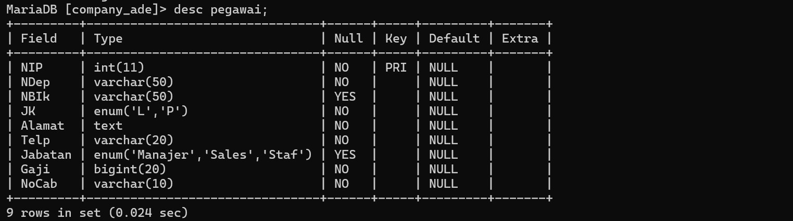
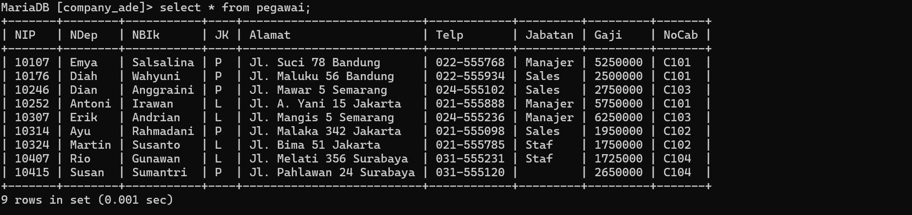

## 1. Gunakan perintah DESC pegawai; untuk mendapatkan struktur tabel.
*STRUKTUR "*
SQL
```sql
CREATE TABLE pegawai (
-> NIP INT PRIMARY KEY,
-> NDep VARCHAR(255) NOT NULL,
-> NBlk VARCHAR(255),
-> JK ENUM('L', 'P') NOT NULL,
-> Alamat TEXT NOT NULL,
-> Telp VARCHAR(255) NOT NULL,
Jabatan ENUM('Manager', 'Sales', 'Staff'),
    Gaji BIGINT NOT NULL,
    NoCab VARCHAR(255) NOT NULL
);

```

*PENJELASAN :*
- *NIP INT PRIMARY KEY*:
    - *NIP*: Kolom ini menyimpan Nomor Induk Pegawai yang bertipe data integer (INT).
    - *PRIMARY KEY*: Menandakan bahwa kolom NIP adalah kunci utama dari tabel ini. Kunci utama harus memiliki nilai yang unik untuk setiap baris dan tidak boleh NULL.
    
- *NDep VARCHAR(255) NOT NULL*:
    - *NDep*: Kolom ini menyimpan Nama Depan pegawai bertipe data string dengan panjang maksimum 255 karakter (VARCHAR(255)).
    - *NOT NULL*: Menandakan bahwa kolom ini tidak boleh berisi nilai kosong (NULL); artinya, setiap baris harus memiliki nilai untuk kolom ini.
    
- *NBlk VARCHAR(255)*:
    - *NBlk*: Kolom ini menyimpan Nama Belakang pegawai bertipe data string dengan panjang maksimum 255 karakter (VARCHAR(255)).
    - Kolom ini tidak memiliki batasan NOT NULL, sehingga nilai kosong (NULL) diizinkan.
    
- *JK ENUM('L', 'P') NOT NULL*:
    - *JK*: Kolom ini menyimpan Jenis Kelamin pegawai dengan tipe data ENUM. Hanya dua nilai yang diperbolehkan: 'L' (Laki-laki) atau 'P' (Perempuan).
    - *NOT NULL*: Menandakan bahwa kolom ini tidak boleh kosong; artinya, setiap baris harus memiliki nilai untuk kolom ini.

- *Alamat TEXT NOT NULL*:
    - *Alamat*: Kolom ini menyimpan alamat pegawai dengan tipe data TEXT, yang bisa menampung teks dalam jumlah besar.
    - *NOT NULL*: Menandakan bahwa kolom ini harus diisi dengan nilai; nilai kosong (NULL) tidak diperbolehkan.

- *Telp VARCHAR(255) NOT NULL*:
    - *Telp*: Kolom ini menyimpan nomor telepon pegawai dengan tipe data string dan panjang maksimum 255 karakter (VARCHAR(255)).
    - *NOT NULL*: Menandakan bahwa kolom ini harus diisi; nilai kosong (NULL) tidak diperbolehkan.
    
- *Jabatan ENUM('Manager', 'Sales', 'Staff')*:
    - *Jabatan*: Kolom ini menyimpan jabatan pegawai dengan tipe data ENUM. Nilai yang diperbolehkan adalah 'Manager', 'Supervisor', atau 'Staff'.
    - Kolom ini tidak memiliki batasan NOT NULL, sehingga nilai kosong (NULL) diizinkan.
    
- *Gaji BIGINT NOT NULL*:
    - *Gaji*: Kolom ini menyimpan gaji pegawai dengan tipe data BIGINT, yang dapat menampung bilangan bulat yang sangat besar.
    - *NOT NULL*: Menandakan bahwa kolom ini harus diisi; nilai kosong (NULL) tidak diperbolehkan.
    
- *NoCab VARCHAR(255) NOT NULL*:
    - *NoCab*: Kolom ini menyimpan nomor cabang pegawai dengan tipe data string dan panjang maksimum 255 karakter (VARCHAR(255)).
    - *NOT NULL*: Menandakan bahwa kolom ini harus diisi; nilai kosong (NULL) tidak diperbolehkan.

*HASIL :*

## 2. Gunakan perintah SELECT * FROM pegawai; untuk mendapatkan data.
*STRUKTUR "*
SQL
INSERT INTO pegawai (NIP, NDep, NBlk, JK, Alamat, Telp, Jabatan, Gaji, NoCab) VALUES 
-> (10107, 'Emya', 'Salsalina', 'P', 'JL. Suci 78 Bandung', '022-555768', 'Manager', 5250000, 'C101'), 
-> (10246, 'Dian', 'Anggraini', 'P', 'JL. Mawar 5 Semarang', '024-555102', 'sales', 2750000, 'C103'), 
-> (10324, 'Martin', 'Susanto', 'L', 'JL. Bima 51 Jakarta', '021-555785', 'Staff', 1750000, 'C102'), 
-> (10252, 'Antoni', 'Irawan', 'L', 'JL. A. Yani 15 Jakarta', '021-555888', 'Manager', 5750000, 'C102'), 
-> (10176, 'Diah', 'Wahyuni', 'P', 'JL. Maluku 56 Bandung', '022-555934', 'sales', 2500000, 'C101'), 
-> (10314, 'Ayu', 'Rahmadani', 'P', 'JL. Malaka 342 Jakarta', '021-555098', 'Sales', 1950000, 'C102'), 
-> (10307, 'Erik', 'Adrian', 'L', 'JL. Manggis 5 Semarang', '024-555236', 'Manager', 6250000, 'C103'), 
-> (10415, 'Susan', 'Sumantri', 'P', 'JL. Pahlawan 24 Surabaya', '031-555120', '', 2650000, 'C104'), 
-> (10407, 'Rio', 'Gunawan', 'L', 'JL. Melati 356 Surabaya', '031-555231', 'Staff', 1725000, 'C104');


*PENJELASAN :*
- *INSERT INTO pegawai*:
    - Menunjukkan bahwa Anda akan menambahkan data ke tabel bernama pegawai.
    
- *(NIP, NDep, NBlk, JK, Alamat, Telp, Jabatan, Gaji, NoCab)*:
    - Ini adalah daftar kolom dalam tabel pegawai yang akan diisi dengan data. Kolom-kolom ini adalah:
        - NIP (Nomor Induk Pegawai)
        - NDep (Nama Depan)
        - NBlk (Nama Belakang)
        - JK (Jenis Kelamin)
        - Alamat (Alamat)
        - Telp (Telepon)
        - Jabatan (Jabatan)
        - Gaji (Gaji)
        - NoCab (Nomor Cabang)
        
- *VALUES*:
    - Menunjukkan data yang akan dimasukkan ke dalam tabel. Data untuk setiap baris harus sesuai dengan urutan kolom yang disebutkan sebelumnya.
    
- *Data yang Dimasukkan*:
    - Baris pertama:
        - NIP: 10107
        - NDep: 'Emya'
        - NBlk: 'Salsalina'
        - JK: 'P' (Perempuan)
        - Alamat: 'JL. Suci 78 Bandung'
        - Telp: '022-555768'
        - Jabatan: 'Manager'
        - Gaji: 5250000
        - NoCab: 'C101'
    - Baris kedua dan seterusnya mengikuti pola yang sama, dengan data yang berbeda.
    
- *Catatan*:
    - Pada baris 10415 untuk Susan Sumantri, kolom Jabatan tidak diisi (''), yang bisa menyebabkan masalah jika kolom Jabatan adalah ENUM dan tidak termasuk nilai kosong. Pastikan kolom Jabatan memiliki nilai yang valid.
    - Jika ada nilai kosong ('') dalam kolom Jabatan, Anda mungkin ingin memperbarui baris ini dengan jabatan yang sesuai, seperti 'Staff', atau menyesuaikan schema tabel untuk mengizinkan nilai kosong jika perlu.

*HASIL :*



## Latihan-1
**GAMBAR : 
![[ade1.jpg]]

*STRIKTUR :*
```sql
SELECT COUNT(NIP) AS JumlahPegawai, COUNT(Jabatan) AS JumlahJabatan FROM pegawai;
```

*PENJELASAN :* 
- SELECT untuk memilih kolom apa saja yang ingin dipilih (untuk dihitung).
- COUNT (NIP) = untuk menghitung Jumlah barisan data yang mempunyai
  dari kalom Yang dipilih. NIP adalah nama kolom Yang dipilih untuk dihitung.

- AS = untuk mengubah nauna dari suatu kolom untuk sementara. Jumlah PeSouvai = merupakan nama ubahan dari Perintah As Yang digunakan. merupakan nama sementara dari perintah COUNT(NIP).

-  COUNT (Departemen) = untuk menghitung jumlah baris data Yoard yang memiliki konten data dari kumpulan yang dipilih.
   Jabatan adalah nama kolom yang dipilih untuk dihitung.

- AS untuk mengubah nama dari suatu kolom untuk sementara. Jumlah Jabatan = merupakan nama sementara dari perintah court (Jabatan).
- From Pegawai merupakan dari tabel mana datanya Yang didupakan Pesawai adalah nama tabel Yang datanya ingin digunakan.

- Hasilnya karena ada y barisan data, Yand indin dihitung adalah kalam NIP, Jumlah dari kolom NIP (isi datanya) ada 9, ditampilkan sebagai Jumlah pesawai. kolom Jabatan Jusa dihitung, akan tetapi ada satu data Yang berisi Null (kosong), oleh karena itu hanya ada & data ditampilkan sebadal jumlah jabatan  
## Latihan-2
**GAMBAR : 
![[ade2.png]]

*STRIKTUR :*
```sql
select count(NIP) AS JumlahPegawai
    -> FROM pegawai
    -> WHERE NoCab = 'C102';
```


*PENJELASAN :* 
- SELECT = untuk memilih kolom mana saja yang ingin dipilih untuk dihitung.
- COUNT (NIP) = untuk menghitung jumlah blok data yang memiliki data dari kolom yang dipilih.
- NIP adalah nama kolom Yang dipilih untuk Jihitung.
- As = untuk mengubah nama dari suatu kolom untuk sementara.
- Jumlah pesawai nama sementara Yang dipilih untuk kolom COUNT (NIP)
- From Pesawai dari tabel mana datanya akan digunakan. Pegawai adalah nama tabel Yang dipilih untuk digunakan.
- WHERE merupakan kondisi yang harus dipenuhi ajar datanya dapat dendon query COUNT (NIP).
- (Nocab = 'C102') = adalah kordisi dari WHERE Yang harus dipenuhi, Jadi hanya barisan data yang memiliki Clo2' di kolom "vocab" Yang bisa dihitung.
-  Hasilnya Di 9 barisan data Yangada Pada tabel Pesawai, kita ingin menghitung Jumlah barisan data Yang memiliki nilai 'clo2' Pada kolom "Nocab" nya dengan menggunakan COUNT. Jadi Yang muncul adalah 3 barisan data. kita Juda ingin mengubah nama dari kolom hasil Perintah COUNT Secara sementara dengan Perintah As, namanya adalah Jumlah Pegawai.
## Latihan-3
**GAMBAR : 
![[ade6.jpg]]

*STRIKTUR :*
```sql
SELECT SUM(Gaji) AS Gaji_Manager
    -> FROM pegawai
    -> WHERE Jabatan = 'Manager';
```

*PENJELASAN :* 
- SELECT untuk memilih kolom mana saja Yand insin dihitung atau ditampilkan. NoCab merupakan nama kolom Yang ingin ditampilkan.
- COUNT (NIP) = untuk menghitung Jumlah batisan data Yang mempunyai isi data dari kolom Yang dipilih. NIP adalah nama kolom Yang dipilih untuk dihitung.
- AS untuk mengubah nama dari suatu kolom untuk sementara.
- Jumlah Pegawai merupakan nama Sementara dari kolom hasil COUNT(NIP). 
- From Pegawai dari tabel mana yang data kodomnya ingin digunakan.
  Pegawai adalah nama tabel Yang dipilih untuk digunakan.
- GROUP BY = untuk menjelompokkan data berdasarkan nilai data yang telah ditentukan Pada kolom yang dipilih.
- Nocab hama kolom Yang dipilih untuk datanya dikelompokkan.
- Hasilnya Berdasarkan 9 barisan data, masing-masing. nilai dalam kojom Nocab.
dikelompokkan berdasarkan nilainya sendiri 
## Latihan-4
**GAMBAR : 
![[ade3.png]]

*STRIKTUR :*
```sql
SELECT NoCab, COUNT(NIP) AS Jumlah_pegawai
    -> FROM pegawai
    -> GROUP BY NoCab;
```

*PENJELASAN :* 
- SELECT = untuk memilih kojom mana sasa Yang ingin dihitung atau ditampilkan.
- Nocab: merupakan nama kolom yang ingin ditampilkan.
- COUNT(NIP) = untuk menghitung jumlah barisun data yang mempunyai isi data dari kolom Yang dipilih. NIP adalah nama kolom Yang dipilih untuk dihitung.
- AS untuk mengubah nama dari suatu kojom untuk sementara.
- Jumlah-Pesawai nama sementara dari kolom hasil COUNT (NIP).
- From Pegawai untuk memilih dari tabel mana Yand data kolomnya ingin digunakan. Pesawai adalah nama taber Yang dipilih untuk digunakan.
GROUP BY untuk menjelompokkan data berdasarkan nilai data Yang telah ditentukan Pada kolom Yang dipilih.
- Nocab nama kolom Yang dipilih untuk dikelompokkan datanya.
- HAVING = untuk menentukan kondisi (Yand hans dipenuhi) oleh suatu kelompok data sedang melakukan ada bisa ditampilkun.
- (COUNT (NIP) >= 3) = merupakan kondisi Yang harus dipenuhi oleh suatu kelompok data. Jadi hanya kelompok data Yang hasil hitungannya lebih atau Sama dengan 3.
- Hasilnya seperti sebelumnya, ada 9 barisan data dibagi sesuai Nocab nya masinθ -masing. Namun Yand indin ditampilkan adalah hasil hitungan yang lebih dari atau sama dengan 3. Yaitu Nocab C102 Yang ada 3. Yang lain c101 ada 2, c103 ada 2, c109 ada 2.
- Jumlah pesawai nama sementara Yang dipilih untuk kolom COUNT (NIP)
- From Pesawai dari tabel mana datanya akan digunakan. Pegawai adalah nama tabel Yang dipilih untuk digunakan. 
- WHERE merupakan kondisi yang harus dipenuhi ajar datanya dapat dendon query COUNT (NIP).
- (Nocab = 'C102') = adalah kordisi dari WHERE Yang harus dipenuhi, Jadi hanya barisan data yang memiliki Clo2' di kolom "vocab" Yang bisa dihitung.
- Hasilnya Di 9 barisan data Yangada Pada tabel Pesawai, kita ingin menghitung Jumlah barisan data Yang memiliki nilai 'clo2' Pada kolom "Nocab" nya dengan menggunakan COUNT. Jadi Yang muncul adalah 3 barisan data. kita Juda ingin mengubah nama dari kolom hasil Perintah COUNT Secara sementara dengan Perintah As, namanya adalah Jumlah Pegawai.
## Latihan-5
**GAMBAR : 
![[ade5.jpg]]

*STRIKTUR :*
```sql
SELECT NoCab, COUNT(NIP) AS Jumlah_pegawai
    -> FROM pegawai
    -> GROUP BY NoCab HAVING COUNT(NIP) >= 3;
```

*PENJELASAN :* 
- SELECT = untuk memilih kolom mana saja Yang dipilih untuk dijumlahkan.
- SUM (Gaji) = untuk menghitung Jumlah data (khusus anika) Pada kolom. Yang dipilih. Gati merupakan nama kolom Yang dipilih untuk dihitung Jumlah isi datan 
- AS untuk mengganti nama dari kolom hasil sum (Gari) untuk sementara. 
- Total Gaji merupakan nama sementara dari perintah As.
- From Pegawai = untuk memilih dari tabel mana Yang kolom datanya akan digunakan. Pegawai adalah nama dari tabel yang dipilih.
- Hasilnya kolom Gati Yang isi datanya berupa anika-anika, semuanya dijumlahkan menjadi satu seperti ditotalkan (Sama seperti matematika Pada umumnya). Dan hasilnya adalah 30575000. Adapun nama kolom dari hasil Jumlah tersebut diubah dari sum(Gati) menjadi Total-Gaji.
## Latihan-6
**GAMBAR : 
![[ade6.jpg]]

STRIKTUR :**
```sql
SELECT SUM(Gaji) AS Gaji_manager
    -> FROM pegawai
    -> WHERE jabatan = 'manajer'
```

*PENJELASAN :* 
- SELECT = untuk memilih kolom mana saja yang dipilih untuk dijumlahfan. Sum (Gavi) = untuk menghitung Jumlah isi data (khusus andka) Pada kolom Yang dipilih. Gaji adalah nama kolom Yang dipilih untuk dijumlahkan isi datanya.
- AS untuk mengganti nama dati kolom hasil sum (Gari) secara sementara. Gazi-Manager = merupakan nama sementara dari Perintah As.
- From Pegawai untuk memilih dari tabel mana Yand kolom datanča akan digunakan. Pegawai adalah nama dari table Yang dipilih.
- (Jabatan = "manager") = merupakan kondisi dari WHERE.
Hanya baris data yang merupakan kolom
Jabatannya berisi
Manajer Yang
kolom Gatinya bisa dijumlahkan.
- WHERE = kondisi Yang harus dipenuhi oleh suatu kolom avar datanya bisa dijumlah.
- Hasilnya barisan data Yang kolom Jabatannya berisi manajer akan dijumlah kolom Golinya menjadi. 1725.0000. Jadi hanya beberapa kolom. Saja yang dijumlah
##  Latihan-7
**GAMBAR : 
![[ade7.jpg]]

STRIKTUR :**
```sql
SELECT NoCab, SUM(Gaji) AS TotalGaji
    -> FROM pegawai
    -> GROUP BY NoCab;
```

*PENJELASAN :* 
- SELECT untuk memilih kolom mana sata yang dipilih untuk ditampilkan/dijumlahkan. Nocab adalah nama kolom yang ingin ditampilkan.
- SUM (Gaji) = untuk menghitung Jumlah data (khusus andra) Pada kolom Yang dipilih. Gaji adalah nama kolom yang dipilih untuk dijumlahkan isi datanya.
- AS untuk menanti nama dari kolom hasil sum(Gasi) untuk sementara. Total Gaji merupakan nama sementara dari Perintah AS.
- From Pelawai untuk memilih dari tabel mana Yand data kolomnya akan digunakan.. Pegawai adalah nama tabel yang dipilih.
- GROUP BY untuk mendelompokkan data ditentukan Pada kolom Yang dipilih. berdasarkan nilai data yang telah ditentukan pada kolom yang dipilih
- Nocab nama kolom yang datanya dipilih untuk dikelompokkan.
- Hasilnya Jadi, berdasarkan kolom Nocab, barisan data yang kolom Nocab nya berisi (101 maka kolom Gazi dari barisan data itu digumlatikan bersama batisan data Yand memiliki Nocab cl01 Juda. Maka kolom Gaji dijumlahikan sesuai dengan kolom Nocab nya masing-masing, mulai dari (101 memiliki 2 kolom Gavi Yand bisa dijumlahkan. sama dengan C103 dan c104. Adapun C102 memiliki 3 kolom Gaji yang dapat dijumlahkan. TotalGari merupakan hasil Perintah dati As untuk mengubah nama kolom hasil dati SUM(GOD).
## Latihan-8
**GAMBAR : 
![[ade8.png]]

STRIKTUR :**
```sql
SELECT NoCab, SUM(Gaji) AS Total_Gaji
    -> FROM pegawai
    -> GROUP BY NoCab HAVING SUM(Gaji) >= 8000000;
```

*PENJELASAN :* 
- select = untuk memilih kolom mana saja yang dipilih untuk ditampilkan/dijumlahkan
- nocab = nama kolom yang dipilih untuk dikelompokkan
- sum(gaji) = untuk mengitung jumlah data (khusus angka) pada kolom yang dipilih gaji adalah nama kolom yang dipilih untuk dijumlahkan isi datanya
- AS = untuk mengganti nama dari kojom hasil sum (Gari) untuk sementara.
- Total-Gari nama sementara dari Perintah As. - From Pesawal untuk memilih dari tabel mana yang data kolomnya ingin digunakan.
- Pegawai adalah nama dari tabel yang dipilih. GROUP BY = untuk mendelompokkan data berdasarkan nilai data Yang telah ditentukan Poda kolom yang dipilih.
- Nocab = noma kolom Yang dipilih untuk datanya dikelompokkan.
- Having = kondisi yang harus dipenuhi oleh suatu kelompok data avar bisa ditampilkan.
- SUM (Gavi) >= 8000000) = kondisi dari HAVING, Hasil dari Penjumlahan Gaji yang hanya bisa ditampilkan adalah Hasil yang lebih dari atau sama dendan 8000000
- Hasilnya = Sama seperti sebelumnya, tetapi Nocab Yand memenuhi kondisi tersebut hanyalah C102 dan C103 karena hasil Jumlah kolom Gati nya lebih dari atau sama dengan 8000000. Adapun hasil kolom Sum(Gazi) diganti Jadi Total-Gaji.
## Latihan-9
**GAMBAR : 
![[ade9.jpg]]

STRIKTUR :**
```sql
SELECT AVG(Gaji) AS Rata_rata
    -> FROM pegawai;
```


*PENJELASAN :* 
- SELECT = untuk memilih kolom mana saja yang dipilih untuk ditampilkan.
- AVG(Gaji) = untuk menghitung rata-rata dari data yang ada Pada kojom Yang dipilih.
- Gaji adalah nama kolom Yang dipilih untuk dihitung rata-ratanya. As untuk mengganti nama dari kolom hasil AVG (Gati) untuk sementara. Rata-rata nama sementara dari Perintah As.
- From Pegawai untuk memilih dari tabel mana yang data kolomnya ingin digunakan. Pegawai adalah nama dari tabel yang dipilih.
- Hasilnya = 3397222.2222 merupakan hasil ratatata dari semua 9 barisan data Pada kolom Gati. Adapun nama kolom hasil dari AVG(Gati) Yaitu Rata-rata.
## Latihan-10
**GAMBAR : 
![[ade10.jpg]]

STRIKTUR :**
```sql
SELECT AVG(Gaji) AS GajiRataMgr
    -> FROM pegawai
    -> WHERE Jabatan = 'Manager';
```

*PENJELASAN :* 
- SELECT = untuk memilih kolom mana saja yang dipilih untuk ditampilkan.
- AVG (Gaji) = untuk menghitung rata-rata dari data yang ada pada kolom Yang dipilih. Gati adalah nama kolom Yang dipilih untuk dihitung rata-ratanya.
- AS = untuk mengganti nama dari kolom hasil AVG (Gaji) untuk sementara.
- Gaji Ratamgr = nama sementara dari Perintah AS.
- FROM pesawal = untuk memilih dari tabel Mang Yand data kolomnya ingin digunakan Pegawai adalah nama dati tabel Yang dipilih.
- WHERE = Kondisi yang harus dipenuhi oleh suatu kolom agar datanya bisa dihitung rata-ratanya
- Jabatan = 'Manager') = kondisi dari WHERE. Barisan data yang kolom Jabatannya manajer akan dihitung rata-rata kolom Gaji nya.
- Hasilnya = 5750000.0000 merupakan hasil hitung rata-rata dari barisan data yand memiliki manajer di kolom Jabatan nya, dari situ kolom Gazi nya di fitung.
## Latihan-11
**GAMBAR : 
![[ade11.jpg]]

STRIKTUR :**
```sql
SELECT NoCab, AVG(Gaji) AS RataGaji
-> FROM pegawai
-> GROUP BY NoCab;
```

*PENJELASAN :* 
- SELECT = untuk memilih kolom mana saja yang dipilih untuk ditampilkan, dihitung. 
- Nocab Kolom Yang dipilih untuk ditampilkan.

- AVG (Gaji) = untuk menghitung rata-rata dari data yang ada pada kolom yang dipilih. Gati adalah nama kolom Yang dipilih untuk dihitung rata-ratanya.

- AS untuk mengganti nama dari kolom hasil AVG(Gavi) untuk sementara.

- Rata Gati adalah nama sementara dari Perintah As.

- From Pegawai = untuk memilih dari tabel mana Yang data kolomiya ingin digunakan. Pegawai adalah nama dari tabel yang dipilih.

- GROUP BY = untuk mengelompokkan data berdasarkan nilai data yang telah ditentukan. Pada kolom Yang dipilih.

- Nocab nama kolom Yang dipilih untuk datanya dikelompokkan.

- Hasilnya = Hampir sama seperti no.7, masing-masing kolom No.cab dihitung rata-ratana sesuai dengan isi nocab,jadi yang c101 yang  lainnya juga (yang sama) adapun ratagaji merupakan nama sementara dari kolom hasil avg(gaji)
## Latiahn-12
**GAMBAR : 
![[ade12.jpg]]

STRIKTUR :**
```sql
SELECT NoCab, AVG(Gaji) AS RataGaji
-> FROM pegawai
-> GROUP BY NoCab HAVING NoCab = 'C101' OR NoCab = 'C102';
```


*PENJELASAN :* 
- SELECT untuk memilih kolom mana saja yang dipilih untuk ditampilkan, dihitung.
- Nocab kolom Yang dipilih untuk ditampilkan.
- AVG (Gaji) = untuk menghitung rata-rata dati data yang ada pada kolom Yang dipilih. Gati adalah nama kolom Yang dipilih untuk dihitung rata-ratanya.
- AS = untuk mengganti nama dati kolom hasil AVG(Gaji) untuk sementara.
- Rata Gaji nama sementara dari Perintah As.
- From Pegawai untuk memilih dari tabel mana yan datanya Kolomnya ingin digunakan Pegawai adalah nama dari tabel yang dipilih.
- GROUP BY = untuk mengelompokkan data berdasarkan nilai data yang telah ditentukan Pada kolom Yang dipilih.
- Nocab = nama kolom Yang dipilih untuk datorva dikelompoklan.
- HAVING = kondisi yang harus dipenuhi oleh suatu kelompok data.
- (Nocab 'C101' OR Nocab = 'c102') = merupakan kondisi dari Having. Jadi kolom Nocab Yang memiliki (101 atau (102 Yang hanya akan ditampilkan. OR adalah kondisi Yang hanya salah satu datanya yang harus dipenuhi.
## Latiahn-13
**GAMBAR : 
![[ade13.jpg]]

STRIKTUR :**
```sql
SELECT MAX(Gaji) AS GajiTerbesar, MIN(Gaji) AS GajiTerkecil
-> FROM pegawai;
```

*PENJELASAN :* 
- SELECT = untuk memilih kolom mana saja Yang dipilih untuk ditampilkan,
- MAX(Gari) = untuk menampilkan nilai maksimum atau terbesar tertinggi dari suatu data dalam kolom Yang dipilih. Gori adalah nama kolom Yand difilih.
- As Gajirerbesar untuk mendianti nama dari kolom hasil max (Gati), menjadi nama Sementaranya Yaitu Gajiterbesar.
- MIN (Gaji) = untuk menampikan nilai data dalam kolom Yang dipilih. minimum atau terkecil/terendah dari suatu Govi adalah nama kolom Yang dipilih.
- As Gajiterkecil = untuk mengganti nama dati kolom hasil MIN (Gati) menjadi Gajiterkecil untur sementara.
- FROM Pegawai untuk memilih dari tabel mana yang dati kolomnya indin ditampilkan.
- Hasilnya Jadi dari 9 nilai yang ada di kolom Gari, Gasi maksimumnya adalah 6250000 dan namanya diubah menadi Gatiterbesar. Gavi minimumnya adalah 1725000 dan namanya diubah meroadi Gariterkecil.
## Latiahn-14
**GAMBAR : 
![[ade14.jpg]]

STRIKTUR :**
```sql
SELECT MAX(Gaji) AS GajiTerbesar, MIN(Gaji) AS GajiTerkecil
-> FROM pegawai
-> WHERE jabatan ='manajer';
```

*PENJELASAN :* 
- SELECT untuk memilih kolom mana saja yang dipilih untuk ditampilkan.
- MAX (Gari) = untuk menampilkan nilai terbesar dari suatu data dalam kolom Yang dipilih.
- Gati adalah nama kolom yang dipilih.
- As Gajiterbesar untuk mengganti nama dari kolom hasil Max (Gati) mentadi Gatiterbesar untuk sementara.
- MIN (Gaji) = untuk menampilkan nilai terkecil dari suatu data dalam kolom Yang dipilih Gaji adalah nama kolom Yang dipilih.
- As Gatiterkecil = untuk menanti nama dari kolom hasil MIN (Gari) menjadi Gati terke -cil untuk sementara.
- From Pegawai untuk memilih dari tabel mana Yand data kojomnya ingin ditampilkan.
- WHERE = kondisi Yang harus dipenuhi oleh suatu kolom data agar bisa ditampilkan.
- jabatan = 'manajer') = kondisi dari WHERE Yang harus dipenuhi. Barisan data Yang kolom Jabatannya bernisi manajer akan ditampilkan kolom Garinya.
- Hasilnya = Jabatan Manater Yang memiliki nilai maksimum adalah 6250000 kolom hasil MAX nya diubah Jadi Gaji terbesar. Sedangkan nilai minimumnya adalah 5250000 kolom hasil MIN nya diubah Jadi Gati jerkecil.
## Latiahn-15
**GAMBAR : 
![[ade15.jpg]]

STRIKTUR :**
```sql
SELECT NoCab, Max(Gaji) AS GajiTerbesar, MIN(Gaji) AS GajiTerkecil
-> FROM pegawai
-> GROUP BY NoCab;
```

*PENJELASAN :* 
- SELECT = untuk memilih kolom mana saja yang dipilih untuk ditampilkan.
- Nocab = nama kolom yang ingin ditampilkan.
- MAX (Gaji) = untuk menampilkan nilai terbesar dari suatu data dalam kolom Yang dilih Gazi nama kolom yang dipilih.
- As Gojiterbesar untuk mengganti nama kolom hasil MAX (Gati) menjadi Gazi Terbesar untuk sementara.
- MIN (GaJi) = untuk menampilkan nilai terkecil dari suatu data dalam kolom Yang dipilih. Gazi nama kojom Yang dipilih.
- As Gaviterkecil = untuk mengganti nama kolom hasil MIN (Gati) menjadi Gari Terkecil. untuk sementara.
- From Pegawai untuk memilih dari tabel mana Yand data kolomnya ingin ditampilkan. Pegawai adalah nama tabel yang dipilih untuk ditampilkan.
- Group BY = untuk mendelompokkan data berdasarkan nilai data yang telah ditentukan Pada kolom Yang dipilih.
- Nocab nama kolom yang ingin dikelompokkan.
- Hasilnya masing-masing Nocab dicari nilai maksimum dan minimumnya. mulai dari 0201, C102, 103, 109. dan nama hasil kolamnya diubah Jadi Gajiterbesar dan Gatiterkecil.
## Latiahn-16
**GAMBAR : 
![[ade16.jpg]]

STRIKTUR :**
```sql
SELECT NoCab, Max(Gaji) AS GajiTerbesar, MIN(Gaji) AS GajiTerkecil
-> FROM pegawai
-> GROUP BY NoCab HAVING COUNT(NIP) >= 3;
```

*PENJELASAN :* 
-  SELECT untuk memilih kolom mana saja yang dipilih untuk ditampilFan.
- Nocab = nama kolom Yang Ingin ditampilkan.
- MAX(GaJi) = untuk menampilkan nilai terbesar dan suatu data dalam kolom Yang dipilih Gati adalah nama kolom Yang dipilih.
 - As Goviterbesar untuk mengganti nama kolom hasil MAX(Gati) menjadi Gariterbesar Untuk sementara.
- MIN (GOJI) = untuk menampilkan nilai terkecil dari suatu data dalam kolom yang dipilih. Gaji adalah nama kolom Yang dipilih.
- As Gajiterkecil untuk mengganti nama kolom hasil MIN (Gaji) menjadi Gariperakecil untuk sementara.
- FROM Pesawai adalah untuk memilih dari tabel mana Yand data kolamnya ingin ditampilkan Pegawai adalah nama tabel Yang dipilih.
- GROUP BY = untuk mendelompokkan data Pada kolom Yang dipilih.
- Nocab nama kolom Yang dipilih untuk dikelompokkan.
- Having = kondisi Yang harus dipenuhi oleh suatu kelompok data 
- (COUNT (NIP) >= 3) = kondisi dati HAVING. Hanya hasil hitung kolom NIP yang lebih dari atau sama dengan 3 Yang muncul.
- hasilnya = seperti no 4  yang mempunyai hasil hitung lebih dari atau sama dengan 3 adalah NoCab C102, jadi hanya itu yang dicari nilai maksimum
pada kolom gaji
## Latiahn-17
**GAMBAR : 
![[ade17.jpg]]

STRIKTUR :**
```sql
SELECT COUNT(NIP) AS JumlahPegawai, SUM(Gaji) AS TotalGaji,
-> AVG(Gaji) AS RataGaji, MAX(Gaji) AS GajiMaks, MIN(Gaji) AS GajiMin
-> FROM pegawai;
```

*PENJELASAN :* 
- SELECT = untuk memilih kolom mana saja Yang di Pilih untuk ditampilkan.
- COUNT (NIP) = untuk menghitung jumlah baris data pada pool yang dipilih.
- As Jumlah pesawai untuk mengganti nama kolom hosil COUNT (NIP) menjadi Jumlah Pesarai. Sum (Gaji) = untuk menjumlah data Yang ada pada kojom Yang dipilih.. Gari adalah kolom Yand dipilih...
- sum (Gazi) menjadi Total Gari.
- AVG (Gari) = untuk menghitung rata-ratanya suatu data dalam kojom Yang dipilih.
- AS Total Gaji = untuk mendianti nama kojom hasil
- Gaji adalah nama kolom Yang dipilih untuk dihitung.
- AS RataGati = untuk mendianti nama kolom hasil AVG (Gari) menjadi Rata Gaji.
- MAX (Gaji) = untuk menampilkan nilai terbesar dari suatu data dalam kojom Yand dipilih
- Gaji adalah nama kolon yang dipilih.
 - As Garimaks = untuk mengganti nama dati kolom hasil MAX(Gati) menjadi Garimals. untuk sementara.
- MIN (Gati) = untuk menampilkan nilai terkecil dari suatu kolom Yang dipilih. Gaji nama kolom Yang dipilih.
- As Gatimin = untuk mengganti nama dati kolom hasil MIN (Gaji) menjadi Garimin. Untuk sementara.
- From Pelawai = untuk memilih tabel mana yang dipilih untuk ditampilkan. Pegawai adalah nama tabel Yang dipilih
- Hasilnya = Dihitung berasa NIP, DiJumlahkan semua data Pada kolom Gaji, Dihitung Ratarata dati kolom Gavi, Ditampilkan nilai terbesar pada kolom Gari, dan Nilai terkecil dalam kojom Gaji.
## Latiahn-18
**GAMBAR : 
![[ade18.jpg]]

STRIKTUR :**
```sql
SELECT COUNT(NIP) AS Jumlahpegawai, SUM(Gaji) AS TotalGaji,
-> AVG(Gaji) AS RataGaji, Max(Gaji) AS GajiMks, MIN(Gaji) AS GajiMin
-> FROM pegawai
-> WHERE Jabatan = 'Staff' OR Jabatan = 'Sales'
-> GROUP BY NoCab HAVING SUM(Gaji) <= 2600000;
```

*PENJELASAN :* 
- SELECT COUNT(NIP) AS Jumlahpegawai:
Bagian ini menghitung jumlah pegawai dengan menghitung jumlah NIP (Nomor
Induk Pegawai) yang ada. Hasilnya akan ditampilkan dengan nama alias
Jumlahpegawai 
- SUM(Gaji) AS TotalGaji:
Bagian ini menjumlahkan semua nilai gaji dari pegawai yang memenuhi kriteria. Hasil
penjumlahan gaji ini akan ditampilkan dengan nama alias TotalGaji .
- AVG(Gaji) AS RataGaji:Bagian ini menghitung rata-rata gaji dari pegawai yang memenuhi kriteria. Hasil
perhitungan rata-rataini akan ditampilkan dengan nama alias RataGaji .
- MAX(Gaji) AS GajiMks:
Bagian ini mencari dan menampilkan gaji tertinggi (maksimum) di antara pegawai
yang memenuhi kriteria. Hasilnya akan ditampilkan dengan nama alias GajiMks .
- MIN(Gaji) AS GajiMin:
Bagian ini mencari dan menampilkan gaji terendah (minimum) di antara pegawai
yang memenuhi kriteria. Hasilnya akan ditampilkan dengan nama alias GajiMin .
- FROM pegawai:
Bagian ini menunjukkan tabel yang menjadi sumber data, yaitu tabel pegawai .
- WHERE Jabatan = 'Staff' OR Jabatan = 'Sales':
Bagian ini menetapkan kondisi untuk memilih hanya pegawai dengan Jabatan yang
bernilai 'Staff' atau 'Sales'. Artinya, hanya data pegawai dengan jabatan ini yang akan
diproses lebih lanjut dalam query ini.
- GROUP BY NoCab:
Bagian ini mengelompokkan data berdasarkan kolom NoCab (Nomor Cabang).
Artinya, data akan dikelompokkan per cabang, dan hasil perhitungan (jumlah
pegawai, total gaji, rata-rata gaji, gaji tertinggi, dan gaji terendah) akan ditampilkan
untuk setiap cabang.
- 32HAVING SUM(Gaji) <= 2600000:
Bagian ini menetapkan kondisi setelah pengelompokan, yaitu hanya cabang-cabang
yang memiliki total gaji kurang dari atau sama dengan 2.600.000 yang akan
ditampilkan dalam hasil akhir query. Kondisi ini digunakan setelah pengelompokan
karena HAVING digunakan untuk menyaring hasil setelah agregasi (seperti SUM ).